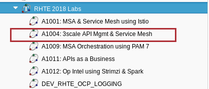
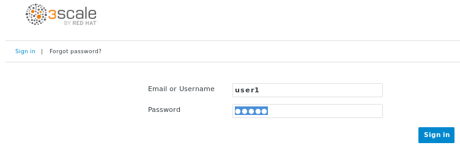

:noaudio:
:scrollbar:
:data-uri:
:toc2:
:linkattrs:
:lab_spreadsheet_apac: link:https://docs.google.com/spreadsheets/d/19Fb4aRYIPWDqUbctXbFvRD7JsT8G_BM9KF5tTo4dWE8/edit?usp=sharing[APAC RHTE: Student lab info spreadsheet]
:lab_spreadsheet_emea: link:https://docs.google.com/spreadsheets/d/1XxwdeGqTSgd1JQssnVMt8TlfyEEPn-MrFz0b2HI_HV0/edit?usp=sharing[EMEA RHTE: Student lab info spreadsheet]
:lab_spreadsheet_chad: link:https://docs.google.com/spreadsheets/d/1v70zpIlrVYRvFBcnnmUmzNFKSq3EK2Nk2JL4mVVFc2M/edit#gid=1002335978[Americas RHTE: Chad Darby Lab: API tenant info spreadsheet]
:lab_spreadsheet_jeff: link:https://docs.google.com/spreadsheets/d/1v70zpIlrVYRvFBcnnmUmzNFKSq3EK2Nk2JL4mVVFc2M/edit#gid=820975580[Americas RHTE: Jeff Bride Lab: API tenant info spreadsheet]

= Lab Setup

.Prerequisites
.. The `ssh` utility installed on your laptop.
+
NOTE: If your network connection is intermittent, consider installing the https://mosh.org/[mosh] utility (`yum install mosh`) as an alternative to the `ssh` utility.

.. Web browser installed on your laptop.
.. Broadband internet connectivity.

:numbered:

== Overview

This first lab of this course orientates you with the course lab assets provided to you.

Your lab environment consists of the following:

. *Remote Virtual Machine*
+
Accessible via the SSH protocol.
It is pre-installed with _OpenShift Container Platform_ and _Istio_.

. *Red Hat 3scale API Manager*
+
Pre-provisioned with an API _domain_ dedicated to you for the duration of this lab.
The 3scale API Manager may or may not be installed on your virtual machine, depending on how you enrolled in this lab.
More details in the following sections.

== Course Virtual Machine
=== Order Virtual Machine
This section guides you through the procedure to order a virtual machine (VM) for this course.

There are three methods for ordering a VM. [red]#Use only one of these methods.#

==== Access VM via RHPDS

NOTE: [blue]#This section is only applicable if you want to utilize a lab environment in Red Hat's _Partner Demo System_ (RHPDS)#.

. In a web browser, navigate to the _Cloud Forms_ environment for Red Hat Partner Demo System at: https://rhpds.redhat.com.
. Authenticate using your _OPENTLC_ credentials, for example: `johndoe-redhat.com`.
. Navigate to the following catalog: `Services -> Catalog -> All Services -> Red Hat Tech Exchange 2018`.
. Select the following catalog item: `3scale API Mgmt & Service Mesh`.
+
image::images/rhpds_catalog.png[]
. Click `Order` and in the next page, click the check box to confirm that you understand and know your runtime and expiration dates.
. Click `Submit`.

==== Access VM via OPENTLC or RHSE

NOTE: [blue]#This section is applicable if you are an existing student of either Red Hat's _Open Partner Enablement Network (OPEN)_ or Skills Exchange (RHSE) programs.#

. In a web browser, navigate to the _Cloud Forms_ environment for OPEN and RHSE at:   https://labs.opentlc.com.
. Authenticate using your _OPENTLC_ credentials, for example: `johndoe-redhat.com`.
. Navigate to the following catalog:  `Services -> Catalog -> Catalog Items -> OPENTLC Middleware Solutions Labs`.
. Select the following catalog item: `3scale API Mgmt & Service Mesh`.
+

. Click `Order` on the next page.

. In the subsequent order form, select the following:
.. *OpenShift Container Platform version*: `3.10.34`
.. *Region*: Select the region you currently reside in
.. Click `Submit`.

==== Access VM via GUID Grabber

NOTE: [blue]#This section is only applicable if you are a participant in a Red Hat conference such as Red Hat Tech Exchange (RHTE)#.

This section of the lab explains how to access the Red Hat Tech Exchange _GuidGrabber_ to obtain a Globally Unique Identifier (GUID).
This GUID will be used to access a virtual machine that you will use in this course.

. In a web browser, navigate to: http://bit.ly/rhte-guidgrabber.

. Select the *Lab Code* :  `A1004 - API Management with 3scale + Istio Microservices`.

. Enter the *Activation Key* provided to you by your instructor.

. Click `Next`.

. The resulting page will display your lab's GUID and other useful information about your lab environment.
+
image::images/guid_grabber_response.png[Guid Grabber Information Page]

. Your remote virtual machine is accessible via the `SSH` protocol.
+
Follow the directions exactly as indicated in the Guid Grabber Information Page to log into your remote lab VM via SSH.

. When you are finished with your lab environment at the end of this course, please click *Reset Workstation* so that you can move on to the next lab.
If you fail to do this, you will be locked into the GUID from the previous lab.
+
[NOTE]
Clicking *Reset Workstation* will not stop or delete the lab environment.

=== Confirmation Emails and SSH access

.Confirmation Emails
After ordering your VM, you will receive several email messages confirming your order.
These messages are sent to the email address associated with your OPENTLC account.

The most important message is the last one, which indicates completion of the provisioning of your lab environment.
This message should arrive about 30 minutes after the lab was ordered.
[blue]#Please save this email#.

The confirmation email will specify a unique GUID.  Please make note of the value of this GUID:
+
image::images/email_guid.png[]

.SSH access to your VM
The confirmation email will describe how to access your remote lab environment via SSH.

Complete the steps in the email to gain access to your lab environment.

[[env_vars]]
== Environment Variables

The instructions in this course require use of environment variables.
Now that you have a lab environment, in this section, you set these environment variables in your remote client environment.

. Set lab environment specific variables.
+
Select one of the following:

.. *Dedicated API Management environment*
+
NOTE: OPEN, RHSE students and users of RHPDS should utilize this approach.

... Log in to your remote lab environment via SSH.
... Execute the following commands:
+
-----
echo "export API_REGION=`echo $HOSTNAME | cut -d'.' -f2`" >> ~/.bashrc
echo "export API_DOMAIN=clientvm.\$API_REGION.openshift.opentlc.com" >> ~/.bashrc
echo "export API_USERNAME=user1" >> ~/.bashrc
echo "export API_TENANT_SUFFIX=3scale-mt-api0" >> ~/.bashrc
echo "export GW_PROJECT=\$API_USERNAME-gw" >> $HOME/.bashrc
source ~/.bashrc
-----

... Set your API Admin access token
+
The user of your API Management tenant is associated with an _access token_.

.... View the access token
+
-----
$ sudo more /root/provisioning_output/clientvm.$API_REGION.openshift.opentlc.com/3scale_tenants_api0/api0_tenant_info_file_1_1.txt | sed '3q;d' | cut -f7 -d$'\t'

eb7de2cc123e9061c787ebaed3856d91f12e7d6227cf0e9ce479e10e5bf4d028
-----
+
Later in this lab, you will make use of this access token to interact with the admin API of the 3scale API Manager tenant.

.... Set the access token as an environment variable
+
-----
$ echo "export API_ADMIN_ACCESS_TOKEN=`sudo more /root/provisioning_output/clientvm.$API_REGION.openshift.opentlc.com/3scale_tenants_api0/api0_tenant_info_file_1_1.txt | sed '3q;d' | cut -f7 -d$'\t'`" >> ~/.bashrc
-----

.. *Shared Multi-tenant API Management environment*
+
NOTE:  Select this approach only if you've been explicitly instructed to do so by an instructor.

... Execute the steps discussed in the section <<api_spreadsheet>>.
... Return to this section after completion.

. For all students, copy and paste the following commands in the same terminal:
+
-----
echo 'export API_PASSWD=r3dh4t1!' >> ~/.bashrc
echo 'export OCP_PASSWD=r3dh4t1!' >> ~/.bashrc
echo "export OCP_USERNAME=developer" >> ~/.bashrc

echo "export LAB_CODE=a1001" >> ~/.bashrc

echo "export OCP_REGION=`echo $HOSTNAME | cut -d'.' -f2`" >> ~/.bashrc
echo "export OCP_DOMAIN=clientvm.\$OCP_REGION.openshift.opentlc.com" >> ~/.bashrc
echo "export OCP_WILDCARD_DOMAIN=apps.\$OCP_DOMAIN" >> ~/.bashrc
echo "export MSA_PROJECT=rhte-mw-api-mesh-\$LAB_CODE" >> ~/.bashrc
echo "export API_WILDCARD_DOMAIN=apps.\$API_DOMAIN" >> ~/.bashrc
echo "export TENANT_NAME=\$API_USERNAME-\$API_TENANT_SUFFIX" >> ~/.bashrc
echo "export THREESCALE_PORTAL_ENDPOINT=https://\${API_ADMIN_ACCESS_TOKEN}@\$TENANT_NAME-admin.\$API_WILDCARD_DOMAIN" >> ~/.bashrc
echo "export BACKEND_ENDPOINT_OVERRIDE=https://backend-\$API_TENANT_SUFFIX.\$API_WILDCARD_DOMAIN" >> ~/.bashrc
-----

. Source the modified ~/.bashrc file so that the environment variables are set in your current shell session:
+
-----
$ source ~/.bashrc
-----

== Utilities and resources

. Validate that the following exists in the $PATH of the remote virtual machine:

.. _git_
.. _curl_
.. _sed_
.. _istioctl_
.. _oc_

. Validate that your virtual machine consists of at least 16GB RAM and 4 CPUs.
.. Execute:
+
-----
$ cat /proc/meminfo | grep MemTotal

MemTotal:        16016680 kB
-----

.. Execute:
+
-----
$ cat /proc/cpuinfo | awk '/^processor/{print $3}' | wc -l

4
-----

== OpenShift Container Platform

Your lab environment is built on Red Hat's OpenShift Container Platform.

Access to your OCP resources can be gained via both the `oc` utility as well as the OCP web console.

. Verify that OCP has started:
+
-----
$ sudo systemctl status oc-cluster

...

Aug 31 21:58:27 clientvm.a4f6.rhte.opentlc.com occlusterup[20544]: Server Information ...
Aug 31 21:58:27 clientvm.a4f6.rhte.opentlc.com occlusterup[20544]: OpenShift server started.
Aug 31 21:58:27 clientvm.a4f6.rhte.opentlc.com occlusterup[20544]: The server is accessible via web console at:
Aug 31 21:58:27 clientvm.a4f6.rhte.opentlc.com occlusterup[20544]: https://clientvm.a4f6.rhte.opentlc.com:8443
Aug 31 21:58:27 clientvm.a4f6.rhte.opentlc.com occlusterup[20544]: You are logged in as:
Aug 31 21:58:27 clientvm.a4f6.rhte.opentlc.com occlusterup[20544]: User:     developer
Aug 31 21:58:27 clientvm.a4f6.rhte.opentlc.com occlusterup[20544]: Password: <any value>
Aug 31 21:58:27 clientvm.a4f6.rhte.opentlc.com occlusterup[20544]: To login as administrator:
Aug 31 21:58:27 clientvm.a4f6.rhte.opentlc.com occlusterup[20544]: oc login -u system:admin
Aug 31 21:58:27 clientvm.a4f6.rhte.opentlc.com systemd[1]: Started OpenShift oc cluster up Service.
-----

. Using the `oc` utility, log into OpenShift
+
-----
$ oc login https://$HOSTNAME:8443 -u $OCP_USERNAME -p $OCP_PASSWD
-----

. Ensure that your `oc` client is the same minor release version as the server:
+
-----
$ oc version

oc v3.10.14
kubernetes v1.10.0+b81c8f8
features: Basic-Auth GSSAPI Kerberos SPNEGO

Server https://master.8091.openshift.opentlc.com:443
openshift v3.10.14
kubernetes v1.10.0+b81c8f8
-----

.. In the above example, notice that version of the `oc` client is of the same release as the remote OCP master API.
.. There are known subtle problems with using a version of the `oc` client that is different from your target OpenShift server.

. View existing projects:
+
-----
$ oc get projects

...

istio-system                                      Active
rhte-mw-api-mesh-1       rhte-mw-api-mesh-1       Active
user1-gw                                          Active
-----

.. *istio-system*
+
Your OCP user has been provided with _view_ and _edit_ access to the central _istio-system_ namespace with all _control plane_ Istio functionality.
+
Later in this lab, you'll use a utility called _istioctl_ .
This utility will need both view and edit privileges to the _istio-system_ namespace.

.. *rhte-mw-api-mesh-**
+
The namespace _rhte-mw-api-mesh-*_ is where you will be working throughout the duration of this lab.

.. *user1-gw*
+
This namespace includes an API gateway pre-configured to interact with your API Management tenant.

. Switch to your  OpenShift project
+
-----
$ oc project $MSA_PROJECT
-----

. View details of the ClusterQuota that the _cluster-admin_ has assigned to your openshift user:
+
-----
$ oc describe AppliedClusterResourceQuota clusterquota-rhte-mw-api-mesh-developer

....

Resource                Used    Hard
--------                ----    ----
configmaps              1       20
limits.cpu              1100m   10
limits.memory           1780Mi  15Gi
persistentvolumeclaims  1       20
pods                    4       30
requests.cpu            425m    5
requests.memory         820Mi   6Gi
requests.storage        1Gi     50Gi
secrets                 24      150
services                4       150
-----

. Validate the ability to _impersonate_ cluster admin:
+
-----
$ oc get nodes --as=system:admin

NAME        STATUS    ROLES     AGE       VERSION
localhost   Ready     <none>    16h       v1.10.0+b81c8f8
-----
+
For the purpose of this lab, the cluster-admin of your OCP environment has provided you with the ability to _impersonate_ the _cluster-admin_.
You would not have had the ability to execute the above command (by specifying `--as=system:admin`) if the cluster-admin had not already done so.
From time to time, you will make use of this ability to impersonate cluster admin in the next lab.

. Log into OpenShift Web Console
.. Many OpenShift related tasks found in this lab can be completed in the Web Console (as an alternative to using the `oc` utility.
.. To access the OCP web console, point to your browser to the output of the following:
+
-----
$ echo -en "\n\nhttps://$OCP_DOMAIN:8443\n\n"
-----

.. Authenticate using the values of $OCP_USERNAME and $OCP_PASSWD

== Catalog Service

The backend business service used throughout this course will be a simple application called the `Catalog Service`.
In this section of the lab, you review this pre-provisioned `Catalog Service`.

[[dvsdc]]
=== Deployment vs DeploymentConfig

Your lab assets consist of a mix of OpenShift _Deployment_ and _DeploymentConfig_ resources.

The _Deployment_ construct is a more recent Kubernetes equivalent of what has always been in OpenShift:  _DeploymentConfig_.

The _istioctl_ utility (introduced later in this lab) of Istio requires the use of the Kubernetes _Deployment_ resource.
Subsequently, for the purpose of this lab, we'll use the Kubernetes _Deployment_ type (instead of DeploymentConfig) for most of the functionality.
One exception to this is the MongoDB.

The CoolStore catalog service included in your lab environment connects to a MongoDB database.
This MongoDB database is managed by Kubernetes using an OpenShift DeploymentConfig instead of a Kubernetes Deployment.
The reason for this is that the OpenShift _DeploymentConfig_ provides more features than a Kubernetes _Deployment_.
In particular, the MongoDB that supports this lab makes use of _life-cycle_ hooks that are only available in a DeploymentConfig.
The life-cycle hooks are used to pre-seed the data in the MongoDB.
This _post deployment_ life-cycle hook is simply ignored if added to a Kubernetes Deployment.

If you interested in learning more about the differences between Kubernetes _Deployments_ and OCP _DeploymentConfigurations_, please see
link:https://docs.openshift.com/container-platform/3.10/dev_guide/deployments/kubernetes_deployments.html#kubernetes-deployments-vs-deployment-configurations[this documentation].

==== OpenShift objects

. Review DeploymentConfig
+
-----
$ oc get dc -n $MSA_PROJECT

...

NAME              REVISION   DESIRED   CURRENT   TRIGGERED BY
catalog-mongodb   1          1         1         config,image(mongodb:3.4)
-----

. Review Deployment
+
-----
$ oc get deploy -n $MSA_PROJECT

...

NAME              DESIRED   CURRENT   UP-TO-DATE   AVAILABLE   AGE
catalog-service   1         1         1            1           4m
-----

. Review running pods
+
-----
$ oc get pods -n $MSA_PROJECT

...

NAME                          READY     STATUS      RESTARTS   AGE
catalog-mongodb-1-clsz4       1/1       Running     0          11m
catalog-service-1-dqb28       1/1       Running     0          11m

...
-----

. Retrieve the URL of the unsecured _catalog_ route:
+
----
$ echo "export NAKED_CATALOG_ROUTE=$(oc get route catalog-unsecured -o template --template='{{.spec.host}}' -n $MSA_PROJECT)" >> ~/.bashrc

$ source ~/.bashrc
----
+
NOTE:  You'll use $NAKED_CATALOG_ROUTE environment variable a various stages in the lab.

. Via the catalog route, retrieve the pre-seeded data in the Mongo database:
+
-----
$ curl -X GET "http://$NAKED_CATALOG_ROUTE/products"

...

{
  "itemId" : "444435",
  "name" : "Oculus Rift",
  "desc" : "The world of gaming has also undergone some very unique and compelling tech advances in recent years. Virtual reality, the concept of complete immersion into a digital universe through a special headset, has been the white whale of gaming and digital technology ever since Nintendo marketed its Virtual Boy gaming system in 1995.",
  "price" : 106.0
}
-----

==== (Optional) Invoke _Open API Specification_ docs

The link:https://swagger.io/docs/specification/about/[OpenAPI Specification^] (formerly "Swagger Specification") is an API description format for REST APIs. link:https://swagger.io/[Swagger^] is a set of open-source tools built around the OpenAPI specification that can help you design, build, document, and consume REST APIs.

Swagger documentation is available for the REST endpoints of the catalog microservice.
You can optionally view this documentation as follows:

. Display the URL for your project:
+
----
$ echo "http://$NAKED_CATALOG_ROUTE"
----

. Copy and paste the URL into a web browser.
* Expect to see the Swagger docs for the REST endpoints:
+
image::images/swagger-ui-coolstore-catalog.png[]

. Click *GET /products Get a list of products* to expand the item.
. Click the *Try it out* button, click *Execute* and view the response.

== API Manager

Your lab environment includes access to a multi-tenant API Manager installation.

For the purpose of this lab, you will serve as the administrator of your own 3scale _tenant_ (aka: _domain_)

Log into the admin portal of your API Manager environment as follows:

. To access the admin portal of your 3scale environment, point to your browser to the output of the following:
+
-----
$ echo -en "\n\nhttps://$TENANT_NAME-admin.$API_WILDCARD_DOMAIN\n\n"
-----

. Authenticate using the values of $API_USERNAME and $API_PASSWD .
.. `echo $API_USERNAME`
.. `echo $API_PASSWD`

. Click the blue `sign-in` button at the bottom right:
+

== API Gateways
In this section you'll create a couple of OCP routes for your API Gateways whose names are in-line with your backend business service.

NOTE: If you don't already have API Gateways deployed in your environment, please provision them as per the section: <<gw_provisioning>>.

. Add a new route for staging:
+
-----
$ oc create route edge catalog-stage-apicast-$OCP_USERNAME --service=stage-apicast  -n $GW_PROJECT
-----

. Add a new route for production:
+
-----
$ oc create route edge catalog-prod-apicast-$OCP_USERNAME --service=prod-apicast  -n $GW_PROJECT
-----
+
You'll reference these route names in the next section of the lab.

. Resume the paused deploy objects:
+
-----
$ oc rollout resume deploy stage-apicast prod-apicast -n $GW_PROJECT
-----

[blue]#Congratulations!#
Your lab environment is now properly set-up.  Please proceed to the next lab:  link:01_2_api_mgmt_service_mesh_Lab.html[*01_2 API Mgmt Service Mesh Lab*]

== Appendix

=== Optional:  Administrative Access

. On your remote lab environment, you can optionally gain access to the `root` operating system user by executing: `sudo -i`
. As the `root` operating system user, `cluster admin` access to your OCP environment can be achieved by executing :
+
-----
# oc login -u system:admin
-----

. You can check the status of the OCP system service by executing:
+
-----
# systemctl status oc-cluster.service
-----

. The OCP environment can be restarted as follows:
+
-----
# systemctl restart oc-cluster.service
-----

. You can optionally install additional networking utilities (that could serve as useful troubleshooting tools ) as follows:
+
-----
$ yum install telnet bind-utils
-----

=== Optional:  Lab Environment Provisioning

This section is offered to those that are interested in setting up an environment to support this lab using their own resources.

==== RHPDS

Lab environments will soon be available in _Red Hat Partner Demo System_ (RHPDS).

More information about this will provided here within the month (Oct. 2018)

==== Ansible Roles

The lab environment can be provisioned via the following ansible roles:

. *ocp-workload-3scale-multitenant*
+
The link:https://github.com/sborenst/ansible_agnostic_deployer/tree/development/ansible/roles/ocp-workload-3scale-multitenant[ocp-workload-3scale-multitenant] ansible role will provision a multi-tenant 3scale API Manager.
+
This role only needs to be executed one time (so as to provision only one multi-tenant API Manager) on a pre-existing OCP 3.10 environment.
+
The role also offers the ability to provision a configurable number of _tenants_ in that multi-tenant API Manager environment.
And, if provisioning tenants, the role also provides the ability to automatically provision API gateways for each tenant (co-located in the same OCP cluster as the API Manager but in their own namespaces).

. *ocp-workload-istio-community*
+
The link:https://github.com/sborenst/ansible_agnostic_deployer/tree/development/ansible/roles/ocp-workload-istio-community[ocp-workload-istio-community] ansible role will layer Istio on a a pre-existing OCP 3.10 environment.
+
This role should be executed on an OCP environment dedicated to a student (ie:  using oc cluster up ).
This role is applied to the same OCP environment utilized by the _ocp-workload-rhte-mw-api-mesh_ role.

. *ocp-workload-rhte-mw-api-mesh*
+
The link:https://github.com/sborenst/ansible_agnostic_deployer/tree/development/ansible/roles/ocp-workload-rhte-mw-api-mesh[ocp-workload-rhte-mw-api-mesh] ansible role will provision supporting lab assets (ie: the catalog service).
+
This role should be executed on an OCP environment dedicated to a student (ie:  using oc cluster up ).
This role is applied to the same OCP environment utilized by the _ocp-workload-istio-community_ role.

[[gw_provisioning]]
=== Optional: API Gateway Provisioning

NOTE: [red]#This section is only relevant if you don't already have API Gateways provisioned#

This section of the lab has you provision a supported version of 3scale _API Gateway_ to manage your CoolStore _catalog_ service.

Your API gateway will retrieve _proxy service_ configurations from the pre-existing 3scale multi-tenant environment.

The management of this API gateway occurs via a Kubernetes _deployment_ (as opposed to an OCP _deploymentconfig_).

In a later section of this course, you will switch to the use of a community variant of API gateway that is enabled with _OpenTracing_ and _Jaeger_ client libraries to participate in distributed tracing.

==== Deploy API Gateway

. In your course lab environment, ensure you are the same non-root user in which you previously set lab related environment variables.
. Using the `oc` utility, ensure you are authenticated and then create a new project where your API gateways will reside:
+
-----
$ echo "export GW_PROJECT=\$API_USERNAME-gw" >> $HOME/.bashrc
$ source ~/.bashrc

$ oc new-project $GW_PROJECT --description=$GW_PROJECT
-----

. Create a directory to store files related to this lab:
+
-----
$ mkdir -p $HOME/lab
-----

. Retrieve API gateway template
+
-----
$ curl -o $HOME/lab/3scale-apicast.yml \
          https://raw.githubusercontent.com/gpe-mw-training/3scale_onpremise_implementation_labs/master/resources/rhte/3scale-apicast.yml
-----

. Review API gateway template
+
-----
$ cat $HOME/lab/3scale-apicast.yml | more
-----

. Create API gateway staging related resources in OpenShift:
+
-----
$ oc new-app \
     -f $HOME/lab/3scale-apicast.yml \
     --param THREESCALE_PORTAL_ENDPOINT=$THREESCALE_PORTAL_ENDPOINT \
     --param BACKEND_ENDPOINT_OVERRIDE=$BACKEND_ENDPOINT_OVERRIDE \
     --param APP_NAME=stage-apicast \
     --param ROUTE_NAME=catalog-stage-apicast-$OCP_USERNAME \
     --param WILDCARD_DOMAIN=$OCP_WILDCARD_DOMAIN \
     --param THREESCALE_DEPLOYMENT_ENV=sandbox \
     --param APICAST_CONFIGURATION_LOADER=lazy \
     -n $GW_PROJECT > $HOME/lab/stage-apicast_details.txt
-----

. Create API gateway production related resources in OpenShift:
+
-----
$ oc new-app \
     -f $HOME/lab/3scale-apicast.yml \
     --param THREESCALE_PORTAL_ENDPOINT=$THREESCALE_PORTAL_ENDPOINT \
     --param BACKEND_ENDPOINT_OVERRIDE=$BACKEND_ENDPOINT_OVERRIDE \
     --param APP_NAME=prod-apicast \
     --param ROUTE_NAME=catalog-prod-apicast-$OCP_USERNAME \
     --param WILDCARD_DOMAIN=$OCP_WILDCARD_DOMAIN \
     --param THREESCALE_DEPLOYMENT_ENV=production \
     --param APICAST_CONFIGURATION_LOADER=lazy \
     -n $GW_PROJECT > $HOME/lab/prod-apicast_details.txt
-----

. Resume the paused deploy objects:
+
-----
$ oc rollout resume deploy stage-apicast prod-apicast -n $GW_PROJECT
-----

[[api_spreadsheet]]
=== Optional: Multi-tenant API Mgmt Information spreadsheet

The virtual machine that you gained access to in the previous section of this lab is one of two components that comprises your lab environment.

The other component of your lab environment is a 3scale _multi-tenant_ environment that has been pre-provisioned and dedicated to you.

You will select one of those dedicated 3scale _tenants_ as follows:

. Using your browser, navigate to one of the the following spreadsheets depending on who your instructor is:
.. *Chad Darby's* lab : {lab_spreadsheet_chad}.
.. *Jeff Bride's* lab : {lab_spreadsheet_jeff}.
. Locate an existing row in the spreadsheet where Column A is empty
. Claim an API Mgmt tenant by adding your name to that *existing row* in Column A of the spreadsheet.
+
image::images/tenant_spreadsheet.png[]

. Utilize the values in the corresponding columns B, C and D to set shell environment variables.

. Ensure you've ssh'd into your remote lab environment.

. Set the following environment variables using the values you've assigned yourself from the spreadsheet introduced in the previous section:
+
-----
$ echo "export API_USERNAME=<column B of spreadsheet>" >> ~/.bashrc
$ echo "export API_ADMIN_ACCESS_TOKEN=<column C of spreadsheet>" >> ~/.bashrc
$ echo "export API_TENANT_SUFFIX=<column D of spreadsheet" >> ~/.bashrc
-----

ifdef::showscript[]

. Set the following environment variables using the values you've assigned yourself in: {lab_spreadsheet}:
+
-----
$ echo "export API_USERNAME=<column B of spreadsheet>" >> ~/.bashrc
$ echo "export API_ADMIN_ACCESS_TOKEN=<column C of spreadsheet>" >> ~/.bashrc
$ echo 'export API_PASSWD=<column D of spreadsheet>' >> ~/.bashrc
$ echo 'export OCP_PASSWD=<column E of spreadsheet>' >> ~/.bashrc
$ echo "export API_TENANT_SUFFIX=<column F of spreadsheet>" >> ~/.bashrc
$ echo "export OCP_USERNAME=<column G of spreadsheet>" >> ~/.bashrc
$ echo "export API_REGION=<column H of spreadsheet>" >> ~/.bashrc
$ echo "export LAB_CODE=<column I of spreadsheet>" >> ~/.bashrc
-----
endif::showscript[]

. Return back to the section: {{env_vars}}

ifdef::showscript[]
endif::showscript[]
