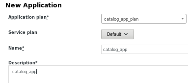
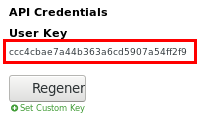
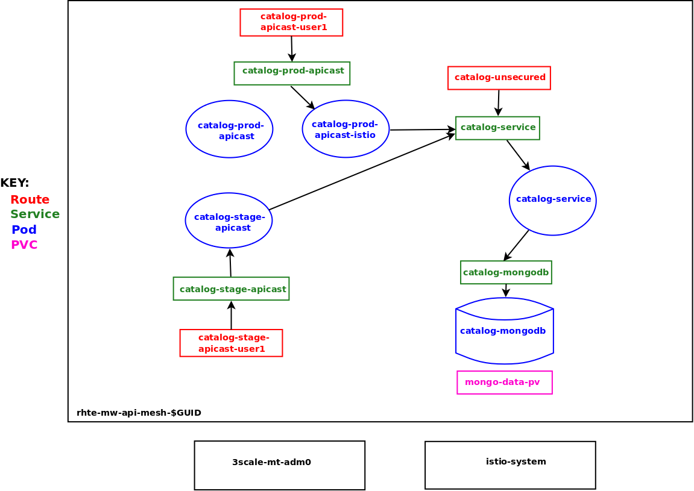
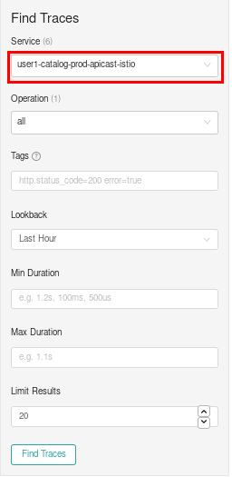
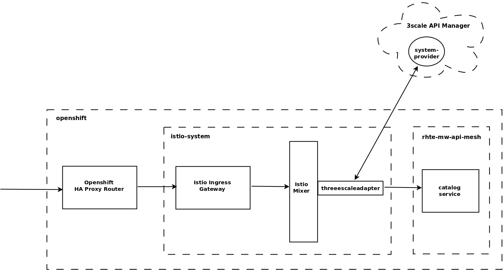

:noaudio:
:scrollbar:
:data-uri:
:toc2:
:linkattrs:
:transaction_costs: link:https://en.wikipedia.org/wiki/Transaction_cost[transaction costs]

= API Management and Service Mesh Lab

.Goals
* Inject Istio Envoy proxy configurations into an API gateway
* Configure an Istio Egress Route for an API gateway
* End-to-end distributed tracing of an MSA application using Jaeger implementation of the _OpenTracing_ specification

.Prerequisites
* Skills
** Completion of the _APIs as a Business_ lab
** Completion of the _MSA and Service Mesh_ lab

:numbered:

== Overview

_API Management_ facilitates relationships between API consumers and producers, lowering {transaction costs} such as search costs, price discovery, policing and enforcement costs, and so on. These would otherwise hinder mutually beneficial exchanges between API consumers and producers.

A _service mesh_ provides the technical resilience and _observability_ needed to facilitate a Microservice Architecture (MSA).

_API Management_ and a _service mesh_ target different use cases, although there is some overlap.

The purpose of this lab is to discover how these technologies can complement each other.
You do this by applying both a _service mesh_ and an _API Management_ solution to an existing _cloud-native_ application running on Red Hat's Openshift Container Platform.

[blue]#In this lab you gradually apply more and more features of both _API Management_ and _service mesh_ to your cloud-native application.#

=== Background

Red Hat invests in technologies that foster cloud-native applications.

. *DevOps*
+
With its _Openshift_ series of offerings, Red Hat is a significant innovator in the technologies used to facilitate _DevOps_.

. *API Management*
+
_Gartner's Magic Quadrant for Full Life Cycle API Management_ names Red Hat a leader for its 3scale API management solution.

. *Microservice Architectures (MSAs)*
+
With MSAs, the need for a _service mesh_ becomes critical.
As such, Red Hat is contributing to the Istio community project.
Red Hat is also working to productize Istio as a supported product on Red Hat's OpenShift Container Platform (OCP).

The following table provides a broad feature comparison of API Management and MSA _service mesh_ :

[width="100%",cols="1,1",options="header"]
|========================
|*Service Mesh* | *API Management*
|Service discovery|Relationship management between API producer and consumer
|Automatic retries|API consumer portal
|Timeouts|API Consumer portal CMS
|Load balancing|API domain administration
|Rating and limiting|API documentation
|Circuit breaker|API testing and request sampling
|Bulk heading|Billing
|Authorization and authentication|API methods and metrics
|Routing (DMZ, Surgical, Dynamic for Blue-green / Canary, Mirroring, Shadow traffic)|Usage limits
|Fault injection|Sign-up and subscriptions
|App level and end-to-end monitoring|Analytics that provide insight into API utilization
|Logging|
|Metrics|
|Distributed tracing|
|========================

Note that the primary purpose of Istio and service mesh management is assigning identity for the benefit of traffic control into and within the cluster/mesh.

Also note that the focus of API Management is fostering business relationships between API consumers and producers.

=== Reference

. Istio / Service Mesh:
.. link:https://docs.google.com/presentation/d/1PaE3RqyKoadllKHlPg0-kHcUrTuCeIdAe81CMk12iWw/edit#slide=id.g17a49862ec_0_0[3scale Next.Gen and Istio]
.. link:https://istio.io/docs/concepts/what-is-istio/[Community Istio Documentation]
.. link:https://github.com/Maistra/istio-operator[Red Hat community Istio (Maistra) operator]
.. link:https://maistra.io/[OpenShift Service Mesh (Maistra) project]

. Distributed Tracing:
.. link:https://github.com/opentracing[GitHub organization for OpenTracing]
+
Includes the OpenTracing specification and the OpenTracing client libraries for many languages.

.. link:https://www.jaegertracing.io/[jaegertracing.io]
.. link:https://github.com/jaegertracing/[GitHub organization for community Jaeger]
+
Includes source code of community Jaeger, and Jaeger client libraries for many languages that implement the corresponding OpenTracing client libraries.

.. link:https://istio.io/blog/2018/v1alpha3-routing/[Overview of Istio v1alpha3 routing API]

=== Alternatives

In regards to API Management and a MSA service mesh, the following are related community initiatives that are not covered in this lab.

==== Standalone community Jaeger

_Jaeger_ is a tool that provides distributed tracing.

Available in the open source community is the _all-in-one_ community Jaeger that includes a jaeger-agent and jaeger-collector.
This link:https://medium.com/@jmprusi_49013/adding-opentracing-support-to-apicast-api-gateway-a8e0a38347d2[OpenTracing tutorial] details the use of an OpenTracing-enabled API gateway with the _all-in-one_ community Jaeger.

As an alternative to the _all-in-one_ standalone Jaeger, Istio also comes included with Jaeger.
In this lab, the Jaeger-based tracing functionality provided by Istio is utilized instead of a standalone Jaeger installation.

==== Istio API Management Working Group

Istio activity is organized into _working groups_.

One of these Istio working groups is focused on link:https://github.com/istio/community/blob/master/WORKING-GROUPS.md#api-management[API Management].

Members of the  Red Hat engineering team are currently participating in this Istio API Management working group.

Outcomes of this working group may potentially guide the development and roadmap of future releases of the Red Hat 3scale API Management product.

In the future, this lab may demonstrate initiatives that may come out of this Istio API Management Working Group.

==== API Gateway Side car

link:https://github.com/nginxinc/nginmesh[nginMesh] is a community initiative that injects the NGinx server as a side-car to your services.
The NGinx side-car acts as a service proxy to an Istio service-mesh (conceptually similar to the _Envoy_ proxy that you will be exposed to in this lab).

Because the API Gateway of 3scale is also built on Nginx, the 3scale API gateway could also be potentially extended to serve as a side car to a service running in a service mesh.

In fact, in an upcoming release of the 3scale API Gateway, it will have the capability to operate independantly of the 3scale API Manager.
It could be injected as a sidecar to an application.

This approach is not covered in this lab.

== Configure and Test API Management

The following deployment topology diagram illustrates the components of this API managed environment, and the connections between them:

image::images/deployment_apicast.png[]

In this lab you incrementally add features of both _API Management_ and _service mesh_ to your cloud-native application.

=== Configure and Test

As the first step, you smoke test the management of your _catalog_ RESTful services using your API Manager and API gateways.

Instructions are provided for both experienced and inexperienced 3scale users.
[red]#Follow only one set of instructions.#

If you are an experienced user of Red Hat 3scale API Management, complete the instructions in section <<configuretestapi>>, then continue with section <<apicast_istio>>.

If you are not an experienced user of Red Hat 3scale API Management, complete the instructions in section <<configuretestapi_stepbystep>>, then continue with section <<apicast_istio>>.

[[configuretestapi_stepbystep]]
=== Configure and Test: Step-by-Step

In this section, you define a service that manages access to the Coolstore catalog service that has already been provisioned for you.

The activities in this section are also found in the prerequisite courses but are provided here as a refresher for your convenience.

==== Define Catalog Service

. From the API Manager Admin Portal home page, navigate to the *API* tab.
. On the far right, click .
. Enter `catalog_service` for the *Name* and *System Name*.
. Select *NGINX API gateway self-managed* *Gateway* type and not a plugin:
+
image::images/apicast_gw.png[]

. Scroll down the page and for the *Authentication* type, select *API Key (user_key)*:
+
image::images/select_api_key.png[]

. Click *Create Service*.

==== Create Application Plan

Application plans define access policies for your API.

. From the *Overview* page of your new `catalog_service`, scroll to the *Published Application Plans* section.
. Click *Create Application Plan*.
+
image::images/create_app_plan.png[]

. Enter `catalog_app_plan` for the *Name* and *System name*:

. Click *Create Application Plan*.
. For the  `catalog_app_plan` application plan, click *Publish*:
+
image::images/publish_app_plan.png[]

==== Create Application

In this section, you associate an application with an API consumer account.
This generates a _user key_ for the application based on the details previously defined in the application plan.
The user key is used as a query parameter to the HTTP request to invoke your business services via the on-premise API gateway.

. Navigate to the *Developers* tab.
. Select the `Developer` account.
. Create Application
.. Click the *0 Applications* link at the top:
+
NOTE: A default application may have already been created, in which case the link will indicate 1 Application, not 0.
If so, this default application is typically associated with the out-of-the-box `API` service, which is not desireable.
If it exists, click on the default application to identify which service it is associated with, then delete it.

.. Click *Create Application*.
.. Fill in the *New Application* form as follows:
... *Application plan*: `catalog_app_plan`
... *Service Plan*: `Default`
... *Name*: `catalog_app`
... *Description*: `catalog_app`
+

.. Click *Create Application*.

. On the details page for your new application (or the default application automatically created), find the API *User Key*:
+

. Create an environment variable set to this user key:
+
-----
$ echo "export CATALOG_USER_KEY=<the catalog app user key>" >> ~/.bashrc

$ source ~/.bashrc
-----

==== Service Integration

In this section, you define an _API proxy_ to manage your _catalog_ RESTful business service.

. In the API Manager Admin Portal, navigate to the *APIs* tab.
. From your `catalog_service`, select *Integration*.
. Click *Add the base URL of your API and save the configuration*.
+
* This navigates to a page that allows you to associate the API gateway staging and production URLs with your new 3scale proxy service.

. Populate the *Configuration: configure & test immediately in the staging environment* form as follows:
.. *Private Base URL*:
... Enter the internal DNS resolvable URL to your Catalog business service.
... The internal URL will be the output of the following:
+
-----
$ echo -en "\n\nhttp://catalog-service.$MSA_PROJECT.svc.cluster.local:8080\n\n"
-----

.. *Staging Public Base URL*:
+
Populate this field with the output from the following command:
+
-----
$ echo -en "\n`oc get route catalog-stage-apicast-$OCP_USERNAME -n $GW_PROJECT --template "https://{{.spec.host}}"`:443\n\n"
-----

.. *Production Public Base URL*:
+
Populate this field with the output from the following command:
+
-----
$ echo -en "\n`oc get route catalog-prod-apicast-$OCP_USERNAME -n $GW_PROJECT --template "https://{{.spec.host}}"`:443\n\n"
-----

.. *MAPPING RULES*:
+
Add an additional `Mapping Rule` for the HTTP POST method. You'll use the POST method in the last section in this lab.

... In the `MAPPING RULES` section, click *Add Mapping Rule*.
... In the new mapping rule, change the *Verb* to `POST` and enter `/` as the Pattern.
+
image::images/post_mapping.png[]

.. *API test GET request*:
+
Enter `/products`.
+
Expect to see a test *curl* command populated with the API key assigned to you for the `catalog_app_plan`:
+
image::images/apikey_shows_up.png[]
+
If you do not see an example curl command, repeat the steps to create an Application Plan and corresponding Application.
+
NOTE: When there are multiple developer accounts, Red Hat 3scale API Management uses the default developer account that is created with every new API provider account to determine which user key to use. When creating new services, the API Manager sets the first application from the first account subscribed to the new service as the default.

. Click *Update & test in Staging Environment*
.. The `apicast-stage` pod invokes your backend _catalog_ business service as per the `Private Base URL`.
.. The page should turn green with a message indicating success:
+
image::images/stage_success.png[]

. Click *Back to Integration & Configuration*
. Click *Promote v. 1 to Production*
+
image::images/stage_and_prod.png[]

Your 3scale by Red Hat service is configured.
Next, the configuration details of your service need to be propagated to your on-premise API gateway.

==== Refresh API Gateway at Boot
Every time a configuration change is made to an API proxy or application plan, the production API gateways need to be refreshed with the latest changes.

The API gateways are configured to refresh the latest configuration information from the API management platform every 5 minutes.
When this internal NGINX timer is triggered, you see log statements in your API gateway similar to the following:

.Sample Output
-----
[debug] 36#36: *3574 [lua] configuration_loader.lua:132: updated configuration via timer:

....

[info] 36#36: *3574 [lua] configuration_loader.lua:160: auto updating configuration finished successfuly, context: ngx.timer
-----

For the purpose of this lab, you can delete your API gateway pods instead of waiting for 5 minutes. Kubernetes will detect the absence of these pods and start new ones.

. Delete API gateway related pods:
+
-----
$ for i in `oc get pod -n $GW_PROJECT | grep "apicast" | awk '{print $1}'`; do oc delete pod $i; done
-----
+
Because the value of the _APICAST_CONFIGURATION_LOADER_ environment variable in the pod is set to `boot`, the service proxy configuration from the API Manager will automatically be pulled upon restart.

. Verify the API gateway related pods have been started.
+
View the latest entries in the new API gateway production pod's log file with the `tail` command.
+
* When the pods are successfully restarted, a debug-level log statement similar to the following appears:
+
.Sample Output
-----
[lua] configuration_store.lua:103: configure(): added service 2555417742084 configuration with hosts: prod-apicast-user1.apps.7777.thinkpadratwater.com, catalog-stage-apicast-user1.apps.7777.thinkpadratwater.com ttl: 300
-----

==== Test Catalog Business Service

In this section, you invoke your Catalog business service via your production API gateway.

. Verify your `$CATALOG_USER_KEY` environment variable is still set:
+
-----
$ echo $CATALOG_USER_KEY
-----

. From the terminal, execute the following:
+
-----
$ curl -v -k `echo "https://"$(oc get route/catalog-prod-apicast-$OCP_USERNAME -o template --template {{.spec.host}})"/products?user_key=$CATALOG_USER_KEY"`
-----
+
.Sample Output
-----
...

{
  "itemId" : "444435",
  "name" : "Oculus Rift",
  "desc" : "The world of gaming has also undergone some very unique and compelling tech advances in recent years. Virtual reality, the concept of complete immersion into a digital universe through a special headset, has been the white whale of gaming and digital technology ever since Nintendo marketed its Virtual Boy gaming system in 1995.",
  "price" : 106.0
}
-----

. If you are still viewing the end of `apicast` pod's log file, expect to see statements similar to this:
+
.Sample Output
-----
...

2018/08/06 19:07:46 [info] 24#24: *19 [lua] backend_client.lua:108: authrep(): backend client uri: http://backend-listener.3scale-mt-adm0:3000/transactions/authrep.xml?service_token=a4e0949f1b677611870dab3fb7c142df50871d1eca3d1c9f1615dd514c937df4&service_id=103&usage%5Bhits%5D=1&user_key=ccc4cbae7a44b363a6cd5907a54ff2f9 ok: true status: 200 body:  while sending to client, client: 172.17.0.1, server: _, request: "GET /products?user_key=ccc4cbae7a44b363a6cd5907a54ff2f9 HTTP/1.1", host: "catalog-service.rhte-mw-api-mesh-user1.svc.cluster.local"

...

-----

[blue]#Congratulations!# Your lab environment should now consist of a _catalog_ RESTful service managed by standard Red Hat 3scale API Manager 2.2 functionality.

[blue]#This is a substantial accomplishment!#
You are now utilizing the tools needed to lower the {transaction_costs} such as search costs, price discovery, policing and enforcement costs, and so on, that would otherwise hinder mutually beneficial exchanges between API consumers and producers.
Using the Red Hat 3scale API Management product, you can manage the entire life cycle of your APIs and provide added value to your customers and partners.

[[apicast_istio]]
== API Gateway: Istio enabled

=== Overview

As the next step in the journey toward API management and service mesh, in this section of the lab you will inject your API gateway with the _Envoy_ sidecar proxy from Istio.
This is of limited value on its own, but you will continue to build upon the foundations set here in later sections of this lab.

In the above diagram, notice the introduction of a new pod: _prod-apicast-istio_.
Inbound requests through the API gateway production route are now directed to this new API gateway pod injected with Istio's _envoy_ sidecar.

The _Envoy_ sidecar in your _prod-apicast-istio_ pod will interoperate with _service mesh control plane_ functionality found in the _istio-system_ namespace.

Your API gateway will continue to pull _service proxy_ configurations from the pre-provisioned multi-tenant API Manager using the value of their  _$THREESCALE_PORTAL_ENDPOINT_ environment variable.

=== Inject Istio

. Retrieve the YAML representation of the current API gateway production deployment:
+
-----
$ oc get deploy prod-apicast -n $GW_PROJECT -o yaml > $HOME/lab/prod-apicast.yml
-----
+
You will use the definition of your existing API gateway as a template to create a new _Istio_ enabled API gateway.

. Differentiate your Istio enabled API gateway from your existing API gateway:
+
-----
$ sed -i "s/prod-apicast/$OCP_USERNAME-prod-apicast-istio/" $HOME/lab/prod-apicast.yml
-----
.. The reason you have included $OCP_USERNAME in the name of your Istio enabled API gateway is because you will need to differentiate it from other Istio enabled API gateways that may be managed in the same service mesh.
.. Also, the _observability_ user interfaces included in Istio such as Jaeger are not currently multi-tenant.
+
By providing a unique identifer as a prefix to your API gateway name, you will be more easily able to identify logs and traces amongst others on the system.

. Place the deployment in a paused state:
+
-----
$ sed -i "s/replicas:\ 1/replicas: 1\n  paused: true/" $HOME/lab/prod-apicast.yml
-----

. View the configmap in the `istio-system` project:
+
-----
$ oc describe configmap istio -n istio-system | more
-----
+
Your OCP user has already been enabled with _view_ access on the _istio-system_ namespace.
This provides access to the _istio_ configuration map.
The _istio_ configmap was generated by a cluster administrator when the Istio control plane was installed on OCP.

. Inject Istio configs (from the _istio_ configmap) into a new API gateway deployment:
+
-----

$ istioctl kube-inject \
           -f $HOME/lab/prod-apicast.yml \
           > $HOME/lab/prod-apicast-istio.yml
-----
+
NOTE:  For the purpose of this lab, you have now manually injected Istio related configs into a _deployment_ definition.
Please note that the cluster administrator of the service mesh could have optionally automated the injection of these Envoy configs into all _deployments_ by default.

. View the Istio injected API gateway deployment descriptor:
+
-----
$ cat $HOME/lab/prod-apicast-istio.yml | more
-----

. Deploy a new Istio enabled API gateway production gateway:
+
-----
$ oc create \
     -f $HOME/lab/prod-apicast-istio.yml \
     -n $GW_PROJECT
-----

. Inject required resource limits and requests into Istio related containers :
+
There is a cluster quota assigned to your OCP user.
This cluster quota requires that all containers, including the _istio-proxy_ and _istio-init_, specify _limits_ and _requests_.
+
-----
$ oc patch deploy/$OCP_USERNAME-prod-apicast-istio -n $GW_PROJECT\
   --patch '{"spec":{"template":{"spec":{"containers":[{"name":"istio-proxy", "resources": {   "limits":{"cpu": "500m","memory": "128Mi"},"requests":{"cpu":"50m","memory":"32Mi"}   }}]}}}}'

$ oc patch deploy/$OCP_USERNAME-prod-apicast-istio -n $GW_PROJECT \
   --patch '{"spec":{"template":{"spec":{"initContainers":[{"name":"istio-init", "resources": {   "limits":{"cpu": "500m","memory": "128Mi"},"requests":{"cpu":"50m","memory":"32Mi"}   }}]}}}}'
-----

. Allow pods in the $GW_PROJECT to run using any user, including root:
+
-----
$ oc adm policy add-scc-to-user privileged -z default -n $GW_PROJECT --as=system:admin
-----

.. For your new Istio enabled API gateway pod to start, it needs the _anyuid_ sidecar container (SCC).
+
The reason for this is that the _envoy_ sidecar containers from Istio currently run as a specific user ID.
Unlike most middleware containers that can run using any arbitrary user ID that is assigned to them at runtime by OCP, the _envoy_ sidecar containers would immediately fail upon startup without the _anyuid_ SCC.
If you attempted to do so, you would see an error similiar to the following:
+
-----
Error creating: pods "user50-prod-apicast-istio-6456c879c8" is forbidden: unable to validate against any security context constraint: [spec.initContainers[0].securityContext.privileged: Invalid value: true: Privileged containers are not allowed capabilities.add: Invalid value: "NET_ADMIN": capability may not be added spec.initContainers[0].securityContext.privileged: Invalid value: true: Privileged containers are not allowed capabilities.add: Invalid value: "NET_ADMIN":
-----

.. For the purpose of this lab, the cluster administrator of your OCP environment has provided you with the ability to _impersonate_ the cluster administrator.
Doing so provides you with the ability to apply the _anyuid_ SCC to your project.

. Resume the paused deployment:
+
-----
$ oc rollout resume deploy/$OCP_USERNAME-prod-apicast-istio -n $GW_PROJECT
-----

.. Notice the presence of an additional container in your new pod.  This additional container is the Istio proxy sidecar.
.. Both containers in the new pod should have started and the pod should be in a _Running_ state:
+
-----
$ oc get pods

NAME                                         READY     STATUS    RESTARTS   AGE

....

user50-prod-apicast-istio-784dc96c75-gvh5f   2/2       Running   0          5m

-----
+
If either of the containers did not start up and the _READY_ column indicates anything other than _2/2_, this indicates a problem.
It's likely that _liveness_ and/or _readiness_ probes on the API gateway are failing.
It's possible that this is due to a misconfiguration of Istio.
As an initial troubleshooting step, remove the _liveness_ and _readiness_ probes defined in the deployment.
After doing so, do both containers start ?
If so, you'll need to troubleshoot the root cause of why either the _liveness_ probe, _readiness_ probe, or both probes are failing.

. Modify the _prod-apicast_ service to route to the new Istio enabled _apicast_:
+
-----
$ oc patch service/prod-apicast -n $GW_PROJECT \
   --patch '{"spec":{"selector":{"app":"'$OCP_USERNAME'-prod-apicast-istio"}}}'
-----
+
Notice that the _service_ to your backend catalog application is being modified instead of the _route_.
You have essentially conducted a simple _A / B Deployment_ at the _service_ layer where 100% of all traffic through the existing unmodified route will flow to this new Istio enabled pod.
As an alternative, _A / B Deployment_ could have occured at the _route_ layer.
This latter approach would have required you to create an additional _service_ associated with the new Istio enabled pod.

. Verify your `$CATALOG_USER_KEY` environment variable is set:
+
-----
$ echo $CATALOG_USER_KEY

d59904ad4515522ecccb8b81c761a283
-----

. From the terminal, execute the following:
+
-----
$ curl -v -k `echo "https://"$(oc get route/catalog-prod-apicast-$OCP_USERNAME -n $GW_PROJECT -o template --template {{.spec.host}})"/products?user_key=$CATALOG_USER_KEY"`
-----

.. The response should be an HTTP 404.
.. Why would this be the case ?
... Inspect the API gateway log file for any clues.
... Is the request reaching your new Istio enabled API gateway?
... The root problem is that your Istio enabled API gateway is unable to connect to the _system-provider_ endpoint exposed by the remote multi-tenant API Manager via the value of: $THREESCALE_PORTAL_ENDPOINT.
+
Your API gateway needs to do this to retrieve all the policy management configuration data from the API Manager.
The reason your API gateway can not make a connection to the API Manager is that $THREESCALE_PORTAL_ENDPOINT references an external internet URL.
By default, Istio blocks all outbound requests to the internet.
In the next section, you will define an _egress route_ to allow your API gateway to communicate with the API Manager.

.  Isolate the problem with your new Istio enabled API gateway by testing the call to the _system-provider_ of the API Manager, from within the API gateway.

.. Execute the following to test the call:
+
-----
$ oc rsh `oc get pod -n $GW_PROJECT | grep "apicast-istio" | awk '{print $1}'` \
          curl -v -k ${THREESCALE_PORTAL_ENDPOINT}/admin/api/services.json

...

Defaulting container name to user50-prod-apicast-istio.
Use 'oc describe pod/user50-prod-apicast-istio-784dc96c75-vxxz5 -n rhte-mw-api-mesh-50' to see all of the containers in this pod.
* About to connect() to user50-3scale-mt-admin.apps.8091.openshift.opentlc.com port 443 (#0)
*   Trying 52.7.161.237...
* Connected to user50-3scale-mt-admin.apps.8091.openshift.opentlc.com (52.7.161.237) port 443 (#0)
* Initializing NSS with certpath: sql:/etc/pki/nssdb
* NSS error -5938 (PR_END_OF_FILE_ERROR)
* Encountered end of file
* Closing connection 0
curl: (35) Encountered end of file
command terminated with exit code 35
-----

.. If you received an error response similar to above, you have isolated the problem to an inability for your API gateway pod to make an external call out of the service mesh.

=== Apply Custom _Egress Route_

In this section, you create a custom Istio _ServiceEntry_ that allows your API gateway to connect to the _system-provider_ of the multi-tenant API Manager.

. Create a custom Istio _Egress Route_ for API gateway configuration file:
+
-----
$ echo \
    "apiVersion: networking.istio.io/v1alpha3
kind: ServiceEntry
metadata:
  name: $OCP_USERNAME-catalog-apicast-egress-rule
spec:
  hosts:
  - $TENANT_NAME-admin.$API_WILDCARD_DOMAIN
  location: MESH_EXTERNAL
  ports:
  - name: https-443
    number: 443
    protocol: HTTPS
  resolution: DNS" \
 > $HOME/lab/catalog-apicast-egressrule.yml
-----

.. Note the value of `spec -> hosts` is set to the same value of the $THREESCALE_PORTAL_ENDPOINT specified in your 3scale API Management gateway.
.. This should allow your API gateway to connect to the route that exposes the _system-provider_ service of the multi-tenant API Manager.

. Load the new egress rule:
+
-----
$ oc create -f $HOME/lab/catalog-apicast-egressrule.yml -n $GW_PROJECT --as=system:admin
-----
+
WARNING:  This command also requires _cluster admin_ capabilities to execute.

. View new ServiceEntry:
+
-----
$ oc describe serviceentry $OCP_USERNAME-catalog-apicast-egress-rule --as=system:admin
-----
+
WARNING:  This command also requires _cluster admin_ capabilities to execute.

. Now that a custom _egress route_ has been added, your API gateway should be able to pull configuration data from the API Manager.
+
Use a command like the following to verify that your Istio enabled API gateway can now poll the API Manager for proxy service configuration information:
+
-----
$ oc rsh `oc get pod -n $GW_PROJECT | grep "apicast-istio" | awk '{print $1}'` \
     curl -k ${THREESCALE_PORTAL_ENDPOINT}/admin/api/services.json \
     | python -m json.tool | more

...

{
    "services": [
        {
            "service": {
                "backend_version": "1",
                "created_at": "2018-08-07T11:13:03Z",
                "end_user_registration_required": true,
                "id": 3,
                "links": [
                    {
                        "href": "https://user1-3scale-admin.apps.7777.thinkpadratwater.com/admin/api/services/3/metrics",
                        "rel": "metrics"
                    },

....
-----

. Either wait up to 5 minutes for your Istio enabled API gateway to refresh its proxy configuration (because pulling this configuration data previously failed) or restart the pod.
. Using the curl utility, attempt again to retrieve catalog data via your Istio enabled API gateway:
+
-----
$ curl -v -k `echo "https://"$(oc get route/catalog-prod-apicast-$OCP_USERNAME -n $GW_PROJECT -o template --template {{.spec.host}})"/products?user_key=$CATALOG_USER_KEY"`
-----
+
This time, you should see the catalog data in the response.
This request now flows through your Istio enabled API gateway.

[blue]#As mentioned previously, what you have accomplished so far is of limited value on its own. However, this is a step to full utilization of API management and service mesh of your container native application.
In the next sections of this lab you will continue to build upon this foundation.#

== Istio Ingress Gateway

Until now, traffic into the production API gateway has been directly via the standard _HAProxy_-based Kubernetes or OCP _router_.

This has worked, but what is missing is the ability to apply more sophisticated route rules and integration with service mesh _observability_ tools such as _Jaeger_ and _Prometheus_.
Istio includes an _Ingress_ gateway that implements these additional features.

In this section of the lab, you will modify the flow of inbound traffic so that it also flows through the _Ingress_ gateway of Istio.
Among other benefits, you will be able to trace inbound traffic as it initially enters your solution.

image::images/api_and_ingress_gateway.png[]

. Create an environment variable that reflects the _Production Public Base URL_ of the _catalog-service_ configured in the API Manager:
+
-----
$ export CATALOG_API_GW_HOST=`oc get route/catalog-prod-apicast-$OCP_USERNAME -n $GW_PROJECT -o template --template {{.spec.host}}`
-----
+
The value of $CATALOG_API_GW_HOST will be specified in the request to the Istio ingress gateway as an HTTP _HOST_ header.
It should match what has been configured in the _catalog-service_ in your API Manager.
+
image::images/recall_prod_base.png[]

. Create a file that defines an _Ingress_ gateway:
+
-----
$ echo \
    "apiVersion: networking.istio.io/v1alpha3
kind: Gateway
metadata:
  name: catalog-istio-gateway
spec:
  selector:
    istio: ingressgateway
  servers:
  - port:
      number: 80
      name: http
      protocol: HTTP
    hosts:
    - "$CATALOG_API_GW_HOST"" \
 > $HOME/lab/catalog-istio-gateway.yml
-----

. Create the gateway in OCP:
+
-----
$ oc create -f $HOME/lab/catalog-istio-gateway.yml -n $GW_PROJECT --as=system:admin
-----

. Create a file that defines a virtual service:
+
-----
$ echo \
    "apiVersion: networking.istio.io/v1alpha3
kind: VirtualService
metadata:
  name: catalog-istio-gateway-vs
spec:
  hosts:
  - "$CATALOG_API_GW_HOST"
  gateways:
  - catalog-istio-gateway
  http:
  - match:
    - uri:
        prefix: /products
    route:
    - destination:
        port:
          number: 8080
        host: prod-apicast" \
> $HOME/lab/catalog-istio-gateway-vs.yml
-----

. Create the virtual service in OCP:
+
-----
$ oc create -f $HOME/lab/catalog-istio-gateway-vs.yml -n $GW_PROJECT --as=system:admin
-----

. Set environment variables that reflect the host and port of the Istio Ingress gateway service:
+
-----
$ export INGRESS_HOST=$(oc -n istio-system get service istio-ingressgateway -o jsonpath='{.status.loadBalancer.ingress[0].ip}')

$ export INGRESS_PORT=$(oc -n istio-system get service istio-ingressgateway -o jsonpath='{.spec.ports[?(@.name=="http2")].port}')
-----
+
NOTE:  This $INGRESS_HOST:$INGRESS_PORT socket is local to the OpenShift Container Platform subnet.
It only becomes available when there is an Istio gateway and virtual service present and even then it might take up to 5 minutes to become available.

. Smoke test a request for catalog data via the newly configured Istio Ingress Gateway:
+
-----
$ curl -v \
       -HHost:$CATALOG_API_GW_HOST \
       http://$INGRESS_HOST:$INGRESS_PORT/products?user_key=$CATALOG_USER_KEY
-----
+
Notice the use of the HTTP _Host_ header.

.. Why is it needed ?
.. What happens if this _HOST_ header is not included in the request ?
.. What happens if this _HOST_ header is included in the request but its value (along with the _host_ attributes in the gateway and virtual service) do not match the _Production Public Base Url_ of the _catalog-service_ in the API Manager ?

. The previous smoke test used an $INGRESS_HOST and $INGRESS_PORT that are made available on the local OpenShift Container Platform network subnet.
Usage of this local $INGRESS_HOST only worked because your curl client is on the same host as OpenShift Container Platform.
+
The `istio-system` namespace provides a route called: `istio-ingressgateway`.
Like all OpenShift Container Platform routes, it is exposed to external clients.
+
Try invoking the API gateway via this `istio-ingressgateway` route instead of using the internal _service-mesh_ related $INGRESS_HOST and $INGRESS_PORT.
The results should be the same.  The command to use is as follows:
+
-----
$  curl -v \
       -HHost:$CATALOG_API_GW_HOST \
      `echo "http://"$(oc get route istio-ingressgateway -n istio-system -o template --template {{.spec.host}})"/products?user_key=$CATALOG_USER_KEY"`
-----

ifdef::showscript[]

Deletion of the route causes the curl command (using the HOST) to no longer work.  not sure why.

. The original route to the product API Gateway specific to the _catalog_ service can optionally be deleted.
Going forward all incoming traffic will flow through the Istio Ingress Gateway.
+
-----
$ oc delete route/catalog-prod-apicast-$OCP_USERNAME -n $GW_PROJECT
-----

endif::showscript[]

== API Gateway: OpenTracing enabled

=== Overview

As the next step in the journey toward utilization of API Management and Service Mesh, in this section of the lab you will begin to explore the visibility provided of your service mesh using the _OpenTracing_ implementation: _Jaeger_.

You will do so in this section by utilizing an _OpenTracing_-enabled variant of the 3scale API Gateway.

OpenTracing is a consistent, expressive, vendor-neutral API for distributed tracing and context propagation. Jaeger is one of several implementations of OpenTracing.

The API gateway that you will switch to in this section of the lab includes several additional _OpenTracing_ and _Jaeger_ related libraries:

. *ngx_http_opentracing_module_so*
+
Located at the following path in the API gateway: /usr/local/openresty/nginx/modules/ngx_http_opentracing_module.so

. *libjaegertracing.so.0*
+
Located at the following path in the API gateway: /opt/app-root/lib/libjaegertracing.so.0

These libraries provide support for the _OpenTracing_ specification using _Jaeger_.

image::images/jaeger_architecture.png[]

You will configure the OpenTracing client libraries in your API gateway to forward traces via UDP to the _jaeger-agent_.

=== Enable OpenTracing using Jaeger

. You will be making quite a few changes to your Istio-enabled API gateway.  Subsequently, put it in a paused state while those changes are being made:
+
-----
$ oc rollout pause deploy $OCP_USERNAME-prod-apicast-istio
-----

.. Verify that the _jaeger-agent_ and _jaeger-collector_ both exist in the _istio-system_ namespace :
+
-----
$  oc get service jaeger-agent jaeger-collector -n istio-system --as=system:admin

NAME           TYPE        CLUSTER-IP   EXTERNAL-IP   PORT(S)                      AGE
jaeger-agent   ClusterIP   None         <none>        5775/UDP,6831/UDP,6832/UDP   4d
jaeger-collector   ClusterIP   172.30.95.25   <none>        14267/TCP,14268/TCP          4d
-----
+
The Jaeger agent receives tracing information (in the form of UDP packets on port 6831) submitted by Jaeger client libraries embedded in applications. It forwards the tracing information in batches to the Jaeger collector.
+
Alternatively, Jaeger client libraries can push tracing information via a TCP connection directly to the _jaeger-collector_ on port 14268.

. Create a JSON configuration file that will instruct the OpenTracing and Jaeger related client libraries in the API gateway to push traces to the `jaeger-agent`:
+
-----
$   cat <<EOF > $HOME/lab/jaeger_config.json
{
    "service_name": "$OCP_USERNAME-prod-apicast-istio",
    "disabled": false,
    "sampler": {
      "type": "const",
      "param": 1
    },
    "reporter": {
      "queueSize": 100,
      "bufferFlushInterval": 10,
      "logSpans": false,
      "localAgentHostPort": "jaeger-agent.istio-system:6831"
    },
    "headers": {
      "jaegerDebugHeader": "debug-id",
      "jaegerBaggageHeader": "baggage",
      "TraceContextHeaderName": "uber-trace-id",
      "traceBaggageHeaderPrefix": "testctx-"
    },
    "baggage_restrictions": {
        "denyBaggageOnInitializationFailure": false,
        "hostPort": "jaeger-agent.istio-system:5778",
        "refreshInterval": 60
    }
}
EOF
-----

.. Pay special attention to the value of _localAgentHostPort_.
+
This is the URL of your API gateway that will push traces (via UDP) to the _jaeger-agent_ service host and port.

. Create a _configmap_ from the OpenTracing JSON file:
+
-----
$ oc create configmap jaeger-config --from-file=$HOME/lab/jaeger_config.json -n $GW_PROJECT
-----

. Mount the configmap to your OpenTracing-enabled API Gateway:
+
-----
$ oc volume deploy/$OCP_USERNAME-prod-apicast-istio --add -m /tmp/jaeger/ --configmap-name jaeger-config -n $GW_PROJECT
-----

. Set environment variables that indicate to the API gateway where to read OpenTracing related configurations:
+
-----
$ oc env deploy/$OCP_USERNAME-prod-apicast-istio \
         OPENTRACING_TRACER=jaeger \
         OPENTRACING_CONFIG=/tmp/jaeger/jaeger_config.json \
         -n $GW_PROJECT
-----

. Update the API gateway _deployment_ to use the OpenTracing and Jaeger enabled image:
+
-----
$ oc patch deploy/$OCP_USERNAME-prod-apicast-istio \
   --patch '{"spec":{"template":{"spec":{"containers":[{"name":"'$OCP_USERNAME'-prod-apicast-istio", "image": "quay.io/3scale/apicast:master" }]}}}}'
-----
+
Notice the use of a community version of the API gateway container image available in a public _quay.io_ organization.
This is the container image that includes the _opentracing_ and _jaeger_ client libraries.

. Resume your Istio and OpenTracing enabled API gateway:
+
-----
$ oc rollout resume deploy $OCP_USERNAME-prod-apicast-istio
-----

. Verify the existence of the OpenTracing library for NGinx in the API gateway.
+
Once your API gateway is back up and running, execute the following command:
+
-----
$ oc rsh `oc get pod | grep "apicast-istio" | awk '{print $1}'` ls -l /usr/local/openresty/nginx/modules/ngx_http_opentracing_module.so

...

-rwxr-xr-x. 1 root root 1457848 Jun 11 06:29 /usr/local/openresty/nginx/modules/ngx_http_opentracing_module.so
-----

. Verify the existence of the Jaeger client library in the API gateway:
+
-----
$ oc rsh `oc get pod | grep "apicast-istio" | awk '{print $1}'` ls -l /opt/app-root/lib/libjaegertracing.so.0

...

lrwxrwxrwx. 1 root root 25 Jun 11 06:38 /opt/app-root/lib/libjaegertracing.so.0 -> libjaegertracing.so.0.3.0
-----

== Jaeger UI

Often the first thing to understand about your microservice architecture is specifically which microservices are involved in an end-user transaction.

The _observability_ tooling built into Istio, either Zipkin or Jaeger, can provide this information.

In this section of the lab, you are exposed to the Jaeger user interface (UI).

The Jaeger UI provides a visual depiction of traces through the services that make up your application.

=== Terminology

An important _distributed tracing_ term to understand is: _span_.
Jaeger defines _span_ as “a logical unit of work in the system that has an operation name, an operation start time, and a duration. Spans can be nested and ordered to model causal relationships. An RPC call is an example of a span.”

Another important term to understand is: _trace_. Jaeger defines _trace_ as “a data or execution path through the system, and can be thought of as a directed acyclic graph of spans".

=== Procedure

. If you are not already there, return to the terminal window of your lab, and use the `curl` utility to invoke your catalog service (via Istio ingress gateway -> API gateway) a few times:
+
-----
$ curl -v \
       -HHost:$CATALOG_API_GW_HOST \
       `echo "http://"$(oc get route istio-ingressgateway -n istio-system -o template --template {{.spec.host}})"/products?user_key=$CATALOG_USER_KEY"`
-----

. Identify the URL to the Jaeger UI:
+
-----
$ echo -en "\n\nhttp://"$(oc get route/tracing -o template --template {{.spec.host}} -n istio-system)"\n\n"
-----

.. In a web browser, navigate to this URL.
.. In this version of Istio, the Jaeger UI is currently not secured.

. In the _Find Traces_ panel, scroll down to locate the traces associated with your OCP user name:
+

.. From the `Service` drop-down list, select the option for the API gateway associated with your username, such as $OCP_USERNAME-prod-apicast-istio.
.. In the `Operation` drop-down list, there are likely only two options available: `all` and `apicast_management`.
+
At this time, neither of these operations are particularly relevant to our use case.
The `apicast_management` operation relates to the invocations made by the _readiness_ and _liveness_ relates to probes of the deployment to the API gateway pod.

.. Return to the Jaeger UI and notice more options present in the `Operation` drop-down.
+
Select the character: '/'.
+
This corresponds to the requests flowing through the API gateway and backend catalog service.

. In the Jaeger UI, click `Find Traces`.
+
You should see an overview with timelines of all of your traces:
+
image::images/trace_overview.png[]

. Click on any one of the circles.
Each one corresponds to an invocation to your catalog service.
+
image::images/individual_trace.png[]

. Click the span relevant to _@upstream_
+
image::images/upstream_span.png[]
+
Notice that this span relates to the invocation of the `products` endpoint of your catalog service.

Traces relevant to your Istio enabled API gateway are now available .
However, tracing of the backend _catalog_ service is missing.

In the next section, you will enable your _catalog_ service to participate in this end-to-end distributed tracing.

== Catalog Service: Istio Enabled

image::images/deployment_catalog-istio.png[]

In the above diagram, notice the introduction of a new pod: _catalog-service-istio_.

Ingress requests through the _catalog-service_ are now directed to this new Istio-enabled _catalog_ pod (instead of the original _catalog_ pod that is not Istio enabled).

The new catalog service is enabled with OpenTracing and Jaeger libraries so that it can also participate in distributed tracing.

=== OpenTracing Libraries Included in Catalog Service

The _catalog service_ is link:https://github.com/gpe-mw-training/catalog-service[written in Java] using the _reactive_ programming framework link:https://vertx.io/[vert.x].

As such, the new catalog service used in the remainder of this course is embedded with the OpenTracing and Jaeger Java client libraries.

Recall that when configuring the NGinx and C++ OpenTracing/Jaeger client libraries in the API gateway, a configuration file (via a config map) was loaded.
The OpenTracing and Jaeger client libraries for Java are easier to work with.
The Java client libraries allow for configuration via environment variables.

The Dockerfile with environment variables (and their default values) utilized in building the new OpenTracing catalog image is as follows:

-----
FROM redhat-openjdk-18/openjdk18-openshift:1.5-14
ENV JAVA_APP_DIR=/deployments
ENV AB_OFF=true
EXPOSE 8080 8778 9779
COPY target/catalog-service-tracing-1.0.17.jar /deployments/
-----

The source code of the OpenTracing-enabled catalog service is available at link:https://github.com/gpe-mw-training/catalog-service/tree/jaeger-rht[https://github.com/gpe-mw-training/catalog-service/tree/jaeger-rht].

=== Inject Envoy into Catalog Service

. Retrieve YAML representation of current _catalog service_ deployment:
+
-----
$ oc get deploy catalog-service -n $MSA_PROJECT -o yaml > $HOME/lab/catalog-service.yml
-----

. Differentiate your Istio-enabled catalog service from your existing catalog service:
+
-----
$ sed -i "s/ catalog-service/ $OCP_USERNAME-cat-service-istio/" $HOME/lab/catalog-service.yml
-----

. Place the deployment in a paused state:
+
-----
$ sed -i "s/replicas:\ 1/replicas: 1\n  paused: true/" $HOME/lab/catalog-service.yml
-----

. Inject Istio configurations into a new catalog service deployment:
+
-----

$ istioctl kube-inject \
           -f $HOME/lab/catalog-service.yml \
           > $HOME/lab/catalog-service-istio.yml
-----

. View Istio-injected catalog service deployment descriptor:
+
-----
$ cat $HOME/lab/catalog-service-istio.yml | more
-----

. Create a new configmap with parameters that configure the OpenTracing-enabled catalog service:
+
-----
$ echo "service-name: $OCP_USERNAME-catalog-service
catalog.http.port: 8080
connection_string: mongodb://catalog-mongodb:27017
db_name: catalogdb
username: mongo
password: mongo
sampler-type: const
sampler-param: 1
reporter-log-spans: True
collector-endpoint: \"http://jaeger-collector.istio-system.svc:14268/api/traces\"
" > $HOME/lab/app-config.yaml

# Delete existing configmap
$ oc delete configmap app-config -n $MSA_PROJECT

# Recreate configmap using additional OpenTracing related params
$ oc create configmap app-config --from-file=$HOME/lab/app-config.yaml -n $MSA_PROJECT
-----

. Deploy a new production Istio-enabled API gateway that correctly points to the Jaeger agent in your _istio-system_ namespace:
+
-----
$ oc create \
     -f $HOME/lab/catalog-service-istio.yml \
     -n $MSA_PROJECT
-----

. Set various environment variables on the OpenTracing-enabled Catalog Service:
+
-----
$ oc set env deploy/$OCP_USERNAME-cat-service-istio APP_CONFIGMAP_NAME=app-config  -n $MSA_PROJECT

$ oc set env deploy/$OCP_USERNAME-cat-service-istio APP_CONFIGMAP_KEY=app-config.yaml  -n $MSA_PROJECT

# Allows for optionally debugging of catalog service so as to better understand how exactly it utilizes the opentracing / jaeger java libraries
$ oc set env deploy/$OCP_USERNAME-cat-service-istio JAVA_DEBUG=true  -n $MSA_PROJECT
$ oc set env deploy/$OCP_USERNAME-cat-service-istio JAVA_DEBUG_PORT=8787  -n $MSA_PROJECT
-----

. Inject required resource limits and requests into Istio-related containers :
+
There is a clusterquota assigned to your OCP user.
This clusterquota requires that all containers, including the _istio-proxy_ and _istio-init_, specify _limits_ and _requests_.
+
-----
$ oc patch deploy/$OCP_USERNAME-cat-service-istio \
   --patch '{"spec":{"template":{"spec":{"containers":[{"name":"istio-proxy", "resources": {   "limits":{"cpu": "500m","memory": "128Mi"},"requests":{"cpu":"50m","memory":"32Mi"}   }}]}}}}' \
   -n $MSA_PROJECT

$ oc patch deploy/$OCP_USERNAME-cat-service-istio \
   --patch '{"spec":{"template":{"spec":{"initContainers":[{"name":"istio-init", "resources": {   "limits":{"cpu": "500m","memory": "128Mi"},"requests":{"cpu":"50m","memory":"32Mi"}   }}]}}}}' \
   -n $MSA_PROJECT
-----

. Update the new catalog service deployment to use the OpenTracing and Jaeger enabled image:
+
-----
$ oc patch deploy/$OCP_USERNAME-cat-service-istio \
   --patch '{"spec":{"template":{"spec":{"containers":[{"name":"'$OCP_USERNAME'-cat-service-istio", "image": "docker.io/rhtgptetraining/catalog-service-tracing:1.0.17" }]}}}}' \
   -n $MSA_PROJECT
-----

ifdef::showscript[]

    based on:  https://github.com/gpe-mw-training/catalog-service/tree/jaeger-rht

endif::showscript[]

. Resume the paused deployment:
+
-----
$ oc rollout resume deploy/$OCP_USERNAME-cat-service-istio -n $MSA_PROJECT
-----

. Modify the _service_ to route to the new Istio-enabled catalog service:
+
-----
$ oc patch service/catalog-service \
   --patch '{"spec":{"selector":{"deployment":"'$OCP_USERNAME'-cat-service-istio"}}}' \
   -n $MSA_PROJECT
-----

. The original catalog service is no longer needed.  Scale it down as follows:
+
-----
$ oc scale deploy/catalog-service --replicas=0 -n $MSA_PROJECT
-----

. Ensure your `$CATALOG_USER_KEY` and `$CATALOG_API_GW_HOST` environment variables remain set:
+
-----
$ echo $CATALOG_USER_KEY

d59904ad4515522ecccb8b81c761a283

$ echo $CATALOG_API_GW_HOST

catalog-prod-apicast-developer.apps.clientvm.b902.rhte.opentlc.com
-----

. From the terminal, use the `curl` utility as you have done previously to invoke your catalog service several times via the Istio ingress.
.. Review the log file of your Istio-enabled catalog service:
+
-----
$ oc logs -f `oc get pod -n $MSA_PROJECT | grep "istio" | awk '{print $1}'` -c $OCP_USERNAME-cat-service-istio -n $MSA_PROJECT
-----

.. With every invocation of the `getProducts` function of the catalog service, there should be a log statement as follows:
+
-----
INFO: getProducts() started span ...
-----

. Return to the Jaeger UI and locate your traces.
.. Notice that there is now a new `service` corresponding to your Istio-enabled catalog service:
+
image::images/new_istio_cat_trace.png[]

.. Drill into this service and notice the _spans_ (to include the span corresponding to invocation of the `getProducts()` function).
+
image::images/spans_with_catalog.png[]

== Red Hat 3scale API Management Analytics

Return to your API Manager as the domain administrator and navigate to the _Analytics_ tab.

image::images/3scale_analytics.png[]

Notice that the _hits_ metric for your _catalog_service_ API is automatically depicted.
3scale analytics can depict the total count of _hits_ on both the API and the API method level graphed over time.

Your API analytics are currently course-grained in that the _hits_ are the sum of invocations on all methods of your catalog service.
Defining fine-grained _methods_ and _mappings_ for your catalog API will subsequently provide for more fine-grained analytics at the method level.

The analytics provided by Red Hat 3scale API Management complement the distributed tracing capabilities of Jaeger.

Prometheus is an analytics tool that comes by default with Istio and is being closely integrated with Red Hat OpenShift.
The analytics and observability provided by Prometheus are conceptually similar to the analytics provided by the Red Hat 3scale API Management.
It is possible that a future version of Red Hat 3scale API Management will provide support for Prometheus for API data analytics.

== 3scale Mixer Adapter

=== Overview

The Red Hat 3scale API Management engineering team is actively working on an Istio _mixer_ adapter.
This Istio mixer adapter will allow Red Hat 3scale API Management policies to be applied directly to the _service mesh_.

In the above diagram, [blue]#notice the replacement of an API Gateway with the Istio 3scale Mixer Adapter#.

=== Disable Existing API Gateways

Your API gateways will no longer be needed.
Inbound traffic will flow through the Istio Ingress gateway directly to the 3scale Istio Mixer and out to the remote 3scale API Manager.

Subsequently, the API gateways and any associated routing rules can be deleted.

. Scale down the non-Istio-enabled API gateway:
+
-----
$ oc scale deploy/prod-apicast --replicas=0 -n $GW_PROJECT
-----

. Scale down the Istio-enabled API gateway:
+
-----
$ oc scale deploy/$OCP_USERNAME-prod-apicast-istio --replicas=0 -n $GW_PROJECT
-----

. Remove virtual service:
+
-----
$ oc delete virtualservice catalog-istio-gateway-vs -n $GW_PROJECT --as=system:admin
-----

. Remove gateway:
+
-----
$ oc delete gateway catalog-istio-gateway -n $GW_PROJECT --as=system:admin
-----

=== New Virtual Service to Catalog Service

You will create a routing rule to invoke the backend catalog service directly via the Istio _ingress_ gateway.

Later, more complex routing rules will modify the flow to redirect through the 3scale Istio Mixer adapter.

. Ensure the $NAKED_CATALOG_ROUTE environment variable still remains in your shell:
+
-----
$ echo $NAKED_CATALOG_ROUTE

catalog-unsecured-rhte-mw-api-mesh-a1001.apps.clientvm.b902.rhte.opentlc.com
-----

. Define a gateway and virtual service that routes inbound traffic (with a web context of _/path_) directly to your backend catalog service.
+
-----
$ echo \
    "apiVersion: networking.istio.io/v1alpha3
kind: Gateway
metadata:
  name: catalog-direct-gw
spec:
  selector:
    istio: ingressgateway
  servers:
  - port:
      number: 80
      name: http
      protocol: HTTP
    hosts:
    - \"*\"
---
apiVersion: networking.istio.io/v1alpha3
kind: VirtualService
metadata:
  name: catalog-direct-vs
spec:
  hosts:
  - \"*\"
  gateways:
  - catalog-direct-gw
  http:
  - match:
    - uri:
        prefix: /products
    - uri:
        prefix: /product
    route:
    - destination:
        host: catalog-service
        port:
          number: 8080" \
 > $HOME/lab/catalog-direct-gw-vs.yml
-----
+
Notice that a match is made for all context paths exposed by the catalog service:  `/products` and `/product`.

. Create the gateway and virtual service in your $MSA_PROJECT :
+
-----
$ oc create -f ~/lab/catalog-direct-gw-vs.yml -n $MSA_PROJECT --as=system:admin
-----

. Bounce the Istio _policy_ pod:
.. With the 1.0.0 version of community Istio, the Istio policy may get into an unstable state.
Before progressing with management of more sophisticated routing rules to support the 3scale Istio Mixer, it is recommended to bounce the _policy_ pod.

.. Execute:
+
-----
$ oc delete pod \
     `oc get pod -n istio-system | grep "istio-policy" | awk '{print $1}'` \
     -n istio-system \
     --as=system:admin
-----

.. View the log file of the refreshed Istio policy pod:
+
-----
$ oc logs -f `oc get pod -n istio-system | grep "istio-policy" | awk '{print $1}'` -c mixer -n istio-system

....

IntrospectionOptions: ctrlz.Options{Port:0x2694, Address:"127.0.0.1"}
warn    Neither --kubeconfig nor --master was specified.  Using the inClusterConfig.  This might not work.
info    Built new config.Snapshot: id='0'
info    Cleaning up handler table, with config ID:-1
info    Built new config.Snapshot: id='1'
info    adapters        getting kubeconfig from: ""     {"adapter": "handler.kubernetesenv.istio-system"}
warn    Neither --kubeconfig nor --master was specified.  Using the inClusterConfig.  This might not work.
info    adapters        Waiting for kubernetes cache sync...    {"adapter": "handler.kubernetesenv.istio-system"}
info    adapters        Cache sync successful.  {"adapter": "handler.kubernetesenv.istio-system"}
info    Cleaning up handler table, with config ID:0
info    adapters        serving prometheus metrics on 42422     {"adapter": "handler.prometheus.istio-system"}
 Mixer: root@71a9470ea93c-docker.io/istio-1.0.0-3a136c90ec5e308f236e0d7ebb5c4c5e405217f4-Clean
Starting gRPC server on port 9091
info    ControlZ available at 172.17.0.10:9876
-----

. From the terminal, conduct a smoke test to validate traffic to the catalog service directly from the Istio ingress gateway.
.. For all of the following smoke tests, notice that the API _user_key_ is not being specified.
It is not needed in these smoke tests because this inbound traffic is no longer flowing through your API gateway.

.. POST a new catalog item:
+
-----
$ curl -v -X POST -H "Content-Type: application/json" `echo "http://"$(oc get route istio-ingressgateway -n istio-system -o template --template {{.spec.host}})""`/product/ -d '{
  "itemId" : "822222",
  "name" : "Oculus Rift 2",
  "desc" : "Oculus Rift 2",
  "price" : 102.0
}'
-----

.. View details of the recently posted catalog item:
+
-----
$ curl -v `echo "http://"$(oc get route istio-ingressgateway -n istio-system -o template --template {{.spec.host}})"/product/822222"`
-----

.. View details of all catalog items:
+
-----
$ curl -v `echo "http://"$(oc get route istio-ingressgateway -n istio-system -o template --template {{.spec.host}})"/products"`
-----

=== 3scale Istio Mixer

In this section of the lab, you provision the community 3scale Istio Mixer in your _istio-system_ namespace.

The Istio Mixer that will be utilized will originate from the following community image in Red Hat's _Quay_ container image registry:

-----
quay.io/3scale/apicast:3scale-http-plugin
-----

. Clone the source code of the 3scale Istio Mixer to your lab environment:

.. For the purpose of this lab, the source code utilized is an unmodified fork of the upstream community at link:https://github.com/3scale/istio-integration[].
.. Execute:
+
-----
$ git clone \
      --branch rhte-2018 \
      https://github.com/gpe-mw-training/istio-integration.git \
      $HOME/lab/istio-integration
-----

. Load the Istio Mixer Adapter deployment (found in the 3scale Istio integration project you just cloned) into the istio-system namespace:
+
-----
$ oc create -f $HOME/lab/istio-integration/3scaleAdapter/openshift -n istio-system --as=system:admin
-----

. Set the 2 containers to debug log level:
+
-----
$ oc set env dc/3scale-istio-adapter --containers="3scale-istio-adapter" -e "THREESCALE_LOG_LEVEL=debug" -n istio-system --as=system:admin

$ oc set env dc/3scale-istio-adapter --containers="3scale-istio-httpclient" -e "APICAST_LOG_LEVEL=debug" -n istio-system --as=system:admin
-----

. Verify that the 3scale Istio Mixer Adapter pod has started with 2 containers:
+
-----
$ oc get pods -n istio-system | grep 3scale-istio-adapter

3scale-istio-adapter-1-t9kj2                2/2       Running     0          47s
-----
+
image::images/mixer_architecture.png[]
+
As per the diagram above, the two containers are as follows:

.. *3scale-istio-adapter*
+
Accepts gRPC invocations from Istio Ingress and routes to the other side car in the pod:  _3scale-istio-httpclient_

.. *3scale-istio-httpclient*
+
Accepts invocations from _3scale-istio-adapter_ and invokes the _system-provider_ and _backend-listener_ endpoints of the remote 3scale API Manager.

. Inject the 3scale handler into the Istio Mixer Adapter:
+
-----
$ oc create -f $HOME/lab/istio-integration/3scaleAdapter/istio/authorization-template.yaml --as=system:admin

$ oc create -f $HOME/lab/istio-integration/3scaleAdapter/istio/threescale-adapter.yaml --as=system:admin
-----
+
Embedded in these YAML files is the 3scale handler that is injected into the Istio Mixer.
The discouraged alternative to injecting a mixer adapter would be to develop the 3scale handler directly in the Istio mixer source code and then compile and deploy this entire modified Istio mixer.

=== 3scale mixer adapter configs

Now that the 3scale Istio mixer adapter is running, various configurations need to be added to the service mesh.

In particular, you will create routing logic that directs ingress traffic destined for your backend catalog service through the 3scale Istio Mixer adapter.

. In the details of your _catalog_ service in the API Manager admin console, locate the `ID for API calls ... `:
+
image::images/service_id.png[]

. Set an environment variable that captures this catalog service Id:
+
-----
$ export CATALOG_SERVICE_ID=<your catalog service Id>
-----

. Review the `threescale-adapter-config.yaml` file :
+
-----
$ cat $HOME/lab/istio-integration/3scaleAdapter/istio/threescale-adapter-config.yaml | more
-----

. Modify the `threescale-adapter-config.yaml` file with id of your _catalog_ service:
+
-----
$ sed -i "s/service_id: .*/service_id: \"$CATALOG_SERVICE_ID\"/" \
      $HOME/lab/istio-integration/3scaleAdapter/istio/threescale-adapter-config.yaml
-----

. Modify the `threescale-adapter-config.yaml` file with the URL to your API Manager tenant:
+
-----
$ sed -i "s/system_url: .*/system_url: \"https:\/\/$TENANT_NAME-admin.$API_WILDCARD_DOMAIN\"/" \
      $HOME/lab/istio-integration/3scaleAdapter/istio/threescale-adapter-config.yaml
-----

. Modify the `threescale-adapter-config.yaml` file with the admin access token of your API Manager admin account:
+
-----
$ sed -i "s/access_token: .*/access_token: \"$API_ADMIN_ACCESS_TOKEN\"/" \
      $HOME/lab/istio-integration/3scaleAdapter/istio/threescale-adapter-config.yaml
-----

. Load the 3scale Istio Handler configurations :
+
-----
$ oc create -f $HOME/lab/istio-integration/3scaleAdapter/istio/threescale-adapter-config.yaml --as=system:admin

...

handler.config.istio.io "threescalehandler" created
instance.config.istio.io "threescaleauthorizationtemplate" created
rule.config.istio.io "usethreescale" created
-----

. Verify that the Istio Handler configurations were created in the istio-system namespace:
+
-----
$ oc get handler -n istio-system --as=system:admin -o yaml

apiVersion: v1
items:
- apiVersion: config.istio.io/v1alpha2
  kind: handler

  ....

  spec:
    adapter: threescale
    connection:
      address: threescaleistioadapter:3333
    params:
      access_token: fa16cd9ebd66jd07c7bd5511be4b78ecf6d58c30daa940ff711515ca7de1194a
      service_id: "103"
      system_url: https://user50-3scale-mt-admin.apps.4a64.openshift.opentlc.com

-----

=== Smoke Test 3scale Istio Mixer Adapter

. From the terminal, execute the following to invoke your catalog service directly via the Istio ingress:
+
-----
$ curl -v \
       `echo "http://"$(oc get route istio-ingressgateway -n istio-system -o template --template {{.spec.host}})"/products"`

...

< HTTP/1.1 403 Forbidden
< content-length: 57
< content-type: text/plain
< date: Tue, 18 Sep 2018 01:24:41 GMT
< server: envoy
< Set-Cookie: cd10b69e39387eb7ec9ac241201ab1ab=7a5ade075364285d1aba87dfec588d36; path=/; HttpOnly
<
* Connection #0 to host istio-ingressgateway-istio-system.apps.clientvm.b902.rhte.opentlc.com left intact
PERMISSION_DENIED:threescalehandler.handler.istio-system:
-----

.. Notice a 403 error response of `PERMISSION_DENIED:threescalehandler.handler.istio-system:`
.. This is to be expected.
Inbound requests through the Istio Ingress are now correctly flowing through the mixer to the 3scale adapter.
In the above request however, the API _user_key_ associated with your catalog service _application_ has been ommitted.
.. View the log file of the 3scale adapter:
+
-----
$ oc logs -f `oc get pod -n istio-system | grep "3scale-istio-adapter" | awk '{print $1}'` \
          -n istio-system \
          -c 3scale-istio-adapter

debug   Got adapter config: &Params{ServiceId:103,SystemUrl:https://user100-3scale-mt-adm1-admin.apps.4a64.openshift.opentlc.com,AccessToken:xxxxxxxxxx,}
debug   Returning result: {Status:{Code:7 Message: Details:[] XXX_NoUnkeyedLiteral:{} XXX_unrecognized:[] XXX_sizecache:0} ValidDuration:1ms ValidUseCount:0}
-----

. Re-attempt invocation of your catalog service using the catalog service _user_key_:
+
-----
$ curl -v \
       `echo "http://"$(oc get route istio-ingressgateway -n istio-system -o template --template {{.spec.host}})"/products?user_key=$CATALOG_USER_KEY"`
-----

[blue]#Congratulations! The catalog service is backed to being managed and secured by the 3scale API Manager.#
This time however, the 3scale Istio Mixer adapter is being utilized rather than the API gateway.

=== Fine tune 3scale Istio Mixer Adapter rules

At this point, *all* traffic inbound through the Istio ingress is configured to route through the 3scale Istio Mixer adapter.
Your use case may require more fine-grained routing rules.

In this last section of the lab, you specify that requests for the catalog `/products` endpoint can by-pass the 3scale Istio Mixer adapter and invoke the catalog service directly.
All requests to the `/product` endpoint will continue to require authentication via the 3scale Istio Mixer adapter.

. Modify the existing `usethreescale` rule:
+
-----
$ oc patch rule/usethreescale \
       --type=json \
       --patch '[{"op": "add", "path": "/spec/match", "value":"destination.service == \"catalog-service.'$MSA_PROJECT'.svc.cluster.local\" && source.namespace != \"'$MSA_PROJECT'\" && request.method == \"POST\" && request.path.startsWith(\"/product\")"  }]' \
       -n istio-system \
       --as=system:admin
-----
+
This modification introduces a fine grained _match_ rule with various conditions.
+
Only when all of the conditions are met, will the inbound traffic be routed to the 3scale mixer adapter.
+
The conditions of the rule are as follows:

.. The destination service needs to be the backend catalog service.
.. The inbound request needs to originate from outside the $MSA_PROJECT (ie: from the istio-ingress of the istio-system).
.. The target is the `/product/` endpoint (which allows for POST, DELETE and GET methods).

. Re-attempt invocation of your catalog service *without* the catalog service _user_key_:
+
-----
$ curl -v \
       `echo "http://"$(oc get route istio-ingressgateway -n istio-system -o template --template {{.spec.host}})"/products"`
-----
+
This request should have now been routed directly to your backend catalog service.
This is because the `/products` endpoint is being invoked (which fails the 3rd condition of the rule).
Subsequently, the API _user_key_ is not needed.

. Attempt to POST a new catalog service *without* the catalog service _user_key_:
+
-----
$ curl -v \
       -X POST \
       -H "Content-Type: application/json" \
       `echo "http://"$(oc get route istio-ingressgateway -n istio-system -o template --template {{.spec.host}})"/product"` \
       -d '{
  "itemId" : "833333",
  "name" : "Oculus Rift 3",
  "desc" : "Oculus Rift 3",
  "price" : 103.0
}'
-----
+
This request should have been routed to the 3scale Istio Mixer adapter.
This is because all 3 conditions of the routing rule have met.
Subsequently, because the API _user_key_ was not applied, the response should be a 403 PERMISSION DENIED .

. Re-Attempt to POST a new catalog service using the catalog service _user_key_:
+
-----
$ curl -v \
       -X POST \
       -H "Content-Type: application/json" \
       `echo "http://"$(oc get route istio-ingressgateway -n istio-system -o template --template {{.spec.host}})"/product?user_key=$CATALOG_USER_KEY"` \
       -d '{
  "itemId" : "833333",
  "name" : "Oculus Rift 3",
  "desc" : "Oculus Rift 3",
  "price" : 103.0
}'
-----
+
This request should have been routed to the 3scale Istio Mixer adapter.
Subsequently, because the API _user_key_ was applied, the response should be a 201 Created .

=== Extra Credit

Thus far, specific endpoints of a single backend _catalog_ service are being managed by the API Manager via the 3scale Istio Mixer adapter.

As an additional exercise, introduce a new backend business service into your service mesh.
Have this backend business service also managed by the API Manager via the 3scale Istio Mixer adapter.

What configurations need to be modified or added ?

== Questions

. Which of the following libraries is embedded in community API gateway to support distributed tracing?
+
-----
a) ngx_http_opentracing_module.so
b) libjaegertracing.so.0
c) libzipkintracing.so.0
d) A and B
-----

. What is the name of the CustomResourceDefinition introduced by Istio's v1alpha3 routing API that allows for configuration of an egress route?
+
-----
a) EgressRule
b) DestinationRule
c) ServiceEntry
d) EgressRoute
-----

. The Jaeger java client library provides which of the following features?
+
-----
a) Propogation of traces to the jaeger-agent via UDP on port 6831
b) Propogation of traces to the jaeger-collector via TCP by specifying the environment variable: JAEGER_ENDPOINT
c) Setting of the trace sampler type via the environment variable: JAEGER_SAMPLER_TYPE
d) All of the above
-----

. Which of the following are feature of the Red Hat 3scale product that are not found in Istio ?
+
-----
a) Developer portal
b) Rate limiting
c) Billing
d) A and C
-----

ifdef::showscript[]
1)  answer D
2)  answer C
3)  answer D
4)  answer D
endif::showscript[]

== Conclusion

In this lab you where exposed to the following:

* Injection Istio Envoy proxy configs into an API gateway
* Configuration of an Istio Egress Route to allow the API gateway to communicate to the remote API Manager
* Invocation of your backend service via the Istio Ingress gateway and 3scale API gateway
* End-to-end distributed tracing of a MSA application using Jaeger implementation of the _OpenTracing_ specification
* Review of the analytics dashboard provided by 3Scale
* Introduction to the 3scale Mixer Adapter

== Appendix

[[configuretestapi]]
=== Configure and Test API Mgmt : Experienced

If you are already proficient with 3scale, then configure and test the management of your _catalog_ RESTful API as per the following :

. Ensure your API gateways started correctly and the value of the _THREESCALE_ENDPOINT_ makes sense.
. Create an API proxy service called _catalog_service_ and configure it to use the API gateway and an API key for security.
. Create an application plan called: _catalog_app_plan_
. Using the existing _Developer_ account and the _catalog_app_plan_, create an application called: _catalog_app_
. Capture the API key for the application and set its value as the following environment variable in your shell terminal:  _CATALOG_USER_KEY_ .
. Configure the _Integration_ section of your _catalog_service_ and publish the service to production.
.. Create mapping rules for the GET, POST and DELETE verbs.
. Test the _/products_ endpoint of your _catalog_ RESTful service via both your staging and production API gateways.
+
You'll likely want to use the curl utility in a manner similar to the following:
+
-----
$ curl -v -k \
       `echo "https://"$(\
        oc get route/catalog-prod-apicast-$OCP_USERNAME \
        -n $GW_PROJECT \
        -o template --template {{.spec.host}})"/products?user_key=$CATALOG_USER_KEY"`
-----
+
WARNING: [red]#Don't proceed beyond this section until this smoke test of your non istio enabled environment passes and the response from your production API gateway is a listing of catalog data#

Once you've smoke tested your API managed environment, proceed to the section: <<apicast_istio>>

=== Delete 3scale Istio Mixer releated artifacts

For convenience, the following script is provided if/when there is a need to delete 3scale Istio Mixer related artifacts.

. Create deletion script:
+
-----
$ echo "
oc delete dc 3scale-istio-adapter -n istio-system --as=system:admin
oc delete handler threescalehandler -n istio-system --as=system:admin
oc delete instance threescaleauthorizationtemplate -n istio-system --as=system:admin
oc delete rule usethreescale -n istio-system --as=system:admin
oc delete adapter threescale -n istio-system --as=system:admin
oc delete template authorization -n istio-system" --as=system:admin \
> $HOME/lab/delete_mixer.sh

$ chmod 755 $HOME/lab/delete_mixer.sh

$ $HOME/lab/delete_mixer.sh
-----

ifdef::showscript[]

[[istio_troubleshooting]]
=== Istio troubleshooting

[red]#TO_DO#

. https://bani.com.br/2018/08/istio-mtls-debugging-a-503-error/

echo -en "\n\ncurl -k ${THREESCALE_PORTAL_ENDPOINT}/admin/api/services.json\n\n"                                    :   test retrival of proxy service info from system-provider

oc rsh `oc get pod | grep "prod-apicast-istio" | awk '{print $1}'` curl localhost:8090/status/live                  :   test liveness probe of istio enabled apicast
oc rsh `oc get pod | grep "prod-apicast-istio" | awk '{print $1}'` curl localhost:8090/status/ready                 :   test readiness probe of istio enabled apicast

oc rsh `oc get pod | grep "apicast-istio" | awk '{print $1}'`                                                       :   ssh into istio enabled API gateway gw

oc logs -f  `oc get pod | grep "apicast-istio" \
            | grep "Running" \
            | awk '{print $1}'` -c $OCP_USERNAME-prod-apicast-istio                                                 :   log of istio enabled API gateway gw

for i in `oc get pod | grep "apicast-istio" | awk '{print $1}'`; do oc delete pod $i; done                          :   Re-dploy Istio enabled API gateway

TO-DO
  1)  Is a liveness probe necessary for API gateway ?  API gateway appears to error out on its own during boot problems.
  2)  With liveness and readiness probes removed, API gateway boot error behaves differently depending on whether it is injected with istio
        - istio injected :   API gateway boot errors cause fail-over the first 2 or 3 times.  Then no longer any errors.
        - no istio       :   API gateway continues to fail upon boot errors

      Turns out envoy proxy is blocking outbound calls at boot for about 1 minute or so
      All outbound calls from primary pods (ie:  API gateway invocation to THREESCALE_PORTAL_ENDPOINT and vert.x / fabric8 invocation to kubernetes API to query for configmap) during that time are blocked.

      https://github.com/istio/istio/issues/3533        :   startup time of istio-proxy causes comm issues for up to 30 seconds

  3) investigate istio-ingress
        OCP ha-proxy -> istio-ingress -> API gateway gw -> catalog service

  4) when API gateway is in info log level, why does it stop rebooting itself when a THREESCALE_PORTAL_ENDPOINT related problem is encountered ?
     when API gateway is in debug log level, it continues to cycle when it encounters a THREESCALE_PORTAL_ENDPOINT problem .

  5) with istio injected apicast, boot doesn't start however a curl within the same pod on THREESCALE_PORTAL_ENDPOINT does work

  6) allow user write access to istio-system to allow for execution of:  "istioctl create"

  7) opentracing enabled apicast
        - quay.io/3scale/apicast:master
        - OPENTRACING_TRACER:           Which Tracer implementation to use, right now, only Jaeger is available.
        - OPENTRACING_CONFIG:           Each tracer has a default configuration file, you can see an example here: jaeger.example.json
        - OPENTRACING_HEADER_FORWARD:   By default, uses uber-trace-id, if your OpenTracing has a different configuration, you will need to change this value, if not, ignore it.

        .. [red]#TODO Investigate why liveness and readiness probes are failing#
        +
        -----
        Readiness probe failed: Get http://10.1.3.121:8090/status/ready: dial tcp 10.1.3.121:8090: getsockopt: connection refused
        Liveness probe failed: Get http://10.1.3.121:8090/status/live: dial tcp 10.1.3.121:8090: getsockopt: connection refused

        -----

The _info_ log level in API gateway actually provides more useful connection error details than does the _debug_ log level.
+
This will become important because we are about to encounter a connection related error now that Istio is introduced .
The connection problem will be in the API gateway at boot when it attempts to pull (using the value set in its THREESCALE_PORTAL_ENDPOINT env variable) _proxy-config_ information from the _system-provider_ of the API Manager.

. Investigate _apicast_ provisioning problem
+
-----
$ oc logs -f `oc get pod | grep "apicast-istio" | awk '{print $1}'` -c $OCP_USERNAME-prod-apicast-istio

...

2018/08/02 08:32:23 [warn] 23#23: *2 [lua] remote_v2.lua:163: call(): failed to get list of services: invalid status: 0 url: https://user1-3scale-admin.apps.7777.thinkpadratwater.com/admin/api/services.json, context: ngx.timer
2018/08/02 08:32:23 [info] 23#23: *2 [lua] remote_v1.lua:98: call(): configuration request sent: https://user1-3scale-admin.apps.7777.thinkpadratwater.com/admin/api/nginx/spec.json, context: ngx.timer
2018/08/02 08:32:23 [error] 23#23: *2 peer closed connection in SSL handshake, context: ngx.timer
2018/08/02 08:32:23 [warn] 23#23: *2 [lua] remote_v1.lua:108: call(): configuration download error: handshake failed, context: ngx.timer
ERROR: /opt/app-root/src/src/apicast/configuration_loader.lua:57: missing configuration
stack traceback:
	/opt/app-root/src/src/apicast/configuration_loader.lua:57: in function 'boot'
	/opt/app-root/src/libexec/boot.lua:6: in function 'file_gen'
	init_worker_by_lua:49: in function <init_worker_by_lua:47>
	[C]: in function 'xpcall'
	init_worker_by_lua:56: in function <init_worker_by_lua:54>

-----

.. From the log file, notice that initial warning indicates a failure "to get list services" from the API Manager _system-provider_ service.
+
Why would you expect that the _curl_ utility to be able to pull the _service-proxy_ data when rsh'd into the API gateway but the API gateway itself fails to do so ?

== istio / OCP workshop problem

[2018-08-11 21:02:53.607][154][info][config] external/envoy/source/server/listener_manager_impl.cc:903] all dependencies initialized. starting workers
2018-08-11T21:02:57.106685Z	warn	Epoch 0 terminated with an error: signal: killed
2018-08-11T21:02:57.106713Z	warn	Aborted all epochs
2018-08-11T21:02:57.106739Z	info	Epoch 0: set retry delay to 3.2s, budget to 5
2018-08-11T21:03:00.306904Z	info	Reconciling configuration (budget 5)

=== Lab Focus: Configuration

The emphasis of this lab is on configuration: specifically, configuration of a _Cloud Native _ application managed by 3scale and an Istio  _Service Mesh_.

Students of this lab will not write any business logic.

Development of cloud native applications can be written in a wide variety of development platforms offered by Red Hat to include:

. Red Hat Openshift Application Runtimes (RHOAR)
. Red Hat Fuse on OpenShift

Details about these Red Hat development platforms are out of scope for this specific lab.

endif::showscript[]

ifdef::showscript[]
endif::showscript[]
