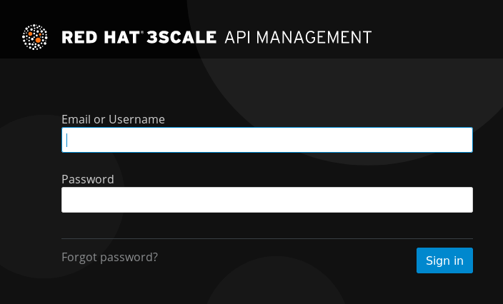

:noaudio:
:scrollbar:
:data-uri:
:toc2:
:linkattrs:

= API Mgmt and Service Mesh Lab

.Goals
* Inject Istio Envoy proxy configs into an Apicast gateway
* Configure an Istio Egress Route for an Apicast gateway
* End-to-end distributed tracing of a MSA application using Jaeger implementation of the _OpenTracing_ specification

.Prerequisite
* Skills
** Completion of the _APIs as a Business_ lab
** Completion of the _MSA and Service Mesh_ lab
* Tools
** `curl` utility
** `oc` version 3.9 utility

:numbered:

== Overview

An _Istio_ based service mesh introduces features that somewhat resumble features found in an API management solution.

The purpose of this lab is to explore what a Container Native application managed by both a _service mesh_ and an API management solution could look like.

=== Benefits

== Lab Asset Overview

=== Environment Variables

Before getting started, you'll want to open a terminal window and set the following environment variables that will be used throughout the duration of this lab.

ifdef::showscript[]
If student lab environment and 3scale tenants were provisioned using the ocp-workload-rhte-mw-api-mesh ansible role, then student details can be found in:

/tmp/3scale_tenants/user_info_file.txt

endif::showscript[]

-----
######  Instructor will provide to you the values to these environment variables #######

$ export REGION=<provided by your instructor>
$ export OCP_USER_ID=<provided by your instructor>
$ export API_ADMIN_ACCESS_TOKEN=<provided by your instructor>

#######  Using the above variables, the following can now be copied and pasted in the same terminal window   ########

$ export OCP_WILDCARD_DOMAIN=apps.$REGION.openshift.opentlc.com
$ export TENANT_NAME=$OCP_USER_ID-3scale
$ export THREESCALE_PORTAL_ENDPOINT=https://${API_ADMIN_ACCESS_TOKEN}@$TENANT_NAME-admin.$OCP_WILDCARD_DOMAIN
-----

ifdef::showscript[]

# Alternative using service endpoint
$ export THREESCALE_PORTAL_ENDPOINT=http://${API_ADMIN_ACCESS_TOKEN}@system-provider.3scale-mt-adm0.svc.cluster.local

endif::showscript[]

=== 3scale AMP access

Your lab environment includes access to a multi-tenant 3scale AMP installation.

For the purpose of this lab, you will serve as the administrator of your own 3scale _tenant_ (aka: _domain_)

. Log into the admin portal of your 3scale AMP environment using the information to do provided by your instructor
. To access the admin portal of your 3scale environment, point to your browser to the output of the following:
+
-----
$ echo -en "\n\nhttps://$TENANT_NAME-admin.$OCP_WILDCARD_DOMAIN\n\n"
-----

. Authenticate using credentials provided to you by your instructor
+

=== OpenShift access

You lab environent is built on Red Hat's OpenShift Container Platform.

Access to your OCP resources can be gained via both the `oc` utility as well as the OCP web console.

. Log into OpenShift
+
-----
$ oc login https://master.$REGION.openshift.opentlc.com -u $OCP_USER_ID -p <OCP user password provided by instructor>
-----

. Ensure that your `oc` client is the same minor release version as the server:
+
-----
$ oc version

oc v3.9.30
kubernetes v1.9.1+a0ce1bc657
features: Basic-Auth GSSAPI Kerberos SPNEGO

Server https://master.a4ec.openshift.opentlc.com:443
openshift v3.9.31
kubernetes v1.9.1+a0ce1bc657
-----

.. In the above example, notice that version of the `oc` client (v3.9.30) is of the same minor release version of the OpenShift version (v3.9.31)
.. There a known subtle problems with using a version of the `oc` client that is different from your target OpenShift server.

. Switch to your  OpenShift project
+
-----
$ oc project rhte-mw-api-mesh-$OCP_USER_ID
-----

. Log into OpenShift Web Console
.. Many OpenShift related tasks found in this lab can be completed in the Web Console (as an alternative to using the `oc` utility`.
.. To access, point to your browser to the output of the following:
+
-----
$ echo -en "\n\nhttps://master.$REGION.openshift.opentlc.com\n\n"
-----

.. Authenticate using the OpenShift userId and passwd provided to you by your instructor

=== Deployment vs DeploymentConfig 

Your lab assets consist of a mix of OpenShift _Deployment_ and _DeploymentConfig_ resources.

The _Deployment_ construct is the more recent Kubernetes equivalent of what has always been in OpenShift:  _DeploymentConfig_.

The _istioctl_ utility (introduced later in this lab) of Istio requires the use of the Kubernetes _Deployment_ resource.
Subsequently, for the purpose of this lab, we'll use the Kubernetes _Deployment_ type (instead of DeploymentConfig) for all microservices.

The CoolStore catalog service included in your lab environment connects to a MongoDB database.
This MongoDB database is managed by Kubernetes using an OpenShift DeploymentConfig instead of a Kubernetes Deployment.
The reason for this is the the OpenShift DeploymentConfig provides more features than a Deployment to include the use of _lifecycle_ hooks.
This is important because the MongoDB in your lab is pre-seeded with data using a _post deployment_ life-cycle hook.
This _post deployment_ lifecycle hook is simply ignored when attempting to use a Kubernetes Deployment.

If you interested in learning more about the differences between Kubernetes _Deployments_ and OCP _DeploymentConfigurations_, please see
link:https://docs.openshift.com/container-platform/3.10/dev_guide/deployments/kubernetes_deployments.html#kubernetes-deployments-vs-deployment-configurations[this documentation].

=== CoolStore Catalog Service

==== OpenShift objects

. Review DeploymentConfig
+
-----
$ oc get dc

...

NAME              REVISION   DESIRED   CURRENT   TRIGGERED BY
catalog-mongodb   1          1         1         config,image(mongodb:3.4)
-----

. Review Deployment
+
-----
$ oc get deploy

...

NAME              DESIRED   CURRENT   UP-TO-DATE   AVAILABLE   AGE
catalog-service   1         1         1            1           4m
-----

. Review running pods
+
-----
$ oc get pods

...

NAME                          READY     STATUS      RESTARTS   AGE
catalog-mongodb-1-clsz4       1/1       Running     0          11m
catalog-service-1-dqb28       1/1       Running     0          11m

...
-----

. Retrieve the URL of the Coolstore catalog microservice:
+
[source,text]
----
$ export CATALOG_URL=http://$(oc get route catalog-service -o template --template='{{.spec.host}}')
----

. Via the catalog service, retrieve the pre-seeded data in the Mongo database:
+
-----
$ curl -X GET "$CATALOG_URL/products"
-----

==== Invoke _Open API Specification_ docs

The link:https://swagger.io/docs/specification/about/[OpenAPI Specification^] (formerly "Swagger Specification") is an API description format for REST APIs. link:https://swagger.io/[Swagger^] is a set of open-source tools built around the OpenAPI specification that can help you design, build, document, and consume REST APIs.

Swagger documentation is available for the REST endpoints of the catalog microservice.

. Display the URL for your project:
+
[source,text]
----
$ echo $CATALOG_URL
----

. Copy and paste the URL into a web browser.
* Expect to see the Swagger docs for the REST endpoints:
+
image::images/swagger-ui-coolstore-catalog.png[]

. Click *GET /products Get a list of products* to expand the item.
. Click the *Try it out* button, then click *Execute*.
. View the REST call response:
+
image::images/swagger-ui-response.png[]

. Use the Swagger UI to test the other REST endpoints for the catalog microservice.

== Apicast: Plain

In this lab, you will provision your own 3scale _apicast_ gateway to manage your CoolStore _catalog_ service.

This apicast gateway is unmodified with the exception that management of it occurs via a Kubernetes _deployment_ as opposed to an OCP _deploymentconfig_. 

In a later section of this lab, this same _apicast_ gateway will be Istio enabled.

=== Deploy Apicast

. Retrieve Apicast template
+
-----
$ curl -o /tmp/3scale-apicast-2.2.yml \
          https://raw.githubusercontent.com/gpe-mw-training/3scale_onpremise_implementation_labs/master/resources/rhte/3scale-apicast-2.2.yml
-----

. Review Apicast template
+
-----
$ cat /tmp/3scale-apicast-2.2.yml | more
-----

. Check your knowledge

. Create Apicast related resources in OpenShift:
+
-----
$ oc new-app \
     -f /tmp/3scale-apicast-2.2.yml \
     --param THREESCALE_PORTAL_ENDPOINT=$THREESCALE_PORTAL_ENDPOINT \
     --param TENANT_NAME=$TENANT_NAME \
     --param WILDCARD_DOMAIN=$OCP_WILDCARD_DOMAIN > /tmp/3scale_apicast_istio_details.txt
-----

. Resume the intially paused deploy object:
+
-----
$ oc rollout resume deploy apicast-prod-plain
-----

=== Configure and Test API Mgmt (Optional)

If you are new to API management using 3scale, it is recommended that you take this opportunity to refresh before continuing with the objectives of this lab.

You can do so by following the instructions found in the <<configuretestapi>> section of the appendix of this lab.

Upon completion, return back to this point in the lab and proceed with next section.

If you are already experienced using Red Hat 3scale, then feel free to just proceed to the next section.

== Apicast: Istio enabled

=== Overview

TO-DO:  Architecture diagram

=== Procedure

. View special privileges:
+
-----

TO-DO: view privileged scc on default sa

-----

. View configmap in `istio-system` project
+
-----
$ oc describe configmap istio -n istio-system | more
-----

. Inject Istio configs into a new apicast deployment
+
-----

# The password can be either the :
#   1) [provider key](https://support.3scale.net/docs/terminology#apikey) or 
#   2) [access token](https://support.3scale.net/docs/terminology#tokens) 
# Note: these should not be confused with [service tokens](https://support.3scale.net/docs/terminology#tokens)
# Example: `https://ACCESS-TOKEN@ACCOUNT-admin.3scale.net` (where the host name is the same as the domain for the URL when you are logged into the admin portal from a browser.
# When `THREESCALE_PORTAL_ENDPOINT` environment variable is provided, the gateway will download the configuration from the 3scale on initializing. 
# The configuration includes all the settings provided on the Integration page of the API(s).

# https://3e7d7556ff02f564ded302c6b1648e33@user1-3scale-admin.apps.dev39.openshift.opentlc.com

$ istioctl kube-inject \
           -f ~/lab/3scale_onpremise_implementation_labs/resources/apicast-deploy-istio.yml \
           >> ~/lab/3scale_onpremise_implementation_labs/resources/3scale-apicast-2.2-istio.yml

$ oc new-app \
     -f ~/lab/3scale_onpremise_implementation_labs/resources/3scale-apicast-2.2-istio.yml \
     --param THREESCALE_PORTAL_ENDPOINT=$THREESCALE_PORTAL_ENDPOINT \
     --param TENANT_NAME=$OCP_USER_ID-3scale \
     --param WILDCARD_DOMAIN=$OCP_WILDCARD_DOMAIN > /tmp/3scale_apicast_istio_details.txt
-----

. Resume pauased _apicast_
+
-----
-----

. Investigate _apicast_ provisioning problem
+
-----

...

2018/08/02 08:32:23 [warn] 23#23: *2 [lua] remote_v2.lua:163: call(): failed to get list of services: invalid status: 0 url: https://ratwater-admin.3scale.net/admin/api/services.json, context: ngx.timer
2018/08/02 08:32:23 [info] 23#23: *2 [lua] remote_v1.lua:98: call(): configuration request sent: https://ratwater-admin.3scale.net/admin/api/nginx/spec.json, context: ngx.timer
2018/08/02 08:32:23 [error] 23#23: *2 peer closed connection in SSL handshake, context: ngx.timer
2018/08/02 08:32:23 [warn] 23#23: *2 [lua] remote_v1.lua:108: call(): configuration download error: handshake failed, context: ngx.timer
ERROR: /opt/app-root/src/src/apicast/configuration_loader.lua:57: missing configuration
stack traceback:
	/opt/app-root/src/src/apicast/configuration_loader.lua:57: in function 'boot'
	/opt/app-root/src/libexec/boot.lua:6: in function 'file_gen'
	init_worker_by_lua:49: in function <init_worker_by_lua:47>
	[C]: in function 'xpcall'
	init_worker_by_lua:56: in function <init_worker_by_lua:54>

-----

. Configure a custom Istio _Egress Route_ for Apicast gateway
+
-----
-----

. Re-dploy Istio enabled Apicast gateway

. Modify _service_ to route to new Istio enabled _apicast_
+
-----
-----

. Test

== Jaeger UI

TO-DO : View OpenTracing spans in Jaeger UI

== Catalog Service: Istio enabled

== 3scale mixer adapter

TO-DO :  Juaquim will elaborate on this on Aug 9 during the 3scale F2F .

== Conclusion

As you know, Openresty is Nginx + luaJIT, and right now, we only get OpenTracing information for the "Nginx" part of it, there aren't any OpenTracing libraries for lua.
We are working on being able to use the OpenTracing C++ libraries from LUA, so we can create spans directly from it, and gain even more visibility into APIcast internals. 
For example, this could help debug if that custom policy you just installed is making things slower.

== Appendix

[[configuretestapi]]
=== Configure and Test API Mgmt (Optional)

In this section, you define a service that manages access to the Coolstore Catalog service that has already been provisioned for you.

The skills gained in this section are learned from pre-req courses but is additionally provided here as a refresher for your conveniance.

==== Define Catalog Service

. From the Admin Portal's home page, navigate to the *API* tab.
. On the far right, click image:images/create_service_icon.png[].
. Enter `catalog_service` for the *Name* and *System Name*.
. Select *NGINX APIcast self-managed* *Gateway* type and not a plugin:
+
image::images/apicast_gw.png[]

. Select *API Key (user_key)* for the *Authentication* type:
+
image::images/select_api_key.png[]

. Click *Create Service*.

==== Create Application Plan

Application plans define access policies for your API.

. From the *Overview* page of your new `catalog_service`, scroll to the *Published Application Plans* section.
. Click image:images/create_app_plan_icon.png[]:
+
image::images/create_app_plan.png[]

. Enter `catalog_app_plan` for the *Name* and *System name*:
+
image::images/pop_app_plan.png[]

. Click *Create Application Plan*.

==== Create Application

In this section, you associate an application to each of your previously defined users.
This generates a _user key_ to the application.
The user key is used as a query parameter to the HTTP request to invoke your business services via your on-premise APIcast gateway.

. Navigate to the *Developers* tab.
. Select your `catalog_account` account.
. Create Application
.. Click the *0 Applications* link at the top:
+
image::images/create_catalog_dev_app.png[]
+
NOTE: A default application may have already been created (in which case the link will indicate 1 Application, not 0).
If so, this default application is typically associated with the out-of-the-box `API` service (which is not what you want).
If it exists, feel free to click on default application to identify which service it is associated with and then delete it.

.. Click image:images/create_app_icon.png[].
.. Fill in the *New Application* form as follows:
... *Application plan*: `catalog_app_plan`
... *Service Plan*: *Default*
... *Name*: `catalog_app`
+
image::images/create_catalog_app.png[]

.. Click *Create Application*.

. On the details page for your new application (or the default application automatically created), find the API *User Key*:
+
image::images/new_catalog_user_key.png[]

. Create an environment variable set to this user key:
+
-----
$ echo "export ONPREM_CATALOG_USER_KEY=<the catalog app user key>" >> ~/.bashrc
$ source ~/.bashrc
-----

==== Stage Service Integration

In this section, you define an API service to manage your _catalog_ RESTful business service.

. In the Admin Portal, navigate to the *APIs* tab.
. From your `catalog_service` service, select *Application Plans*.
. For the  `catalog_app_plan` and click the *Publish* link:
+
image::images/publish_app_plan.png[]
. From your `catalog_service` service, select *Integration*.
. Click *Add the base URL of your API and save the configuration*.
+
image::images/add_base_url.png[]
+
* This takes you to a page that allows you to configure the apicast staging and production environments.

. Populate the *Configuration: configure & test immediately in the staging environment* form as follows:
.. *Private Base URL*:
... Enter the internal DNS resolvable URL to your mock Catalog business service.
... The internal URL will be the output of the following:
+
-----
$ echo -en "\n\nhttp://wfswarm-date-service.$OCP_PROJECT_PREFIX-bservices.svc.cluster.local:8080\n\n"
-----
... Do not include the `/time/now` web context in this URL.

.. *Staging Public Base URL*: Populate this field with the output from the following command:
+
-----
$ echo -en "\n`oc get route swarm-apicast-stage -n $OCP_PROJECT_PREFIX-3scale-amp --template "https://{{.spec.host}}"`:443\n\n"
-----

.. *Production Public Base URL*: Populate this field with the output from the following command:
+
-----
$ echo -en "\n`oc get route swarm-apicast-prod -n $OCP_PROJECT_PREFIX-3scale-amp --template "https://{{.spec.host}}"`:443\n\n"
-----

.. *API test GET request*: Enter `/time/now`.

** Expect to see a test cURL command populated with the API key assigned to you for the `catalog_app_plan`:
+
image::images/apikey_shows_up.png[]
+
.. If not, go back through the steps to create an Application Plan and corresponding Application.
+
NOTE: When there are multiple developer accounts, Red Hat 3scale API Management uses the default developer account that is created with every new API provider account to determine which user key to use. When creating new services, the 3scale AMP sets the first application from the first account subscribed to the new service as the default.

. Click *Update & test in Staging Environment*
.. In doing so, the `apicast-stage` pod invokes your backend _catalog_ business service as per the `Private Base URL`.
.. The page should turn green with a message indicating success.
+
image::images/stage_success.png[]

. Click *Back to Integration & Configuration*:
. Click *Promote v. 1 to Production*:
+
image::images/stage_and_prod.png[]

Your 3scale by Red Hat service is configured.
Next, the configuration details of your service need to be propagated to your on-premise APIcast gateway.

==== Run On-Premise APIcast

===== Refresh APIcast at boot
Every time a configuration change is made to a api management service or application plan, the APIcast gateways need to be refreshed with the latest changes.

The APIcast gateways are configured to refresh the latest service-related configuration information from the API management platform every 5 minutes.
When this internal NGINX timer is triggered, you see log statements in your APIcast gateway similar to the following:

.Sample Output
-----
[debug] 36#36: *3574 [lua] configuration_loader.lua:132: updated configuration via timer:

....

[info] 36#36: *3574 [lua] configuration_loader.lua:160: auto updating configuration finished successfuly, context: ngx.timer
-----

Instead of potentially waiting for 5 minutes, you can force your apicast pods to refresh themselves.

. In your apicast-production dc, change the value of the _APICAST_CONFIGURATION_LOADER_ environment variable from `lazy` to: `boot`.
. Modifying the dc will reload it and subsequently start a new pod.
+
Because, the APICAST_CONFIGURATION_LOADER environment variable is now set to true, the apicast pod should pickup the latest api management configurations at start-up.
. Tail the log of the new `apicast-production` pod.

* A debug-level log statement similar to the following appears:
+
.Sample Output
-----
[lua] configuration_store.lua:103: configure(): added service 2555417742084 configuration with hosts: swarm-3scale-apicast.apps.13.58.42.137.xip.io ttl: nil
-----

===== Test Catalog Business Service

In this section, you invoke your Catalog business service via your on-premise APIcast gateway.

. Make sure that your `$ONPREM_CATALOG_USER_KEY` environment variable is still set:
+
-----
$ echo $ONPREM_CATALOG_USER_KEY
-----

. From the terminal, execute the following:
+
-----
$ curl -v -k `echo -en "\nhttps://"$(oc get route/swarm-apicast-prod -o template --template {{.spec.host}})"/time/now?user_key=$ONPREM_SWARM_USER_KEY\n"`
-----
+
.Sample Output
-----
...

{"value" : "The time is 2017-05-13T01:57:12.781Z"}
-----

. If you are still tailing the log of your `apicast` pod, expect to see statements similar to this:
+
.Sample Output
-----
...

2017/05/11 20:31:32 [info] 29#29: *179 [lua] proxy.lua:372: post_action(): [async] reporting to backend asynchronously, cached_key: 2555417742084:92042b24681f9f61dc48bce46f4eaa6f:usage%5Bhits%5D=1 while sending to client, client: 172.17.0.1, server: _, request: "GET /time/now?user_key=92042b24681f9f61dc48bce46f4eaa6f HTTP/1.1", upstream: "https://13.58.42.137:443/time/now?user_key=92042b24681f9f61dc48bce46f4eaa6f", host: "wfswarmdatestampservice-bservices.apps.13.58.42.137.xip.io"

...

[11/May/2017:20:31:32 +0000] swarm-3scale-apicast.apps.13.58.42.137.xip.io:8080 172.17.0.1:40554 "GET /time/now?user_key=92042b24681f9f61dc48bce46f4eaa6f HTTP/1.1" 200 50 (0.090) 0.075
-----

ifdef::showscript[]

export API_ADMIN_ACCESS_TOKEN=9a67667ef15213f421430aaa9fe3fa1ceab44f165324fdae30941d98110ea1ae

endif::showscript[]

ifdef::showscript[]

endif::showscript[]

