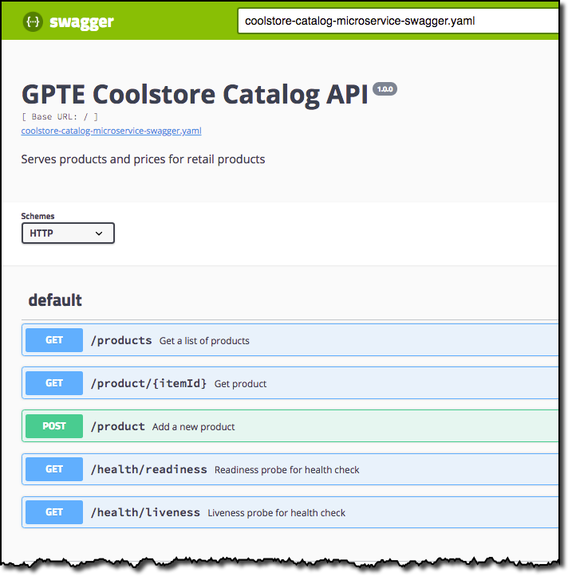
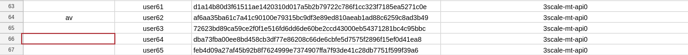

:noaudio:
:scrollbar:
:data-uri:
:toc2:
:linkattrs:
:lab_spreadsheet_apac: link:https://docs.google.com/spreadsheets/d/19Fb4aRYIPWDqUbctXbFvRD7JsT8G_BM9KF5tTo4dWE8/edit?usp=sharing[APAC RHTE: Student lab info spreadsheet]
:lab_spreadsheet_emea: link:https://docs.google.com/spreadsheets/d/1XxwdeGqTSgd1JQssnVMt8TlfyEEPn-MrFz0b2HI_HV0/edit?usp=sharing[EMEA RHTE: Student lab info spreadsheet]
:lab_spreadsheet_chad: link:https://docs.google.com/spreadsheets/d/1v70zpIlrVYRvFBcnnmUmzNFKSq3EK2Nk2JL4mVVFc2M/edit#gid=1002335978[Americas RHTE: Chad Darby Lab: API tenant info spreadsheet]
:lab_spreadsheet_jeff: link:https://docs.google.com/spreadsheets/d/1v70zpIlrVYRvFBcnnmUmzNFKSq3EK2Nk2JL4mVVFc2M/edit#gid=820975580[Americas RHTE: Jeff Bride Lab: API tenant info spreadsheet]

= Lab Setup

.Prerequisites
.. The `ssh` utility installed on your laptop.
+
NOTE: If your network connection is intermittent, consider installing the https://mosh.org/[mosh] utility (`yum install mosh`) as an alternative to the `ssh` utility.

.. Web browser installed on your laptop.
.. Broadband internet connectivity.

:numbered:

== Overview

This first lab of this course orientates you with the course lab assets provided to you.

Your lab environment consists of the following:

. *Remote Virtual Machine*
+
Accessible via the SSH protocol.
It is pre-installed with _OpenShift Container Platform_ and _Red Hat Service Mesh_.

. *Red Hat 3scale API Manager*
+
Pre-provisioned with an API _domain_ dedicated to you for the duration of this lab.
The 3scale API Manager may or may not be installed on your virtual machine, depending on how you enrolled in this lab.
More details in the following sections.

== Course Virtual Machine
=== Order Virtual Machine
This section guides you through the procedure to order a virtual machine (VM) for this course.

/////
There are three methods for ordering a VM. [red]#Use only one of these methods.#

==== Access VM via RHPDS

NOTE: [blue]#This section is only applicable if you want to utilize a lab environment in Red Hat's _Partner Demo System_ (RHPDS)#.

. In a web browser, navigate to the _Cloud Forms_ environment for Red Hat Partner Demo System at: https://rhpds.redhat.com.
. Authenticate using your _OPENTLC_ credentials, for example: `johndoe-redhat.com`.
. Navigate to the following catalog: `Services -> Catalog -> All Services -> Red Hat Tech Exchange 2018`.
. Select the following catalog item: `3scale API Mgmt & Service Mesh`.
+

. Click `Order` and in the next page, click the check box to confirm that you understand and know your runtime and expiration dates.
. Click `Submit`.
/////

==== Access VM via OPENTLC or RHSE

NOTE: [blue]#This section is applicable if you are an existing student of either Red Hat's _Open Partner Enablement Network (OPEN)_ or Skills Exchange (RHSE) programs.#

. In a web browser, navigate to the _Cloud Forms_ environment for OPEN and RHSE at:   https://labs.opentlc.com.
. Authenticate using your _OPENTLC_ credentials, for example: `johndoe-redhat.com`.
. Navigate to the following catalog:  `Services -> Catalog -> Catalog Items -> OPENTLC Middleware Solutions Labs`.
. Select the following catalog item: `3scale API Mgmt & Service Mesh`.
+

. Click `Order` on the next page.

. In the subsequent order form, select the following:
.. *OpenShift Container Platform version*: `3.11.43`
.. *Region*: Select the region you currently reside in
.. Click `Submit`.

/////
==== Access VM via GUID Grabber

NOTE: [blue]#This section is only applicable if you are a participant in a Red Hat conference such as Red Hat Tech Exchange (RHTE)#.

This section of the lab explains how to access the Red Hat Tech Exchange _GuidGrabber_ to obtain a Globally Unique Identifier (GUID).
This GUID will be used to access a virtual machine that you will use in this course.

. In a web browser, navigate to: http://bit.ly/rhte-guidgrabber.

. Select the *Lab Code* :  `A1004 - API Management with 3scale + Istio Microservices`.

. Enter the *Activation Key* provided to you by your instructor.

. Click `Next`.

. The resulting page will display your lab's GUID and other useful information about your lab environment.
+
image::images/guid_grabber_response.png[Guid Grabber Information Page]

. Your remote virtual machine is accessible via the `SSH` protocol.
+
Follow the directions exactly as indicated in the Guid Grabber Information Page to log into your remote lab VM via SSH.

. When you are finished with your lab environment at the end of this course, please click *Reset Workstation* so that you can move on to the next lab.
If you fail to do this, you will be locked into the GUID from the previous lab.
+
[NOTE]
Clicking *Reset Workstation* will not stop or delete the lab environment.
/////

=== Confirmation Emails

Upon ordering the lab environment, you will receive the following two emails:

. *Your lab environment is building*
.. Save this email.
.. This email Includes details of the three VMs that make up your lab application similar to the following:
+
image::images/aio_first_email.png[]

.. Make note of the 4 digit GUID (aka: REGION CODE)
+
* Whenever you see "GUID" or "$GUID" in a command, make sure to replace it with your GUID.

.. Make note of the URL of the `workstation` VM.
+
You will use this when ssh'ing to your application.

.. Make note of the URL of the `master` VM.
+
You will use this when accessing the OCP Web Console.

** The OpenShift master URL varies based on the region where you are located, and may vary from the example shown above.
** For the duration of the course, you navigate to this OpenShift Container Platform master node.

. *VM ready for authentication*
+
Once you receive this second email, you can then ssh into the `workstation` VM of your Ravello application.

=== SSH Access and `oc` utility

SSH access to the remote lab environment provides you with the OpenShift `oc` utility.

. ssh access to the Ravello application is provided using the following convention:
+
-----
$ ssh <opentlc-userId>@<workstation URL as listed in 1st confirmation email>
-----

. Authenticate into OpenShift using `oc` utility
+ 
-----
$ oc login https://master00.example.com -u user1 -p r3dh4t1!
-----

. OCP cluster admin access
.. Cluster admin access to the your OpenShift environment is provided but is not required for this course.
.. If you do happen to need OpenShift cluster-admin access, execute the following: 
+
-----
$ sudo -i

# oc login -u system:admin      # NOTE: This command is typically not needed
                                #       /root/.kube/config already contains the _system:admin_ user's token
-----
+
[blue]#Make sure to exit out of the root shell after every use#

=== OCP Web Console

. Point your browser to the following URL:
+
-----
$ https://<master node URL as listed in 1st confirmation email>
-----

. Authenticate using the following user credentials
.. Username:    user1
.. Password:    r3dh4t1!

[[env_vars]]
== Environment Variables

The instructions in this course require use of environment variables.
Now that you have a lab environment, in this section, you set these environment variables in your remote client environment.

/////
. Set lab environment specific variables.
+
Select one of the following:

.. *Dedicated API Management environment*
+
NOTE: OPEN, RHSE students and users of RHPDS should utilize this approach.
/////

. Log in to your remote lab environment via SSH.
. As the non-root operating system user, execute the following commands:
+
-----
echo "export API_REGION=`echo $HOSTNAME | cut -d'.' -f1 | cut -d'-' -f2`" >> ~/.bashrc
echo "export API_DOMAIN=\$API_REGION.generic.opentlc.com" >> ~/.bashrc
echo "export API_USERNAME=api1" >> ~/.bashrc
echo "export API_MANAGER_NS=3scale-mt-api0" >> ~/.bashrc
echo "export OCP_USERNAME=user1" >> ~/.bashrc
echo "export GW_PROJECT=\$OCP_USERNAME-gw" >> $HOME/.bashrc
source ~/.bashrc
-----

. Set your API Admin access token
+
The user of your API Management tenant is associated with an _access token_.
You'll reference this access token later in this lab when configuring your API Gateways to communicate with the API Manager.

/////
.... View the access token
+
-----
$ sudo less /home/opentlc-mgr/provisioning_output/clientvm.$API_REGION.openshift.opentlc.com/3scale_tenants_api0/api0_tenant_info_file_1_1.txt | sed '/API admin access token/d' | cut -f5 -d$'\t'

eb7de2cc123e9061c787ebaed3856d91f12e7d6227cf0e9ce479e10e5bf4d028
-----
+
Later in this lab, you will make use of this access token to interact with the admin API of the 3scale API Manager tenant.

.... Set the access token as an environment variable
+
-----
$ echo "export API_ADMIN_ACCESS_TOKEN=`sudo more /home/opentlc-mgr/provisioning_output/clientvm.$API_REGION.openshift.opentlc.com/3scale_tenants_api0/api0_tenant_info_file_1_1.txt | sed '/API admin access token/d' | cut -f5 -d$'\t'`" >> ~/.bashrc
-----
/////

.. View the access token
+
-----
$ oc get deploy prod-apicast -n $GW_PROJECT -o json | grep system-master | cut -d'@' -f1 | cut -d'/' -f3 

eb7de2cc123e9061c787ebaed3856d91f12e7d6227cf0e9ce479e10e5bf4d028
-----
+
Later in this lab, you will make use of this access token to interact with the admin API of the 3scale API Manager tenant.

.. Set the access token as an environment variable
+
-----
$ echo "export API_ADMIN_ACCESS_TOKEN=`oc get deploy prod-apicast -n $GW_PROJECT -o json | grep system-master | cut -d'@' -f1 | cut -d'/' -f3`" >> ~/.bashrc
-----

/////
.. *Shared Multi-tenant API Management environment*
+
NOTE:  Select this approach only if you've been explicitly instructed to do so by an instructor.

... Execute the steps discussed in the section <<api_spreadsheet>>.
... Return to this section after completion.
/////

. For all students, copy and paste the following commands in the same terminal:
+
-----
echo 'export API_PASSWD=admin' >> ~/.bashrc
echo 'export OCP_PASSWD=r3dh4t1!' >> ~/.bashrc

echo "export OCP_REGION=`echo $HOSTNAME | cut -d'.' -f1 | cut -d'-' -f2`" >> ~/.bashrc
echo "export OCP_DOMAIN=\$API_REGION.generic.opentlc.com" >> ~/.bashrc
echo "export OCP_WILDCARD_DOMAIN=apps-\$OCP_DOMAIN" >> ~/.bashrc
echo "export MSA_PROJECT=rhte-mw-api-mesh-\$OCP_USERNAME" >> ~/.bashrc
echo "export API_WILDCARD_DOMAIN=apps-\$API_DOMAIN" >> ~/.bashrc
echo "export TENANT_NAME=\$API_USERNAME-\$API_MANAGER_NS" >> ~/.bashrc
echo "export THREESCALE_PORTAL_ENDPOINT=https://\${API_ADMIN_ACCESS_TOKEN}@\$TENANT_NAME-admin.\$API_WILDCARD_DOMAIN" >> ~/.bashrc
echo "export BACKEND_ENDPOINT_OVERRIDE=https://backend-\$API_MANAGER_NS.\$API_WILDCARD_DOMAIN" >> ~/.bashrc
-----

. Source the modified `~/.bashrc` file so that the environment variables are set in your current shell session:
+
-----
$ source ~/.bashrc
-----

. Create a directory to store files related to this lab:
+
-----
$ mkdir -p $HOME/lab
-----

== OpenShift Container Platform

Your lab environment is built on Red Hat's OpenShift Container Platform (OCP).

Access to your OCP resources can be gained via both the `oc` CLI utility and the OCP web console.

. View existing projects:
+
-----
$ oc get projects

...

3scale-mt-api0            3scale-mt-api0          Active
istio-system                                      Active
rhte-mw-api-mesh-user1   rhte-mw-api-mesh-13e6    Active
user1-gw                                          Active
-----

.. *3scale-mt-api0*
+
If you ordered your lab environment from RHPDS or OPENTLC, then it will include 3scale API Manager.
If not, then your instructor will provide details.

.. *istio-system*
+
Your OCP user has been provided with _view_ and _edit_ access to the central _istio-system_ namespace with all _control plane_ Service Mesh functionality.
+
Later in this lab, you will use a utility called _istioctl_ .
This utility will need both view and edit privileges to the _istio-system_ namespace.

.. *rhte-mw-api-mesh-**
+
The namespace _rhte-mw-api-mesh-*_ is where you will be working throughout the duration of this lab.

.. *user1-gw*
+
This namespace includes an API gateway pre-configured to interact with your API Management tenant.

. Switch to your OpenShift project:
+
-----
$ oc project $MSA_PROJECT
-----

. Validate the ability to _impersonate_ cluster admin:
+
-----
$ oc get nodes --as=system:admin

NAME                      STATUS    ROLES            AGE       VERSION
infranode00.example.com   Ready     infra            4d        v1.11.0+d4cacc0
master00.example.com      Ready     compute,master   4d        v1.11.0+d4cacc0
-----
+
For the purpose of this lab, the cluster-admin of your OCP environment has provided you with the ability to _impersonate_ the _cluster-admin_.
You would not have had the ability to execute the above command (by specifying `--as=system:admin`) if the cluster-admin had not already done so.
In the next lab you will use this ability to impersonate the cluster admin.

. View details of the ClusterQuota that the _cluster-admin_ has assigned to your OpenShift user:
+
-----
$ oc describe clusterquota clusterquota-rhte-mw-api-mesh-$OCP_USERNAME --as=system:admin

....

Resource                Used    Hard
--------                ----    ----
configmaps              1       20
limits.cpu              1100m   10
limits.memory           1780Mi  15Gi
persistentvolumeclaims  1       20
pods                    4       30
requests.cpu            425m    5
requests.memory         820Mi   6Gi
requests.storage        1Gi     50Gi
secrets                 24      150
services                4       150
-----

== Catalog Service

The backend business service used throughout this course will be a simple application called the `Catalog Service`.
In this section of the lab, you review this pre-provisioned `Catalog Service`.

[[dvsdc]]
=== Deployment vs DeploymentConfig

Your lab assets consist of a mix of OpenShift _Deployment_ and _DeploymentConfig_ resources.

The _Deployment_ construct is a more recent Kubernetes equivalent of what has always been in OpenShift:  _DeploymentConfig_.

/////
The _istioctl_ utility (introduced later in this lab) of Istio requires the use of the Kubernetes _Deployment_ resource.
Subsequently, for the purpose of this lab, we'll use the Kubernetes _Deployment_ type (instead of DeploymentConfig) for most of the functionality.
One exception to this is the MongoDB.
/////

In your lab environment, the CoolStore catalog service connects to a MongoDB database.
OpenShift is used to manage the MongoDB database, using an OpenShift DeploymentConfig instead of a Kubernetes Deployment.
The OpenShift _DeploymentConfig_ provides more features than a Kubernetes _Deployment_.
For example, the MongoDB database is pre-seeded using life-cycle hooks, and these are only available in a DeploymentConfig.
The _post deployment_ life-cycle hook is ignored if added to a Kubernetes Deployment.

To learn more about the differences between Kubernetes _Deployments_ and OCP _DeploymentConfigurations_, see
link:https://docs.openshift.com/container-platform/3.10/dev_guide/deployments/kubernetes_deployments.html#kubernetes-deployments-vs-deployment-configurations[Kubernetes Deployments Versus Deployment Configurations].

==== OpenShift objects

. Review DeploymentConfig:
+
-----
$ oc get dc -n $MSA_PROJECT

...

NAME              REVISION   DESIRED   CURRENT   TRIGGERED BY
catalog-mongodb   1          1         1         config,image(mongodb:3.4)
-----

. Review Deployment:
+
-----
$ oc get deploy -n $MSA_PROJECT

...

NAME              DESIRED   CURRENT   UP-TO-DATE   AVAILABLE   AGE
catalog-service   1         1         1            1           4m
-----

. Review running pods:
+
-----
$ oc get pods -n $MSA_PROJECT

...

NAME                          READY     STATUS      RESTARTS   AGE
catalog-mongodb-1-clsz4       1/1       Running     0          11m
catalog-service-1-dqb28       1/1       Running     0          11m

...
-----

. Retrieve the URL of the unsecured _catalog_ route:
+
----
$ echo "export NAKED_CATALOG_ROUTE=$(oc get route catalog-unsecured -o template --template='{{.spec.host}}' -n $MSA_PROJECT)" >> ~/.bashrc

----
+
NOTE:  You will use the $NAKED_CATALOG_ROUTE environment variable during the lab.

. Reload the `.bashrc` file to enable the new environment variable:
+
----
$ source ~/.bashrc
----

. Retrieve the pre-seeded data in the MongoDB database via the catalog route:
+
-----
$ curl -X GET "http://$NAKED_CATALOG_ROUTE/products"

...

{
  "itemId" : "444435",
  "name" : "Oculus Rift",
  "desc" : "The world of gaming has also undergone some very unique and compelling tech advances in recent years. Virtual reality, the concept of complete immersion into a digital universe through a special headset, has been the white whale of gaming and digital technology ever since Nintendo marketed its Virtual Boy gaming system in 1995.",
  "price" : 106.0
}
-----

==== (Optional) Invoke _Open API Specification_ docs

The link:https://swagger.io/docs/specification/about/[OpenAPI Specification^] (formerly "Swagger Specification") is an API description format for REST APIs. link:https://swagger.io/[Swagger^] is a set of open-source tools built around the OpenAPI specification that can help you design, build, document, and consume REST APIs.

Swagger documentation is available for the REST endpoints of the catalog microservice.
You can optionally view this documentation as follows:

. Display the URL for your project:
+
----
$ echo "http://$NAKED_CATALOG_ROUTE"
----

. Copy and paste the URL into a web browser.
* Expect to see the Swagger docs for the REST endpoints:
+

. Click *GET /products Get a list of products* to expand the item.
. Click the *Try it out* button, click *Execute* and view the response.

== API Manager

Your lab environment includes access to a multi-tenant API Manager installation.

For the purpose of this lab, you will serve as the administrator of your own 3scale _tenant_, also known as a _domain_.

Log into the administration portal of your API Manager environment as follows:

. Display the URL for your 3scale tenant:
+
-----
$ echo -en "\n\nhttps://$TENANT_NAME-admin.$API_WILDCARD_DOMAIN\n\n"
-----

. Copy and paste the URL into a web browser.

. Authenticate using the values of $API_USERNAME and $API_PASSWD .
.. `echo $API_USERNAME`
.. `echo $API_PASSWD`

. Click the `Sign in` button:
+
image::images/3scale_login.png[]

== API Gateways
In this section you will create two OCP routes for your API Gateways whose names are consistent with your backend business service.

NOTE: If you don't already have API Gateways deployed in your environment, please provision them as per the section: <<gw_provisioning>>.

. Add a new route for staging:
+
-----
$ oc create route edge catalog-stage-apicast-$OCP_USERNAME --service=stage-apicast  -n $GW_PROJECT
-----

. Add a new route for production:
+
-----
$ oc create route edge catalog-prod-apicast-$OCP_USERNAME --service=prod-apicast  -n $GW_PROJECT
-----
+
You will reference these route names in the next section of the lab.

. Resume the paused deploy objects:
+
-----
$ oc rollout resume deploy stage-apicast prod-apicast -n $GW_PROJECT
-----

[blue]#Congratulations!#
Your lab environment is now ready to use.  Please proceed to the next lab:  link:01_2_api_mgmt_service_mesh_Lab.html[*01_2 API Mgmt Service Mesh Lab*]

== Appendix

=== Optional:  Administrative Access

. On your remote lab environment, you can optionally gain access to the `root` operating system user by executing:
+
----
$ `sudo -i`
----

. As the `root` operating system user, you can gain `cluster admin` access to your OCP environment by executing:
+
-----
# oc login -u system:admin
-----

. You can check the status of the OCP system service by executing:
+
-----
# systemctl status oc-cluster.service
-----

. The OCP environment can be restarted as follows:
+
-----
# systemctl restart oc-cluster.service
-----

. You can optionally install additional networking utilities (that could serve as useful troubleshooting tools ) as follows:
+
-----
$ yum install telnet bind-utils
-----

=== Optional:  Lab Environment Provisioning

This section is offered to those that are interested in setting up an environment to support this lab using their own resources.

==== RHPDS

Lab environments will soon be available in the _Red Hat Partner Demo System_ (RHPDS).

More information about this will provided here within the month (October 2018)

==== Ansible Roles

The lab environment can be provisioned via the following Ansible roles:

. *ocp-workload-3scale-multitenant*
+
The link:https://github.com/sborenst/ansible_agnostic_deployer/tree/development/ansible/roles/ocp-workload-3scale-multitenant[ocp-workload-3scale-multitenant] Ansible role will provision a multi-tenant 3scale API Manager.
+
This role needs to be executed only once (to provision only one multi-tenant API Manager) on a pre-existing OCP 3.11 environment.
+
The role also offers the ability to provision a configurable number of _tenants_ in that multi-tenant API Manager environment.
If provisioning tenants, the role also provides the ability to automatically provision API gateways for each tenant (co-located in the same OCP cluster as the API Manager but in their own namespaces).

. *ocp-workload-istio-community*
+
The link:https://github.com/sborenst/ansible_agnostic_deployer/tree/development/ansible/roles/ocp-workload-istio-community[ocp-workload-istio-community] Ansible role will layer Istio on a pre-existing OCP 3.11 environment.
+
This role should be executed on an OCP environment dedicated to a student (that is, using `oc cluster up`).
This role is applied to the same OCP environment utilized by the _ocp-workload-rhte-mw-api-mesh_ role.

. *ocp-workload-rhte-mw-api-mesh*
+
The link:https://github.com/sborenst/ansible_agnostic_deployer/tree/development/ansible/roles/ocp-workload-rhte-mw-api-mesh[ocp-workload-rhte-mw-api-mesh] Ansible role will provision supporting lab assets (that is, the catalog service).
+
This role should be executed on an OCP environment dedicated to a student (that is, using `oc cluster up`).
This role is applied to the same OCP environment utilized by the _ocp-workload-istio-community_ role.

[[gw_provisioning]]
=== Optional: API Gateway Provisioning

NOTE: [red]#This section is only relevant if you don't already have API Gateways provisioned#

In this section of the lab you provision a supported version of 3scale _API Gateway_ to manage your CoolStore _catalog_ service.

Your API gateway will retrieve _proxy service_ configurations from the pre-existing 3scale multi-tenant environment.

The management of this API gateway occurs via a Kubernetes _deployment_ (as opposed to an OCP _deploymentconfig_).

In a later section of this course, you will switch to the use of a community variant of API gateway that is enabled with _OpenTracing_ and _Jaeger_ client libraries, to participate in distributed tracing.

==== Optional: Deploy API Gateway

[blue}#This section of the lab is only applicable if API gateways have not already been provisioned in your lab environment in the project:  $GW_PROJECT#

. In your course lab environment, ensure you are the same non-root user in which you previously set lab related environment variables.

. Using the `oc` utility, create a new project where your API gateways will reside:
+
-----
$ oc new-project $GW_PROJECT --description=$GW_PROJECT
-----

. Retrieve the API gateway template:
+
-----
$ curl -o $HOME/lab/3scale-apicast.yml \
          https://raw.githubusercontent.com/gpe-mw-training/3scale_onpremise_implementation_labs/master/resources/rhte/3scale-apicast.yml
-----

. Review the API gateway template:
+
-----
$ less $HOME/lab/3scale-apicast.yml | more
-----

. Create API gateway staging related resources in OpenShift:
+
-----
$ oc new-app \
     -f $HOME/lab/3scale-apicast.yml \
     --param THREESCALE_PORTAL_ENDPOINT=$THREESCALE_PORTAL_ENDPOINT \
     --param BACKEND_ENDPOINT_OVERRIDE=$BACKEND_ENDPOINT_OVERRIDE \
     --param APP_NAME=stage-apicast \
     --param ROUTE_NAME=catalog-stage-apicast-$OCP_USERNAME \
     --param WILDCARD_DOMAIN=$OCP_WILDCARD_DOMAIN \
     --param THREESCALE_DEPLOYMENT_ENV=sandbox \
     --param APICAST_CONFIGURATION_LOADER=lazy \
     -n $GW_PROJECT > $HOME/lab/stage-apicast_details.txt
-----

. Create API gateway production related resources in OpenShift:
+
-----
$ oc new-app \
     -f $HOME/lab/3scale-apicast.yml \
     --param THREESCALE_PORTAL_ENDPOINT=$THREESCALE_PORTAL_ENDPOINT \
     --param BACKEND_ENDPOINT_OVERRIDE=$BACKEND_ENDPOINT_OVERRIDE \
     --param APP_NAME=prod-apicast \
     --param ROUTE_NAME=catalog-prod-apicast-$OCP_USERNAME \
     --param WILDCARD_DOMAIN=$OCP_WILDCARD_DOMAIN \
     --param THREESCALE_DEPLOYMENT_ENV=production \
     --param APICAST_CONFIGURATION_LOADER=lazy \
     -n $GW_PROJECT > $HOME/lab/prod-apicast_details.txt
-----

. Resume the paused deploy objects:
+
-----
$ oc rollout resume deploy stage-apicast prod-apicast -n $GW_PROJECT
-----

[[api_spreadsheet]]
=== Optional: Multi-tenant API Management Information spreadsheet

The virtual machine that you gained access to in the previous section of this lab is one of two components that comprises your lab environment.

The other component of your lab environment is a 3scale _multi-tenant_ environment that has been pre-provisioned and dedicated to you.

You will select one of those dedicated 3scale _tenants_ as follows:

. In a web browser, navigate to one of the following spreadsheets, depending on who your instructor is:
.. *Chad Darby's* lab : {lab_spreadsheet_chad}.
.. *Jeff Bride's* lab : {lab_spreadsheet_jeff}.
. Locate an existing row in the spreadsheet where Column A is empty.
. Claim an API Management tenant by adding your name to that *existing row* in Column A of the spreadsheet.
+

. Utilize the values in the corresponding columns B, C and D to set shell environment variables.

. Log in to your remote lab environment via SSH.

. Set the following environment variables, using the values you've assigned yourself from the spreadsheet introduced in the previous section:
+
-----
$ echo "export API_USERNAME=<column B of spreadsheet>" >> ~/.bashrc
$ echo "export API_ADMIN_ACCESS_TOKEN=<column C of spreadsheet>" >> ~/.bashrc
$ echo "export API_MANAGER_NS=<column D of spreadsheet" >> ~/.bashrc
-----

ifdef::showscript[]

. Set the following environment variables, using the values you've assigned yourself in: {lab_spreadsheet}:
+
-----
$ echo "export API_USERNAME=<column B of spreadsheet>" >> ~/.bashrc
$ echo "export API_ADMIN_ACCESS_TOKEN=<column C of spreadsheet>" >> ~/.bashrc
$ echo "export API_PASSWD=<column D of spreadsheet>" >> ~/.bashrc
$ echo "export OCP_PASSWD=<column E of spreadsheet>" >> ~/.bashrc
$ echo "export API_MANAGER_NS=<column F of spreadsheet>" >> ~/.bashrc
$ echo "export OCP_USERNAME=<column G of spreadsheet>" >> ~/.bashrc
$ echo "export API_REGION=<column H of spreadsheet>" >> ~/.bashrc
$ echo "export LAB_CODE=<column I of spreadsheet>" >> ~/.bashrc
-----
endif::showscript[]

. Return to section: {{env_vars}}

ifdef::showscript[]
endif::showscript[]
