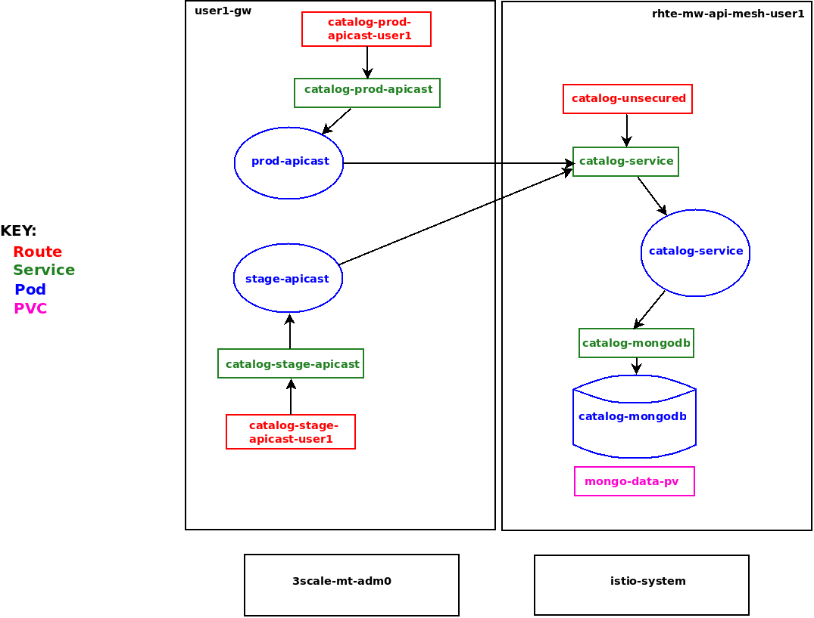
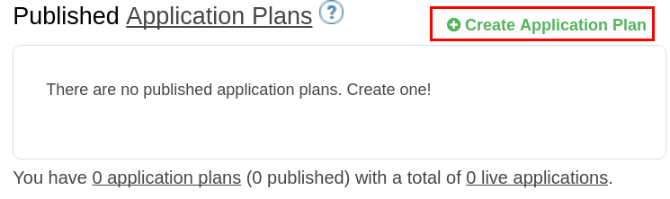
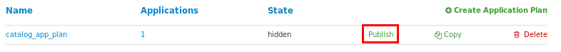
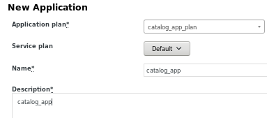
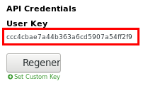
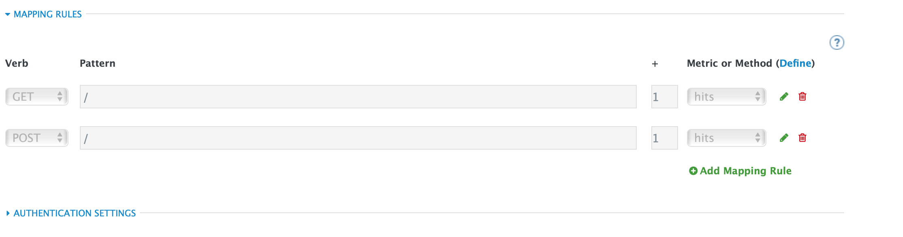
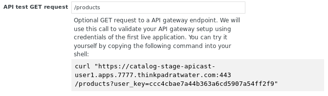
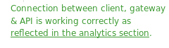
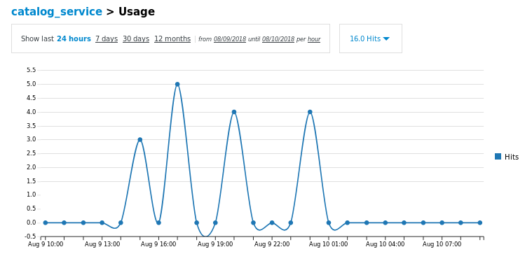

:noaudio:
:scrollbar:
:data-uri:
:toc2:
:linkattrs:
:transaction_costs: link:https://en.wikipedia.org/wiki/Transaction_cost[transaction costs]

= API Management Lab

.Goals
* Management of an external API using API Management
* Review of the analytics dashboard provided by Red Hat 3scale API Management

:numbered:

== Overview 

This lab provides instructions for the management of your _catalog_ RESTful API via the 3scale API Manager.

Instructions are provided for both experienced and inexperienced 3scale users.
[red]#Follow only one set of instructions.#

If you are an experienced user of Red Hat 3scale API Management, complete the instructions in section <<configuretestapi>>, then continue with section <<apicast_istio>>.

If you are not an experienced user of Red Hat 3scale API Management, complete the instructions in section <<configuretestapi_stepbystep>>, then continue with section <<apicast_istio>>.

The following deployment topology diagram illustrates the components of this API managed environment, and the data flow from an external request through them:

In a later lab of this course, you will incrementally add features of a _service mesh_ to this API Managed _catalog_ RESTful application.

[[configuretestapi_stepbystep]]
== Configure and Test: Step-by-Step

In this section, you define a service that manages access to the Coolstore catalog service that has already been provisioned for you.

The activities in this section are also found in the prerequisite courses but are provided here as a refresher for your convenience.

=== Define Catalog Service

. From the API Manager Admin Portal home page, navigate to : `Dashboard -> APIS` 
. On the far right, click .
. Enter `catalog_service` for the *Name*,  *System Name* and *Description*.  Click *Add API*.

=== Create Application Plan

Application plans define access policies for your API.

. From the *Overview* page of your new `catalog_service`, scroll to the *Published Application Plans* section.
. Click *Create Application Plan*.
+

. Enter `catalog_app_plan` for the *Name* and *System name*:

. Click *Create Application Plan*.
. For the  `catalog_app_plan` application plan, click *Publish*:
+

=== Create Application

In this section, you associate an application with an API consumer account.
This generates a _user key_ for the application based on the details previously defined in the application plan.
The user key is used as a query parameter to the HTTP request to invoke your business services via the on-premise API gateway.

. Navigate to the *Audience -> Accounts -> Listing* .
. Select the `Developer` account.
. Create Application
.. Click the *0 Applications* link at the top:
+
NOTE: A default application may have already been created, in which case the link will indicate 1 Application, not 0.
If so, this default application is typically associated with the out-of-the-box `API` service, which is not desireable.
If it exists, click on the default application to identify which service it is associated with, then delete it.

.. Click *Create Application*.
.. Fill in the *New Application* form as follows:
... *Application plan*: `catalog_app_plan`
... *Service Plan*: `Default`
... *Name*: `catalog_app`
... *Description*: `catalog_app`
+

.. Click *Create Application*.

. On the details page for your new application (or the default application automatically created), find the API *User Key*:
+

. Create an environment variable set to this user key:
+
-----
$ echo "export CATALOG_USER_KEY=<the catalog app user key>" >> ~/.bashrc

$ source ~/.bashrc
-----

=== Service Integration

In this section, you define an _API proxy_ to manage your _catalog_ RESTful business service.

. In the top panel of the API Manager Admin Portal, navigate to _catalog_service_ API.
. In the left panel, select *Integration -> Configuration*.
. Click *Add the base URL of your API and save the configuration*.
+
* This navigates to a page that allows you to associate the API gateway staging and production URLs with your new Red Hat 3scale API Management proxy service.

. Populate the *Configuration: configure & test immediately in the staging environment* form as follows:
.. *Private Base URL*:
... Enter the internal DNS resolvable URL to your Catalog business service.
... The internal URL will be the output of the following:
+
-----
$ echo -en "\n\nhttp://catalog-service.$MSA_PROJECT.svc.cluster.local:8080\n\n"
-----

.. *Staging Public Base URL*:
+
Populate this field with the output from the following command:
+
-----
$ echo -en "\n`oc get route catalog-stage-apicast-$OCP_USERNAME -n $GW_PROJECT --template "https://{{.spec.host}}"`:443\n\n"
-----

.. *Production Public Base URL*:
+
Populate this field with the output from the following command:
+
-----
$ echo -en "\n`oc get route catalog-prod-apicast-$OCP_USERNAME -n $GW_PROJECT --template "https://{{.spec.host}}"`:443\n\n"
-----

.. *MAPPING RULES*:
+
Add an additional `Mapping Rule` for the HTTP POST method. You'll use the POST method in the last section in this lab.

... In the `MAPPING RULES` section, click *Add Mapping Rule*.
... In the new mapping rule, change the *Verb* to `POST` and enter `/` as the Pattern.
+

.. *API test GET request*:
+
Enter `/products`.
+
Expect to see a test *curl* command populated with the API key assigned to you for the `catalog_app_plan`:
+

+
If you do not see an example curl command, repeat the steps to create an Application Plan and corresponding Application.
+
NOTE: When there are multiple developer accounts, Red Hat 3scale API Management uses the default developer account that is created with every new API provider account to determine which user key to use. When creating new services, the API Manager sets the first application from the first account subscribed to the new service as the default.

. Click *Update & test in Staging Environment*
.. The `apicast-stage` pod invokes your backend _catalog_ business service as per the `Private Base URL`.
.. The page should turn green with a message indicating success:
+

. Click *Back to Integration & Configuration*
. Click *Promote v. 1 to Production*
+

Your Red Hat 3scale API Management service is configured.
Next, the configuration details of your service need to be propagated to your on-premise API gateway.

=== Refresh API Gateway
Every time a configuration change is made to an API proxy or application plan, the production API gateways need to be refreshed with the latest changes.

The API gateways are configured to refresh the latest configuration information from the API management platform every 5 minutes.
When this internal NGINX timer is triggered, you see log statements in your API gateway similar to the following:

.Sample Output
-----
[debug] 36#36: *3574 [lua] configuration_loader.lua:132: updated configuration via timer:

....

[info] 36#36: *3574 [lua] configuration_loader.lua:160: auto updating configuration finished successfuly, context: ngx.timer
-----

For the purpose of this lab, you can delete your API gateway pods instead of waiting for 5 minutes. Kubernetes will detect the absence of these pods and start new ones.

. Delete API gateway related pods:
+
-----
$ for i in `oc get pod -n $GW_PROJECT | grep "apicast" | awk '{print $1}'`; do oc delete pod $i -n $GW_PROJECT; done
-----
+
Because the value of the _APICAST_CONFIGURATION_LOADER_ environment variable in the pod is set to `boot`, the service proxy configuration from the API Manager will automatically be pulled upon restart.

. Verify the API gateway related pods have been started.
+
View the latest entries in the new API gateway production pod's log file with the `tail` command.
+
* When the pods are successfully restarted, a debug-level log statement similar to the following appears:
+
.Sample Output
-----
[lua] configuration_store.lua:103: configure(): added service 2555417742084 configuration with hosts: prod-apicast-user1.apps.7777.thinkpadratwater.com, catalog-stage-apicast-user1.apps.7777.thinkpadratwater.com ttl: 300
-----

== Test Catalog Business Service

In this section, you invoke your Catalog business service via your production API gateway.

. Verify your `$CATALOG_USER_KEY` environment variable is still set:
+
-----
$ echo $CATALOG_USER_KEY
-----

. From the terminal, execute the following:
+
-----
$ curl -v -k `echo "https://"$(oc get route/catalog-prod-apicast-$OCP_USERNAME -n $GW_PROJECT -o template --template {{.spec.host}})"/products?user_key=$CATALOG_USER_KEY"`
-----
+
.Sample Output
-----
...

{
  "itemId" : "444435",
  "name" : "Oculus Rift",
  "desc" : "The world of gaming has also undergone some very unique and compelling tech advances in recent years. Virtual reality, the concept of complete immersion into a digital universe through a special headset, has been the white whale of gaming and digital technology ever since Nintendo marketed its Virtual Boy gaming system in 1995.",
  "price" : 106.0
}
-----

. If you are still viewing the end of `apicast` pod's log file, expect to see statements similar to this:
+
.Sample Output
-----
...

2018/08/06 19:07:46 [info] 24#24: *19 [lua] backend_client.lua:108: authrep(): backend client uri: http://backend-listener.3scale-mt-adm0:3000/transactions/authrep.xml?service_token=a4e0949f1b677611870dab3fb7c142df50871d1eca3d1c9f1615dd514c937df4&service_id=103&usage%5Bhits%5D=1&user_key=ccc4cbae7a44b363a6cd5907a54ff2f9 ok: true status: 200 body:  while sending to client, client: 172.17.0.1, server: _, request: "GET /products?user_key=ccc4cbae7a44b363a6cd5907a54ff2f9 HTTP/1.1", host: "catalog-service.rhte-mw-api-mesh-user1.svc.cluster.local"

...

-----

[blue]#Congratulations!# Your lab environment should now consist of a _catalog_ RESTful service managed by standard Red Hat 3scale API Manager 2.2 functionality.

[blue]#This is a substantial accomplishment!#
You are now utilizing the tools needed to lower the {transaction_costs} such as search costs, price discovery, policing and enforcement costs, and so on, that would otherwise hinder mutually beneficial exchanges between API consumers and producers.
Using the Red Hat 3scale API Management product, you can manage the entire life cycle of your APIs and provide added value to your customers and partners.

== Red Hat 3scale API Management Analytics

Return to your API Manager as the domain administrator and navigate to the _Analytics_ tab.

Notice that the _hits_ metric for your _catalog_service_ API is automatically depicted.
3scale analytics can depict the total count of _hits_ on both the API and the API method level graphed over time.

Your API analytics are currently course-grained in that the _hits_ are the sum of invocations on all methods of your catalog service.
Defining fine-grained _methods_ and _mappings_ for your catalog API will subsequently provide for more fine-grained analytics at the method level.

The analytics provided by Red Hat 3scale API Management complement the distributed tracing capabilities of Jaeger.

Prometheus is an analytics tool that comes by default with Istio and is being closely integrated with Red Hat OpenShift.
The analytics and observability provided by Prometheus are conceptually similar to the analytics provided by the Red Hat 3scale API Management.
It is possible that a future version of Red Hat 3scale API Management will provide support for Prometheus for API data analytics.

== Appendix

[[configuretestapi]]
=== Configure and Test API Management: Experienced

If you are already proficient with Red Hat 3scale API Management, then configure and test the management of your _catalog_ RESTful API as per the following instructions:

. Ensure your API gateways started correctly and the value of the _THREESCALE_ENDPOINT_ makes sense.
. Create an API proxy service called _catalog_service_ and configure it to use the API gateway and an API key for security.
. Create an application plan called: _catalog_app_plan_
. Using the existing _Developer_ account and the _catalog_app_plan_, create an application called: _catalog_app_
. Capture the API key for the application and set its value as the following environment variable in your shell terminal:  _CATALOG_USER_KEY_ .
. Configure the _Integration_ section of your _catalog_service_ and publish the service to production.
.. Create mapping rules for the GET, POST and DELETE verbs.
. Test the _/products_ endpoint of your _catalog_ RESTful service via both your staging and production API gateways.
+
Use the curl utility as in the following example:
+
-----
$ curl -v -k \
       `echo "https://"$(\
        oc get route/catalog-prod-apicast-$OCP_USERNAME \
        -n $GW_PROJECT \
        -o template --template {{.spec.host}})"/products?user_key=$CATALOG_USER_KEY"`
-----
+
WARNING: [red]#Do not proceed beyond this section until this smoke test of your non-Istio-enabled environment passes this test, and the response from your production API gateway is a listing of catalog data.#

Once you have smoke tested your API managed environment, proceed to the section: <<apicast_istio>>

ifdef::showscript[]
endif::showscript[]
