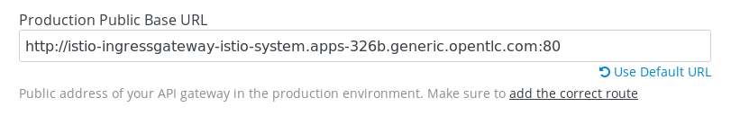

:noaudio:
:scrollbar:
:data-uri:
:toc2:
:linkattrs:
:transaction_costs: link:https://en.wikipedia.org/wiki/Transaction_cost[transaction costs]

= Service Mesh Routing Lab

.Goals
* Modify Red Hat Service Mesh default pertaining to Egress 
* Inject Red Hat Service Mesh Envoy proxy configurations into an API gateway
* Configure a Red Hat Service Mesh Egress Route for an API gateway
* Invoke your backend service via the Red Hat Service Mesh Ingress gateway and Red Hat 3scale API Management gateway

:numbered:

== Overview

Traffic routing can occur in several locations of the software stack:

. *OpenShift Container Platform*:
+
Provides routing functionality via either the HA-Proxy router and the traditional Kubernetes _Ingress_ controller.
Both of these components provide the ability to handle the traffic that enters the cluster from the outside.
+
OCP also provides the ability to completely by-pass these controllers via the use of a _NodePort_. 
+
Once traffic is in the OCP cluster, OCP also provides traffic routing features at the _service_ layer.

. *Red Hat Service Mesh*:
+
Red Hat Service Mesh replaces the Kubernetes Ingress controller with a new _Gateway_ and _Virtual Service_ that work in tandem to route the traffic into the mesh.

. *3scale API Management*:
+
The API Gateway is configured with policies that (among other capabilities) will route traffic to backend business services given the _Host_ header of the request.

In this lab, you work through various scenarios with the goal of gaining appreciation for the traffic routing features of each of these mentioned tools and how they complement each other.

=== Reference

. link:https://blog.jayway.com/2018/10/22/understanding-istio-ingress-gateway-in-kubernetes/[Understanding Red Hat Service Mesh Ingress Gateway]
. link:https://itnext.io/how-to-access-your-app-behind-an-openshift-router-87cbae3e7185[Accessing apps behind OCP Router]

== Lock down Red Hat Service Mesh
This first section of the lab involves you impersonating the role of a cluster admin to lock down the pre-installed Red Hat Service Mesh.

Red Hat Service Mesh has an installation option that configures the Istio proxy sidecar to pass through, instead of block, calls to URLs that are external to the cluster . 
This option is enabled by default so that one can start evaluating Red Hat Service Mesh quickly.
For the purpose of this lab, modify this default behavior such that apps can not make requests to external URLs by default.

Do so by executing the following:

. Study the configmap called _istio_ in the _istio-system_ namespace and notice the the value of variable _outboundTrafficPolicy_ is currently set to _ALLOW_ANY_.
+
-----
$ oc get configmap istio -n istio-system --export -o yaml | grep -E 'outboundTrafficPolicy|mode:'

...

    registry as well\n#   as those defined through ServiceEntries  \noutboundTrafficPolicy:\n
    \ mode: ALLOW_ANY
-----

. Change the value of the _outboundTrafficPolicy_ variable from _ALLOW_ANY_ to _REGISTRY_ONLY_:
+
-----
$ oc get configmap istio -n istio-system --export -o yaml \
     | sed 's/mode: ALLOW_ANY/mode: REGISTRY_ONLY/g' \
     | oc replace -n istio-system --as=system:admin -f - 
-----

== API Gateway: Red Hat Service Mesh enabled

=== Overview

As the next step in the journey toward API management and service mesh, in this section of the lab you will inject your API gateway with the _Envoy_ sidecar proxy from Red Hat Service Mesh.
A service mesh enabled API Gateway is of limited value on its own, but you will continue to build upon the foundations set here in later sections of this lab.

image::images/deployment_apicast-istio.png[]

In the above diagram, notice the introduction of a new pod: _prod-apicast-istio_.
Inbound requests through the API gateway production route are now directed to this new API gateway pod injected with the  _envoy_ sidecar.

The _Envoy_ sidecar in your _prod-apicast-istio_ pod will interoperate with _service mesh control plane_ functionality found in the _istio-system_ namespace.

Your API gateway will continue to pull _service proxy_ configurations from the pre-provisioned multi-tenant API Manager using the value of their  _$THREESCALE_PORTAL_ENDPOINT_ environment variable.

=== Allow injection of Envoy sidecar 

The Envoy sidecar container that will be injected into your API Gateway pod currently needs special permissions not commonly granted to containers.
In particular, both the _anyuid_ and _privileged_ security context contstraints (SCC).
Please enable both SCCs in the project where the API Gateway runs as follows: 

. *anyuid* scc:
.. For your new Red Hat Service Mesh enabled API gateway pod to start, it needs the _anyuid_ SCC.
+
The reason for this is that the _envoy_ sidecar containers from Red Hat Service Mesh currently run as a specific user ID.
Unlike most middleware containers that can run using any arbitrary user ID that is assigned to them at runtime by OCP, the _envoy_ sidecar containers would immediately fail upon startup without the _anyuid_ SCC.
If you attempted to do so, you would see an error similiar to the following:
+
-----
Error creating: pods "user50-prod-apicast-istio-6456c879c8" is forbidden: unable to validate against any security context constraint: [spec.initContainers[0].securityContext.privileged: Invalid value: true: Privileged containers are not allowed capabilities.add: Invalid value: "NET_ADMIN": capability may not be added spec.initContainers[0].securityContext.privileged: Invalid value: true: Privileged containers are not allowed capabilities.add: Invalid value: "NET_ADMIN":
-----

.. For the purpose of this lab, the cluster administrator of your OCP environment has provided you with the ability to _impersonate_ the cluster administrator.
Doing so provides you with the ability to apply the _anyuid_ SCC to your project.

.. Allow pods in the $GW_PROJECT to run using any user, including root:
+
-----
$ oc adm policy add-scc-to-user anyuid -z default -n $GW_PROJECT --as=system:admin
-----

. *privileged* scc
.. Allow pods in the $GW_PROJECT to run in a privledged manner:
+
-----
$ oc adm policy add-scc-to-user privileged -z default -n $GW_PROJECT --as=system:admin
-----
+
This SCC is required to ensure changes to the pod’s networking configuration is updated successfully with the istio-init initialization container.

=== Inject Red Hat Service Mesh proxy side-car

. Install community _istioctl_ utility
+
-----
$ mkdir -p $HOME/bin/ && \
    wget https://github.com/istio/istio/releases/download/1.1.0-rc.2/istio-1.1.0-rc.2-linux.tar.gz -O /tmp/istioctl.tar.gz && \
    tar -zxvf /tmp/istioctl.tar.gz -C /tmp && \
    cp /tmp/istio-1.1.0-rc.2/bin/istioctl $HOME/bin

-----

. Retrieve the YAML representation of the current API gateway production deployment:
+
-----
$ oc get deploy prod-apicast -n $GW_PROJECT -o yaml > $HOME/lab/prod-apicast.yml
-----
+
You will use the definition of your existing API gateway as a template to create a new Red Hat Service Mesh enabled API gateway.

. Differentiate your Red Hat Service Mesh enabled API gateway from your existing API gateway:
+
-----
$ sed -i "s/prod-apicast/$OCP_USERNAME-prod-apicast-istio/" $HOME/lab/prod-apicast.yml
-----

.. The reason you have included $OCP_USERNAME in the name of your  service mesh enabled API gateway is because you will need to differentiate it from other service mesh enabled API gateways that may be managed in the same service mesh.

.. Also, the _observability_ user interfaces included in Red Hat Service Mesh such as Jaeger are not currently multi-tenant.
+
By providing a unique identifer as a prefix to your API gateway name, you will be more easily able to identify logs and traces amongst others on the system.

. Place the deployment in a paused state:
+
-----
$ sed -i "s/replicas:\ 1/replicas: 1\n  paused: true/" $HOME/lab/prod-apicast.yml
-----

. Specify to the gateway that it should pull API service configuration information from the API Manager upon first request:
+
-----
$ sed -i "s/boot/lazy/" $HOME/lab/prod-apicast.yml
-----

. View the configmap in the `istio-system` project:
+
-----
$ oc describe configmap istio -n istio-system | more
-----
+
Your OCP user has already been enabled with _view_ access to the _istio-system_ namespace.
This provides access to the _istio_ configuration map.
The _istio_ configmap was generated by a cluster administrator when the Red Hat Service Mesh control plane was installed on OCP.

. Inject Red Hat Service Mesh configs (from the _istio_ configmap) into a new API gateway deployment:
+
-----

$ istioctl kube-inject \
           -f $HOME/lab/prod-apicast.yml \
           > $HOME/lab/prod-apicast-istio.yml
-----
+
NOTE:  For the purpose of this lab, you have now manually injected Red Hat Service Mesh related configs into a _deployment_ definition.
An alternative approach which involves adding a special annotation to your deployment definition will be introduced later lab of this course.

. View the Red Hat Service Mesh injected API gateway deployment descriptor:
+
-----
$ less $HOME/lab/prod-apicast-istio.yml | more
-----

. Deploy a new Red Hat Service Mesh enabled API gateway production gateway:
+
-----
$ oc create \
     -f $HOME/lab/prod-apicast-istio.yml \
     -n $GW_PROJECT
-----

. Resume the paused deployment:
+
-----
$ oc rollout resume deploy/$OCP_USERNAME-prod-apicast-istio -n $GW_PROJECT
-----

.. Notice the presence of an additional container in your new pod.  This additional container is the Red Hat Service Mesh proxy sidecar.
.. Both containers in the new pod should have started and the pod should be in a _Running_ state:
+
-----
$ oc get pods -n $GW_PROJECT

NAME                                         READY     STATUS    RESTARTS   AGE

....

user50-prod-apicast-istio-784dc96c75-gvh5f   2/2       Running   0          5m

-----
+
If either of the containers did not start up and the _READY_ column indicates anything other than _2/2_, this indicates a problem.
It's likely that _liveness_ and/or _readiness_ probes on the API gateway are failing.
It's possible that this is due to a misconfiguration of Red Hat Service Mesh.
As an initial troubleshooting step, remove the _liveness_ and _readiness_ probes defined in the deployment.
After doing so, do both containers start ?
If so, you'll need to troubleshoot the root cause of why either the _liveness_ probe, _readiness_ probe, or both probes are failing.

. Modify the _prod-apicast_ service to route inbound requests to the new Red Hat Service Mesh enabled _apicast_:
+
-----
$ oc patch service/prod-apicast -n $GW_PROJECT \
   --patch '{"spec":{"selector":{"app":"'$OCP_USERNAME'-prod-apicast-istio"}}}'
-----
+
Notice that the _service_ to your backend catalog application is being modified instead of the OpenShift _route_.
You have essentially conducted a simple _A / B Deployment_ at the _service_ layer where 100% of all traffic through the existing unmodified route will flow to this new Red Hat Service Mesh enabled pod.
As an alternative, _A / B Deployment_ could have occured at the _route_ layer.
This latter approach would have required you to create an additional _service_ associated with the new Red Hat Service Mesh enabled pod.

=== Test 
. Verify your `$CATALOG_USER_KEY` environment variable is set:
+
-----
$ echo $CATALOG_USER_KEY

d59904ad4515522ecccb8b81c761a283
-----

. From the terminal, execute the following:
+
-----
$ curl -v -k `echo "https://"$(oc get route/catalog-prod-apicast-$OCP_USERNAME -n $GW_PROJECT -o template --template {{.spec.host}})"/products?user_key=$CATALOG_USER_KEY"`
-----

.. [red]#The response should be an HTTP 404.#
.. Why would this be the case ?
... Inspect the API gateway log file for any clues.
... Is the request reaching your new Red Hat Service Mesh enabled API gateway?
... The root problem is that your service mesh enabled API gateway is unable to connect to the _system-provider_ endpoint exposed by the remote multi-tenant API Manager via the value of: $THREESCALE_PORTAL_ENDPOINT.
+
Your API gateway needs to do this to retrieve all the policy management configuration data from the API Manager.
The reason your API gateway can not make a connection to the API Manager is that $THREESCALE_PORTAL_ENDPOINT references an external internet URL.
By default, Red Hat Service Mesh blocks all outbound requests to the internet.
In the next section, you will define an _egress route_ to allow your API gateway to communicate with the API Manager.

.  Isolate the problem with your new  service mesh enabled API gateway by testing the call to the _system-provider_ of the API Manager, from within the API gateway.

.. Execute the following to test the call:
+
-----
$ oc rsh `oc get pod -n $GW_PROJECT | grep "apicast-istio" | awk '{print $1}'` \
          curl -v -k ${THREESCALE_PORTAL_ENDPOINT}/admin/api/services.json

...

Defaulting container name to user50-prod-apicast-istio.
Use 'oc describe pod/user50-prod-apicast-istio-784dc96c75-vxxz5 -n rhte-mw-api-mesh-50' to see all of the containers in this pod.
* About to connect() to user50-3scale-mt-admin.apps.8091.openshift.opentlc.com port 443 (#0)
*   Trying 52.7.161.237...
* Connected to user50-3scale-mt-admin.apps.8091.openshift.opentlc.com (52.7.161.237) port 443 (#0)
* Initializing NSS with certpath: sql:/etc/pki/nssdb
* NSS error -5938 (PR_END_OF_FILE_ERROR)
* Encountered end of file
* Closing connection 0
curl: (35) Encountered end of file
command terminated with exit code 35
-----

.. If you received an error response similar to above, you have isolated the problem to an inability for your API gateway pod to make an external call out of the service mesh.

=== Apply Custom _Egress Route_

In this section, you create a custom Red Hat Service Mesh _ServiceEntry_ that allows your API gateway to connect to the _system-provider_ of the multi-tenant API Manager.

. Create a custom Red Hat Service Mesh _Egress Route_ for API gateway configuration file:
+
-----
$ echo \
    "apiVersion: networking.istio.io/v1alpha3
kind: ServiceEntry
metadata:
  name: $OCP_USERNAME-catalog-apicast-egress-rule
spec:
  hosts:
  - $TENANT_NAME-admin.$API_WILDCARD_DOMAIN
  location: MESH_EXTERNAL
  ports:
  - name: https-443
    number: 443
    protocol: HTTPS
  resolution: DNS" \
 > $HOME/lab/catalog-apicast-egressrule.yml
-----

.. Note the value of `spec -> hosts` is set to the same value of the $THREESCALE_PORTAL_ENDPOINT specified in your Red Hat 3scale API Management gateway.
.. This should allow your API gateway to connect to the route that exposes the _system-provider_ service of the multi-tenant API Manager.

. Load the new egress rule:
+
-----
$ oc create -f $HOME/lab/catalog-apicast-egressrule.yml -n $GW_PROJECT 
-----

. View new ServiceEntry:
+
-----
$ oc describe serviceentry $OCP_USERNAME-catalog-apicast-egress-rule -n $GW_PROJECT
-----

. Now that a custom _egress route_ has been added, your API gateway should be able to pull configuration data from the API Manager.
+
Use a command like the following to verify that your service mesh enabled API gateway can now poll the API Manager for proxy service configuration information:
+
-----
$ oc rsh `oc get pod -n $GW_PROJECT | grep "apicast-istio" | awk '{print $1}'` \
     curl -k ${THREESCALE_PORTAL_ENDPOINT}/admin/api/services.json \
     | python -m json.tool | more

...

{
    "services": [
        {
            "service": {
                "backend_version": "1",
                "created_at": "2018-08-07T11:13:03Z",
                "end_user_registration_required": true,
                "id": 3,
                "links": [
                    {
                        "href": "https://user1-3scale-admin.apps.7777.thinkpadratwater.com/admin/api/services/3/metrics",
                        "rel": "metrics"
                    },

....
-----

. Either wait up to 5 minutes for your service mesh enabled API gateway to refresh its proxy configuration (because pulling this configuration data previously failed) or restart the pod.
. Using the curl utility, attempt again to retrieve catalog data via your service mesh enabled API gateway:
+
-----
$ curl -v -k `echo "https://"$(oc get route/catalog-prod-apicast-$OCP_USERNAME -n $GW_PROJECT -o template --template {{.spec.host}})"/products?user_key=$CATALOG_USER_KEY"`
-----
+
This time, you should see the catalog data in the response.
This request now flows through your service mesh enabled API gateway.

[blue]#As mentioned previously, what you have accomplished so far is of limited value on its own. 
However, this is a step to full utilization of API management and service mesh of your container native application.
In the next sections of this lab you will continue to build upon this foundation.#

== Red Hat Service Mesh Ingress Gateway

Until now, traffic into the production API gateway has been directly via the standard _HAProxy_-based OCP _router_.

This has worked, however what is missing is the ability to apply more sophisticated route rules and capture improved _observability_ as soon as the request enters the OCP cluster.
Red Hat Service Mesh includes an _Ingress_ gateway that implements these additional features.

In this section of the lab, you will modify the flow of inbound traffic so that it flows through the _Ingress_ gateway of Red Hat Service Mesh.
Among other benefits, you will be able to trace inbound traffic as it initially enters your solution.

You will do so using the following two approaches:

. Direct inbound request directly to the service mesh Ingress Gateway via an OCP _NodePort_.
. Direct inbound request to the service mesh Ingress Gateway via its _route_ configuration in OCP's HA-Proxy router.

=== Define Gateway and VirtualService

. Create an environment variable that reflects the _Production Public Base URL_ of the _catalog-service_ configured in the API Manager:
+
-----
$ echo "export CATALOG_API_GW_HOST=`oc get route/catalog-prod-apicast-$OCP_USERNAME -n $GW_PROJECT -o template --template {{.spec.host}}`" >> ~/.bashrc

$ source ~/.bashrc
-----
+
The value of $CATALOG_API_GW_HOST will be specified in the request to the Red Hat Service Mesh ingress gateway as an HTTP _HOST_ header.
It should match what has been configured in the _catalog-service_ in your API Manager.
+
image::images/recall_prod_base.png[]

. Create a file that defines an _Ingress_ gateway:
+
-----
$ echo \
    "apiVersion: networking.istio.io/v1alpha3
kind: Gateway
metadata:
  name: catalog-istio-gateway
spec:
  selector:
    istio: ingressgateway # use istio default controller
  servers:
  - port:
      number: 80
      name: http
      protocol: HTTP
    hosts:
    - '*'" \
> $HOME/lab/catalog-istio-gateway.yml
-----

. Create the gateway in OCP:
+
-----
$ oc create -f $HOME/lab/catalog-istio-gateway.yml -n $GW_PROJECT
-----

. Create a file that defines a virtual service:
+
-----
$ echo \
    "apiVersion: networking.istio.io/v1alpha3
kind: VirtualService
metadata:
  name: catalog-istio-gateway-vs
spec:
  hosts:
  - '*' 
  gateways:
  - catalog-istio-gateway
  http:
  - match:
    - uri:
        prefix: /products
    route:
    - destination:
        port:
          number: 8080
        host: prod-apicast" \
> $HOME/lab/catalog-istio-gateway-vs.yml
-----

. Create the virtual service in OCP:
+
-----
$ oc create -f $HOME/lab/catalog-istio-gateway-vs.yml -n $GW_PROJECT 
-----

. View the _istio-ingressgateway_ related resources in the _istio-system_ namespace:
+
-----
$ oc get all -l app=istio-ingressgateway -n istio-system
-----
+
The response back should list the _istio-ingressgateway_ pod, service, deployment, replicaset and route.

. The _istio-ingressgateway_ exposes a very handy service (called _config_dump_) to view its existing configurations.
+
As an OCP cluster-admin, verify the existence of the new route configurations in the _istio-ingressgateweay_ pod.

.. Switch to the root operating system user so as to leverage OCP cluster admin capabilities
+
-----
$ sudo -i
-----

.. Execute the following and review the response:
+
-----
# oc project istio-system && \
         oc rsh `oc get pod | grep "istio-ingressgateway" | awk '{print $1}'` \
         curl http://localhost:15000/config_dump \
         > /tmp/config_dump \
         && less /tmp/config_dump \
         | /usr/local/bin/jq ".configs | last | .dynamic_route_configs"
-----
+
The json response should include all the details of your new route configuration from the Service Mesh ingress to your API gateway.

. Return back to the non-root operating system user (user1):
+
-----
# exit
-----

=== Direct inbound traffic via OCP Node Port
Your lab environment allows direct access from external clients to the _istio-ingressgateway_ OpenShift service of Red Hat Service Mesh via a node port of: 31380.

In this section of the lab, you'll invoke your API gateway via the _istio-ingressgateway_ exposed via this node port.

image::images/ingress_gateway_via_node_port.png[]

. Set an environment variable that reflects the nodeport of the Red Hat Service Mesh ingress gateway service:
+
-----
$ echo "export INGRESS_PORT=$(oc -n istio-system get service istio-ingressgateway -o jsonpath='{.spec.ports[?(@.name=="http2")].nodePort}')" >> ~/.bashrc

source ~/.bashrc
-----

. Smoke test a request for catalog data via the newly configured Red Hat Service Mesh ingress gateway:
+
-----
$ curl -v \
       http://master00.example.com:$INGRESS_PORT/products?user_key=$CATALOG_USER_KEY
-----

.. The response back should be a 404.  Why ?
.. Check the log file of your istio enabled production API gateway.  There should be a recent statement similar to the following
+
-----
host_based_finder.lua:20: find_service(): service not found for host istio-ingressgateway-istio-system.apps-326b.generic.opentlc.com, client: 127.0.0.1, server: _, request: "GET /products?user_key=95706a476fcf08a95322084a8f5632b4 HTTP/1.1", host: "istio-ingressgateway-istio-system.apps-326b.generic.opentlc.com"
-----

.. The HTTP request (sent to master00.example.com:$INGRESS_PORT) was successfully routed from the istio ingressgateway to the istio enabled API gateway.
However, the problem is that the API gateway is not able to deduce from the request which API Managed service (such as your catalog service) this request correspondes to.
The API Gateway requires a request where the HTTP _Host_ header matches that of the _Production Base URL_ of the API.

. Re-send the request for catalog data explicitly specifying the _Host_ header in the HTTP request:
+
-----
$ curl -v \
       -H"Host: $CATALOG_API_GW_HOST" \
       http://master00.example.com:$INGRESS_PORT/products?user_key=$CATALOG_USER_KEY
-----
+
Notice the value of the HTTP _Host_ header now matches that of the _Production Base URL_ of your API.
Subsequently, the API Gateway should have authorized the request.

=== Direct inbound traffic via OpenShift Route

image::images/ingress_gateway_via_node_port.png[]

The previous test used an OpenShift NodePort to route inbound traffic directly to the service mesh via the _istio ingressgateway_.
This approach by-passed the OpenShift HA-Proxy.

The `istio-system` namespace also provides an OpenShift route called: `istio-ingressgateway`.
Like all Red Hat OpenShift Container Platform routes, it is exposed to external clients via its HA-Proxy.

In this section of the lab, you direct traffic to the mesh via the OCP HA-Proxy.
This approach introduces an extra hop in the network but could be useful in scenarious where creating a NodePort is not feasible.

. Begin by executing a request to the _istio-ingressgateway_ OpenShift route:
+
-----
$  curl -v \
      `echo "http://"$(oc get route istio-ingressgateway -n istio-system -o template --template {{.spec.host}})"/products?user_key=$CATALOG_USER_KEY"` \
      -o /dev/null
-----

.. Did you receive back an HTTP 404 ?   If so, why ?
.. Maybe the fix is to explicitly over-ride the _Host_ header as you did in the previous section ?  Try it out.
+
-----
$ curl -v \
       -H"Host: $CATALOG_API_GW_HOST" \
      `echo "http://"$(oc get route istio-ingressgateway -n istio-system -o template --template {{.spec.host}})"/products?user_key=$CATALOG_USER_KEY"` \
      -o /dev/null
-----
+
By over-riding the Host header with the value of $CATALOG_API_GW_HOST, the HA-Proxy of OCP will reject the request with a 503.
The request will not even be forwarded to the istio-ingressgateway pod.
The reason for this is that the HA-Proxy of OCP routes traffic based on the value of the HTTP _Host_ header.
It is not able to route to a host given that hostname and the default port 80.

. To direct inbound traffic through the _istio-ingressgateway_ route, the solution is to modify the _Public Base URL_ of the 3scale API to match the hostname of the _istio-ingressgateway_ hostname.
Do so as follows:

.. Point your browser to the Admin Console of 3scale and navigate to the `APIcast configuration` page of the catalog_service.
.. Change the value of the _Production Base URL_ to the value of the following:
+
-----
$ echo -en "\nhttp://`oc get route istio-ingressgateway -n istio-system -o template --template {{.spec.host}}:80`\n\n"
-----
+

.. Save the APIcast configuration change and promote the change to production.
.. Wait 5 minutes or so for the config changes to propogate to the production API gateway or refresh the production API gateway (by deleting the pod and letting kubernetes re-create it).
.. Send a new request to your production API Gatway via the istio ingressgateway:
+
-----
$  curl -v \
      `echo "http://"$(oc get route istio-ingressgateway -n istio-system -o template --template {{.spec.host}})"/products?user_key=$CATALOG_USER_KEY"`
-----

Please continue on to the next lab:  link:03_2_service_mesh_observability_Lab.html[Service Mesh Observability]

ifdef::showscript[]
endif::showscript[]
