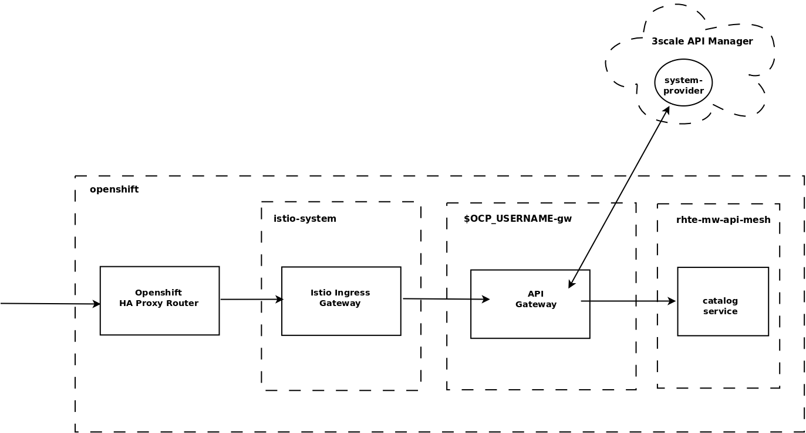

:noaudio:
:scrollbar:
:data-uri:
:toc2:
:linkattrs:
:transaction_costs: link:https://en.wikipedia.org/wiki/Transaction_cost[transaction costs]

= Service Mesh Routing Lab

.Goals
* Inject Istio Envoy proxy configurations into an API gateway
* Configure an Istio Egress Route for an API gateway
* Invocation of your backend service via the Istio Ingress gateway and Red Hat 3scale API Management gateway

:numbered:

== Overview

_API Management_ facilitates relationships between API consumers and producers, lowering link:https://en.wikipedia.org/wiki/Transaction_cost[transaction costs] such as search costs, price discovery, policing and enforcement costs, and so on. 
These would otherwise hinder mutually beneficial exchanges between API consumers and producers.

A _service mesh_ provides the technical resilience and _observability_ needed to facilitate a Microservice Architecture (MSA).

_API Management_ and a _service mesh_ target different use cases, although there is some overlap.

The purpose of this lab is to discover how these technologies can complement each other.
You do this by gradually applying features of a _service mesh_ to the existing API Managed _catalog_ application.

=== Alternatives

In regards a MSA service mesh, the following are related community initiatives that are not covered in this lab.

==== Standalone community Jaeger

_Jaeger_ is a tool that provides distributed tracing.

Available in the open source community is the _all-in-one_ community Jaeger that includes a jaeger-agent and jaeger-collector.
This link:https://medium.com/@jmprusi_49013/adding-opentracing-support-to-apicast-api-gateway-a8e0a38347d2[OpenTracing tutorial] details the use of an OpenTracing-enabled API gateway with the _all-in-one_ community Jaeger.

As an alternative to the _all-in-one_ standalone Jaeger, Istio also comes included with Jaeger.
In this lab, the Jaeger-based tracing functionality provided by Istio is utilized instead of a standalone Jaeger installation.

==== Istio API Management Working Group

Istio activity is organized into _working groups_.

One of these Istio working groups is focused on link:https://github.com/istio/community/blob/master/WORKING-GROUPS.md#api-management[API Management].

Members of the  Red Hat engineering team are currently participating in this Istio API Management working group.

Outcomes of this working group may potentially guide the development and roadmap of future releases of the Red Hat 3scale API Management product.

In the future, this lab may demonstrate initiatives that may come out of this Istio API Management Working Group.

==== API Gateway Side car

link:https://github.com/nginxinc/nginmesh[nginMesh] is a community initiative that injects the NGinx server as a side-car to your services.
The NGinx side-car acts as a service proxy to an Istio service-mesh (conceptually similar to the _Envoy_ proxy that you will be exposed to in this lab).

Because the API Gateway of 3scale is also built on Nginx, the 3scale API gateway could also be potentially extended to serve as a side car to a service running in a service mesh.

In fact, in an upcoming release of the 3scale API Gateway, it will have the capability to operate independantly of the 3scale API Manager.
It could be injected as a sidecar to an application.

This approach is not covered in this lab.

== Lock down Red Hat Service Mesh
This first section of the lab involves you impersonating the role of a cluster admin to lock down the Service Mesh in several ways.

. Service Mesh has an installation option that configures the Istio proxy to pass through, instead of block, calls to external services on any ports. 
This option is enabled by default so that one can start evaluating Red Hat Service Mesh quickly, without controlling access to external services.
For the purpose of this lab, modify this default behavior such that apps can not make requests to external services by default:
+
-----
$ oc get configmap istio -n istio-system --export -o yaml \
     | sed 's/mode: ALLOW_ANY/mode: REGISTRY_ONLY/g' \
     | oc replace -n istio-system --as=system:admin -f - 
-----

[[apicast_istio]]
== API Gateway: Istio enabled

=== Overview

As the next step in the journey toward API management and service mesh, in this section of the lab you will inject your API gateway with the _Envoy_ sidecar proxy from Istio.
A service mesh enabled API Gateway is of limited value on its own, but you will continue to build upon the foundations set here in later sections of this lab.

In the above diagram, notice the introduction of a new pod: _prod-apicast-istio_.
Inbound requests through the API gateway production route are now directed to this new API gateway pod injected with Istio's _envoy_ sidecar.

The _Envoy_ sidecar in your _prod-apicast-istio_ pod will interoperate with _service mesh control plane_ functionality found in the _istio-system_ namespace.

Your API gateway will continue to pull _service proxy_ configurations from the pre-provisioned multi-tenant API Manager using the value of their  _$THREESCALE_PORTAL_ENDPOINT_ environment variable.

=== Inject Istio proxy side-car

. Install community _istioctl_ utility
+
-----
$ mkdir -p $HOME/bin/ && \
    wget https://github.com/istio/istio/releases/download/1.1.0-rc.2/istio-1.1.0-rc.2-linux.tar.gz -O /tmp/istioctl.tar.gz && \
    tar -zxvf /tmp/istioctl.tar.gz -C /tmp && \
    cp /tmp/istio-1.1.0-rc.2/bin/istioctl $HOME/bin

-----

. Retrieve the YAML representation of the current API gateway production deployment:
+
-----
$ oc get deploy prod-apicast -n $GW_PROJECT -o yaml > $HOME/lab/prod-apicast.yml
-----
+
You will use the definition of your existing API gateway as a template to create a new _Istio_ enabled API gateway.

. Differentiate your Istio enabled API gateway from your existing API gateway:
+
-----
$ sed -i "s/prod-apicast/$OCP_USERNAME-prod-apicast-istio/" $HOME/lab/prod-apicast.yml
-----
.. The reason you have included $OCP_USERNAME in the name of your Istio-enabled API gateway is because you will need to differentiate it from other Istio-enabled API gateways that may be managed in the same service mesh.
.. Also, the _observability_ user interfaces included in Istio such as Jaeger are not currently multi-tenant.
+
By providing a unique identifer as a prefix to your API gateway name, you will be more easily able to identify logs and traces amongst others on the system.

. Place the deployment in a paused state:
+
-----
$ sed -i "s/replicas:\ 1/replicas: 1\n  paused: true/" $HOME/lab/prod-apicast.yml
-----

. Specify to the gateway that it should pull API service configuration information from the API Manager upon first request:
+
-----
$ sed -i "s/boot/lazy/" $HOME/lab/prod-apicast.yml
-----

. View the configmap in the `istio-system` project:
+
-----
$ oc describe configmap istio -n istio-system | more
-----
+
Your OCP user has already been enabled with _view_ access to the _istio-system_ namespace.
This provides access to the _istio_ configuration map.
The _istio_ configmap was generated by a cluster administrator when the Istio control plane was installed on OCP.

. Inject Istio configs (from the _istio_ configmap) into a new API gateway deployment:
+
-----

$ istioctl kube-inject \
           -f $HOME/lab/prod-apicast.yml \
           > $HOME/lab/prod-apicast-istio.yml
-----
+
NOTE:  For the purpose of this lab, you have now manually injected Istio related configs into a _deployment_ definition.
An alternative approach which involves adding a special annotation to your deployment definition will be introduced later in this lab.

. View the Istio injected API gateway deployment descriptor:
+
-----
$ less $HOME/lab/prod-apicast-istio.yml | more
-----

. Deploy a new Istio-enabled API gateway production gateway:
+
-----
$ oc create \
     -f $HOME/lab/prod-apicast-istio.yml \
     -n $GW_PROJECT
-----

. Inject required resource limits and requests into Istio related containers :
+
There is a cluster quota assigned to your OCP user.
This cluster quota requires that all containers, including the _istio-proxy_ and _istio-init_, specify _limits_ and _requests_.
+
-----
$ oc patch deploy/$OCP_USERNAME-prod-apicast-istio -n $GW_PROJECT\
   --patch '{"spec":{"template":{"spec":{"containers":[{"name":"istio-proxy", "resources": {   "limits":{"cpu": "500m","memory": "128Mi"},"requests":{"cpu":"50m","memory":"32Mi"}   }}]}}}}'

$ oc patch deploy/$OCP_USERNAME-prod-apicast-istio -n $GW_PROJECT \
   --patch '{"spec":{"template":{"spec":{"initContainers":[{"name":"istio-init", "resources": {   "limits":{"cpu": "500m","memory": "128Mi"},"requests":{"cpu":"50m","memory":"32Mi"}   }}]}}}}'
-----

. Allow pods in the $GW_PROJECT to run using any user, including root:
+
-----
$ oc adm policy add-scc-to-user anyuid -z default -n $GW_PROJECT --as=system:admin
-----

.. For your new Istio-enabled API gateway pod to start, it needs the _anyuid_ sidecar container (SCC).
+
The reason for this is that the _envoy_ sidecar containers from Istio currently run as a specific user ID.
Unlike most middleware containers that can run using any arbitrary user ID that is assigned to them at runtime by OCP, the _envoy_ sidecar containers would immediately fail upon startup without the _anyuid_ SCC.
If you attempted to do so, you would see an error similiar to the following:
+
-----
Error creating: pods "user50-prod-apicast-istio-6456c879c8" is forbidden: unable to validate against any security context constraint: [spec.initContainers[0].securityContext.privileged: Invalid value: true: Privileged containers are not allowed capabilities.add: Invalid value: "NET_ADMIN": capability may not be added spec.initContainers[0].securityContext.privileged: Invalid value: true: Privileged containers are not allowed capabilities.add: Invalid value: "NET_ADMIN":
-----

.. For the purpose of this lab, the cluster administrator of your OCP environment has provided you with the ability to _impersonate_ the cluster administrator.
Doing so provides you with the ability to apply the _anyuid_ SCC to your project.

. Allow pods in the $GW_PROJECT to run in a privledged manner:
+
-----
$ oc adm policy add-scc-to-user privileged -z default -n $GW_PROJECT --as=system:admin
-----
+
This SCC is required to ensure changes to the pod’s networking configuration is updated successfully with the istio-init initialization container.

. Resume the paused deployment:
+
-----
$ oc rollout resume deploy/$OCP_USERNAME-prod-apicast-istio -n $GW_PROJECT
-----

.. Notice the presence of an additional container in your new pod.  This additional container is the Istio proxy sidecar.
.. Both containers in the new pod should have started and the pod should be in a _Running_ state:
+
-----
$ oc get pods -n $GW_PROJECT

NAME                                         READY     STATUS    RESTARTS   AGE

....

user50-prod-apicast-istio-784dc96c75-gvh5f   2/2       Running   0          5m

-----
+
If either of the containers did not start up and the _READY_ column indicates anything other than _2/2_, this indicates a problem.
It's likely that _liveness_ and/or _readiness_ probes on the API gateway are failing.
It's possible that this is due to a misconfiguration of Istio.
As an initial troubleshooting step, remove the _liveness_ and _readiness_ probes defined in the deployment.
After doing so, do both containers start ?
If so, you'll need to troubleshoot the root cause of why either the _liveness_ probe, _readiness_ probe, or both probes are failing.

. Modify the _prod-apicast_ service to route inbound requests to the new Istio enabled _apicast_:
+
-----
$ oc patch service/prod-apicast -n $GW_PROJECT \
   --patch '{"spec":{"selector":{"app":"'$OCP_USERNAME'-prod-apicast-istio"}}}'
-----
+
Notice that the _service_ to your backend catalog application is being modified instead of the OpenShift _route_.
You have essentially conducted a simple _A / B Deployment_ at the _service_ layer where 100% of all traffic through the existing unmodified route will flow to this new Istio enabled pod.
As an alternative, _A / B Deployment_ could have occured at the _route_ layer.
This latter approach would have required you to create an additional _service_ associated with the new Istio enabled pod.

=== Test 
. Verify your `$CATALOG_USER_KEY` environment variable is set:
+
-----
$ echo $CATALOG_USER_KEY

d59904ad4515522ecccb8b81c761a283
-----

. From the terminal, execute the following:
+
-----
$ curl -v -k `echo "https://"$(oc get route/catalog-prod-apicast-$OCP_USERNAME -n $GW_PROJECT -o template --template {{.spec.host}})"/products?user_key=$CATALOG_USER_KEY"`
-----

.. [red]#The response should be an HTTP 404.#
.. Why would this be the case ?
... Inspect the API gateway log file for any clues.
... Is the request reaching your new Istio enabled API gateway?
... The root problem is that your Istio-enabled API gateway is unable to connect to the _system-provider_ endpoint exposed by the remote multi-tenant API Manager via the value of: $THREESCALE_PORTAL_ENDPOINT.
+
Your API gateway needs to do this to retrieve all the policy management configuration data from the API Manager.
The reason your API gateway can not make a connection to the API Manager is that $THREESCALE_PORTAL_ENDPOINT references an external internet URL.
By default, Istio blocks all outbound requests to the internet.
In the next section, you will define an _egress route_ to allow your API gateway to communicate with the API Manager.

.  Isolate the problem with your new Istio-enabled API gateway by testing the call to the _system-provider_ of the API Manager, from within the API gateway.

.. Execute the following to test the call:
+
-----
$ oc rsh `oc get pod -n $GW_PROJECT | grep "apicast-istio" | awk '{print $1}'` \
          curl -v -k ${THREESCALE_PORTAL_ENDPOINT}/admin/api/services.json

...

Defaulting container name to user50-prod-apicast-istio.
Use 'oc describe pod/user50-prod-apicast-istio-784dc96c75-vxxz5 -n rhte-mw-api-mesh-50' to see all of the containers in this pod.
* About to connect() to user50-3scale-mt-admin.apps.8091.openshift.opentlc.com port 443 (#0)
*   Trying 52.7.161.237...
* Connected to user50-3scale-mt-admin.apps.8091.openshift.opentlc.com (52.7.161.237) port 443 (#0)
* Initializing NSS with certpath: sql:/etc/pki/nssdb
* NSS error -5938 (PR_END_OF_FILE_ERROR)
* Encountered end of file
* Closing connection 0
curl: (35) Encountered end of file
command terminated with exit code 35
-----

.. If you received an error response similar to above, you have isolated the problem to an inability for your API gateway pod to make an external call out of the service mesh.

=== Apply Custom _Egress Route_

In this section, you create a custom Istio _ServiceEntry_ that allows your API gateway to connect to the _system-provider_ of the multi-tenant API Manager.

. Create a custom Istio _Egress Route_ for API gateway configuration file:
+
-----
$ echo \
    "apiVersion: networking.istio.io/v1alpha3
kind: ServiceEntry
metadata:
  name: $OCP_USERNAME-catalog-apicast-egress-rule
spec:
  hosts:
  - $TENANT_NAME-admin.$API_WILDCARD_DOMAIN
  location: MESH_EXTERNAL
  ports:
  - name: https-443
    number: 443
    protocol: HTTPS
  resolution: DNS" \
 > $HOME/lab/catalog-apicast-egressrule.yml
-----

.. Note the value of `spec -> hosts` is set to the same value of the $THREESCALE_PORTAL_ENDPOINT specified in your Red Hat 3scale API Management gateway.
.. This should allow your API gateway to connect to the route that exposes the _system-provider_ service of the multi-tenant API Manager.

. Load the new egress rule:
+
-----
$ oc create -f $HOME/lab/catalog-apicast-egressrule.yml -n $GW_PROJECT 
-----

. View new ServiceEntry:
+
-----
$ oc describe serviceentry $OCP_USERNAME-catalog-apicast-egress-rule -n $GW_PROJECT
-----

. Now that a custom _egress route_ has been added, your API gateway should be able to pull configuration data from the API Manager.
+
Use a command like the following to verify that your Istio-enabled API gateway can now poll the API Manager for proxy service configuration information:
+
-----
$ oc rsh `oc get pod -n $GW_PROJECT | grep "apicast-istio" | awk '{print $1}'` \
     curl -k ${THREESCALE_PORTAL_ENDPOINT}/admin/api/services.json \
     | python -m json.tool | more

...

{
    "services": [
        {
            "service": {
                "backend_version": "1",
                "created_at": "2018-08-07T11:13:03Z",
                "end_user_registration_required": true,
                "id": 3,
                "links": [
                    {
                        "href": "https://user1-3scale-admin.apps.7777.thinkpadratwater.com/admin/api/services/3/metrics",
                        "rel": "metrics"
                    },

....
-----

. Either wait up to 5 minutes for your Istio-enabled API gateway to refresh its proxy configuration (because pulling this configuration data previously failed) or restart the pod.
. Using the curl utility, attempt again to retrieve catalog data via your Istio-enabled API gateway:
+
-----
$ curl -v -k `echo "https://"$(oc get route/catalog-prod-apicast-$OCP_USERNAME -n $GW_PROJECT -o template --template {{.spec.host}})"/products?user_key=$CATALOG_USER_KEY"`
-----
+
This time, you should see the catalog data in the response.
This request now flows through your Istio-enabled API gateway.

[blue]#As mentioned previously, what you have accomplished so far is of limited value on its own. 
However, this is a step to full utilization of API management and service mesh of your container native application.
In the next sections of this lab you will continue to build upon this foundation.#

== Istio Ingress Gateway

Until now, traffic into the production API gateway has been directly via the standard _HAProxy_-based OCP _router_.

This has worked, but what is missing is the ability to apply more sophisticated route rules and integration with service mesh _observability_ tools such as _Jaeger_ and _Prometheus_.
Istio includes an _Ingress_ gateway that implements these additional features.

In this section of the lab, you will modify the flow of inbound traffic so that it also flows through the _Ingress_ gateway of Istio.
Among other benefits, you will be able to trace inbound traffic as it initially enters your solution.

. Create an environment variable that reflects the _Production Public Base URL_ of the _catalog-service_ configured in the API Manager:
+
-----
$ echo "export CATALOG_API_GW_HOST=`oc get route/catalog-prod-apicast-$OCP_USERNAME -n $GW_PROJECT -o template --template {{.spec.host}}`" >> ~/.bashrc

$ source ~/.bashrc
-----
+
The value of $CATALOG_API_GW_HOST will be specified in the request to the Istio ingress gateway as an HTTP _HOST_ header.
It should match what has been configured in the _catalog-service_ in your API Manager.
+

. Create a file that defines an _Ingress_ gateway:
+
-----
$ echo \
    "apiVersion: networking.istio.io/v1alpha3
kind: Gateway
metadata:
  name: catalog-istio-gateway
spec:
  selector:
    istio: ingressgateway # use istio default controller
  servers:
  - port:
      number: 80
      name: http
      protocol: HTTP
    hosts:
    - "$CATALOG_API_GW_HOST"" \
 > $HOME/lab/catalog-istio-gateway.yml
-----

. Create the gateway in OCP:
+
-----
$ oc create -f $HOME/lab/catalog-istio-gateway.yml -n $GW_PROJECT
-----

. Create a file that defines a virtual service:
+
-----
$ echo \
    "apiVersion: networking.istio.io/v1alpha3
kind: VirtualService
metadata:
  name: catalog-istio-gateway-vs
spec:
  hosts:
  - "$CATALOG_API_GW_HOST"
  gateways:
  - catalog-istio-gateway
  http:
  - match:
    - uri:
        prefix: /products
    route:
    - destination:
        port:
          number: 8080
        host: prod-apicast" \
> $HOME/lab/catalog-istio-gateway-vs.yml
-----

. Create the virtual service in OCP:
+
-----
$ oc create -f $HOME/lab/catalog-istio-gateway-vs.yml -n $GW_PROJECT 
-----

-----
# sudo -i

# oc project istio-system && \
         oc rsh `oc get pod | grep "istio-ingressgateway" | awk '{print $1}'` \
         curl http://localhost:15000/config_dump \
         > /tmp/config_dump \
         && less /tmp/config_dump \
         | jq ".configs | last | .dynamic_route_configs"

# exit
-----

. Set environment variables that reflect the host and port of the Istio ingress gateway service:
+
-----
$ echo "export INGRESS_HOST=$(oc -n istio-system get service istio-ingressgateway -o jsonpath='{.status.loadBalancer.ingress[0].ip}')" >> ~/.bashrc

$ echo "export INGRESS_PORT=$(oc -n istio-system get service istio-ingressgateway -o jsonpath='{.spec.ports[?(@.name=="http2")].port}')" >> ~/.bashrc

source ~/.bashrc
-----
+
NOTE:  This $INGRESS_HOST:$INGRESS_PORT socket is local to the Red Hat OpenShift Container Platform subnet.
It only becomes available when there is an Istio gateway and virtual service present and even then it might take up to 5 minutes to become available.

. Smoke test a request for catalog data via the newly configured Istio ingress gateway:
+
-----
$ curl -v \
       http://$INGRESS_HOST:$INGRESS_PORT/products?user_key=$CATALOG_USER_KEY
-----

.. The response back should be a 404.  Why ?
.. Check the log file of your istio enabled production API gateway.  There should be a recent statement similar to the following
+
-----
host_based_finder.lua:20: find_service(): service not found for host istio-ingressgateway-istio-system.apps-326b.generic.opentlc.com, client: 127.0.0.1, server: _, request: "GET /products?user_key=95706a476fcf08a95322084a8f5632b4 HTTP/1.1", host: "istio-ingressgateway-istio-system.apps-326b.generic.opentlc.com"
-----
.. The HTTP request was routed from the istio ingressgateway to the istio enabled API gateway.
The API gateway is not able to deduce from the request the _Production Base URL_ that corresponds to a API Managed service (such as your catalog service).

. Smoke test a request for catalog data via the newly configured Istio ingress gateway:
+
-----
$ curl -v \
       -HHost:$CATALOG_API_GW_HOST \
       http://$INGRESS_HOST:$INGRESS_PORT/products?user_key=$CATALOG_USER_KEY
-----
+
Notice the use of the HTTP _Host_ header.

.. Why is it needed ?
.. What happens if this _HOST_ header is not included in the request ?
.. What happens if this _HOST_ header is included in the request but its value (along with the _host_ attributes in the gateway and virtual service) do not match the _Production Public Base Url_ of the _catalog-service_ in the API Manager ?

. The previous smoke test used an $INGRESS_HOST and $INGRESS_PORT that are made available on the local Red Hat OpenShift Container Platform network subnet.
Usage of this local $INGRESS_HOST only worked because your curl client is on the same host as Red Hat OpenShift Container Platform.
+
The `istio-system` namespace provides a route called: `istio-ingressgateway`.
Like all Red Hat OpenShift Container Platform routes, it is exposed to external clients.
+
Try invoking the API gateway via this `istio-ingressgateway` route instead of using the internal _service-mesh_ related $INGRESS_HOST and $INGRESS_PORT.
The results should be the same.  The command to use is as follows:
+
-----
$  curl -v \
       -HHost:$CATALOG_API_GW_HOST \
      `echo "http://"$(oc get route istio-ingressgateway -n istio-system -o template --template {{.spec.host}})"/products?user_key=$CATALOG_USER_KEY"`
-----
+
NOTE: [red]#There is currently a bug in your student lab environment that is causing this step to fail.  
Specifically, the _istio-ingressgateway_ service of the _istio-system_ namespace makes use of OCP _nodeport_ features.
The _nodeports_ defined in the _istio-ingressgateway_ service are currently blocked by the cloud provider hosting your VM#

ifdef::showscript[]

Deletion of the route causes the curl command (using the HOST) to no longer work.  not sure why.

. The original route to the product API Gateway specific to the _catalog_ service can optionally be deleted.
Going forward all incoming traffic will flow through the Istio Ingress Gateway.
+
-----
$ oc delete route/catalog-prod-apicast-$OCP_USERNAME -n $GW_PROJECT
-----

endif::showscript[]

ifdef::showscript[]
endif::showscript[]
