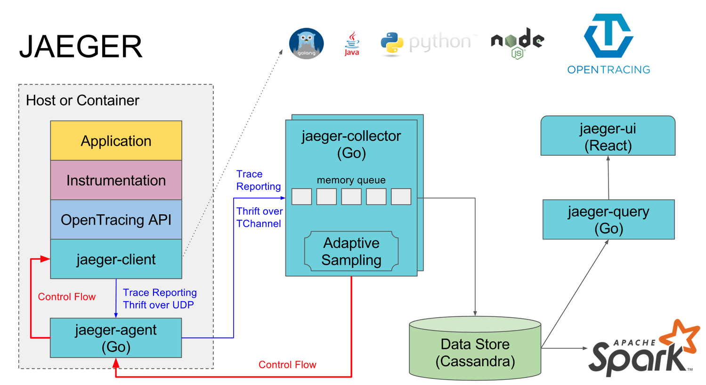
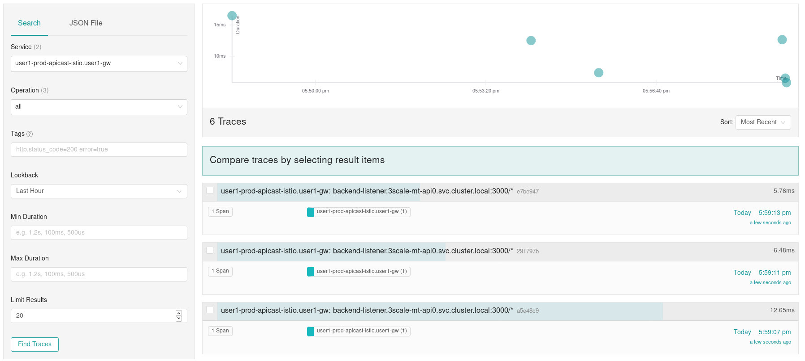
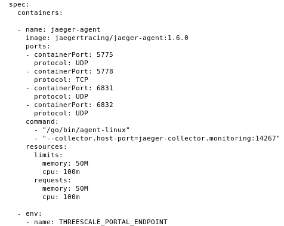
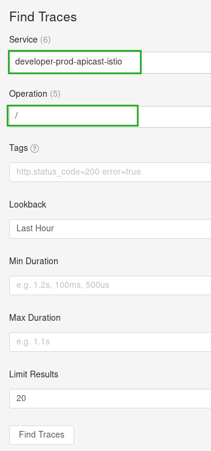
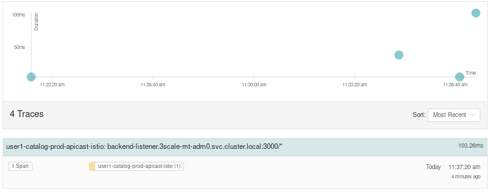
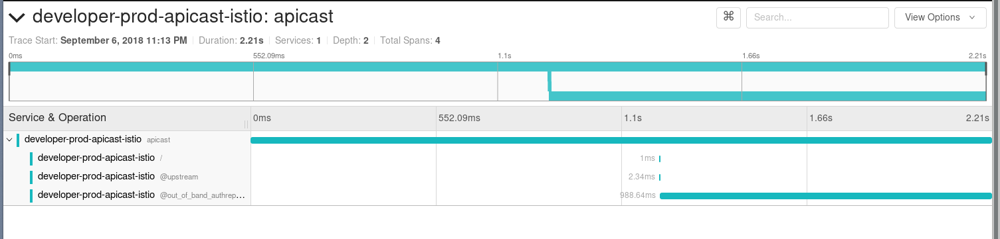
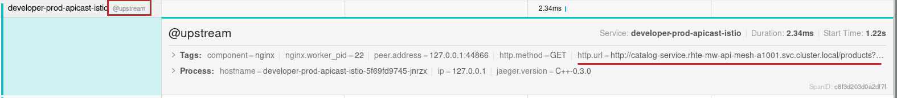
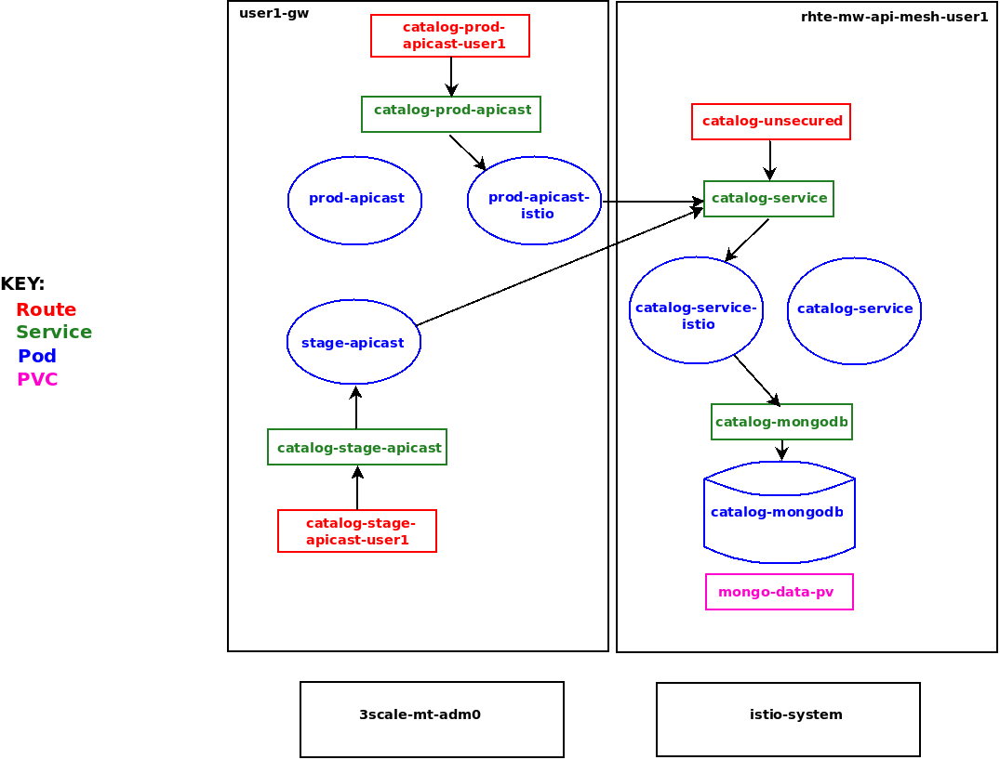
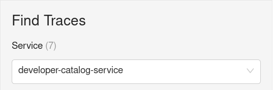
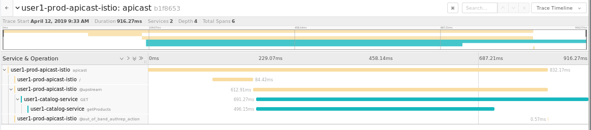

:noaudio:
:scrollbar:
:data-uri:
:toc2:
:linkattrs:
:transaction_costs: link:https://en.wikipedia.org/wiki/Transaction_cost[transaction costs]

= Service Mesh Observability Lab

.Goals
* End-to-end distributed tracing of an MSA application using Jaeger implementation of the _OpenTracing_ specification

:numbered:

== Overview

As the next step in the journey toward utilization of API Management and Service Mesh, in this section of the lab you will begin to explore the visibility provided of your service mesh using the _OpenTracing_ implementation: _Jaeger_.

You will do so in this section by utilizing an _OpenTracing_-enabled variant of the Red Hat 3scale API Management gateway.

OpenTracing is a consistent, expressive, vendor-neutral API for distributed tracing and context propagation. Jaeger is one of several implementations of OpenTracing.

The API gateway that you will switch to in this section of the lab includes several additional _OpenTracing_ and _Jaeger_ related libraries:

. *ngx_http_opentracing_module_so*
+
Located at the following path in the API gateway: /usr/local/openresty/nginx/modules/ngx_http_opentracing_module.so

. *libjaegertracing.so.0*
+
Located at the following path in the API gateway: /opt/app-root/lib/libjaegertracing.so.0

These libraries provide support for the _OpenTracing_ specification using _Jaeger_.

You will configure the OpenTracing client libraries in your API gateway to forward traces via UDP to the _jaeger-agent_.

In order for Istio to trace a request between services, a set of headers are injected by Istio's Ingress Controller when a request enters the cluster. It then gets prapagated arond Envoy sidecars and each one reports the associated span to Jaeger. This helps connecting the spans to a single trace. Our application code takes advantage of these headers to collapse the inter-service with inner-service spans.

== Jaeger UI

Often the first thing to understand about your microservice architecture is specifically which microservices are involved in an end-user transaction.

The _observability_ tooling built into Istio, either Zipkin or Jaeger, can provide this information.

In this section of the lab, you are exposed to the Jaeger user interface (UI).

The Jaeger UI provides a visual depiction of traces through the services that make up your application.

=== Terminology

An important _distributed tracing_ term to understand is: _span_.
Jaeger defines a _span_ as “a logical unit of work in the system that has an operation name, an operation start time, and a duration. Spans can be nested and ordered to model causal relationships. An RPC call is an example of a span.”

Another important term to understand is: _trace_. Jaeger defines _trace_ as “a data or execution path through the system, and can be thought of as a directed acyclic graph of spans".

== View Initial Traces and Spans

. If you are not already there, return to the terminal window of your lab, and use the `curl` utility to invoke your catalog service (via Istio ingress gateway -> API gateway) a few times:
+
-----
$ curl -v \
      `echo "http://"$(oc get route istio-ingressgateway -n istio-system -o template --template {{.spec.host}})"/products?user_key=$CATALOG_USER_KEY"`
-----

. Identify the URL to the Jaeger UI:
+
-----
$ echo -en "\n\nhttps://"$(oc get route/tracing -o template --template {{.spec.host}} -n istio-system)"\n\n"
-----

. In a web browser, navigate to this URL.
.. You should see your initial traces similar to the following:
+

.. Notice the existance of only one _span_ per trace.
This _span_ begins with the istio ingressgateway and ends at the service mesh enabled API Gateway.

== Service Mesh _Control Plane_ Observability

. View the various _jaeger_ related components in the _istio-system_ namespace :
+
-----
$ oc get service -l app=jaeger -n istio-system

NAME               TYPE           CLUSTER-IP       EXTERNAL-IP                     PORT(S)                        AGE
jaeger-collector   ClusterIP      172.30.255.137   <none>                          14267/TCP,14268/TCP,9411/TCP   7d
jaeger-query       LoadBalancer   172.30.6.215     172.29.105.9,172.29.105.9       80:32050/TCP                   7d
tracing            LoadBalancer   172.30.207.62    172.29.118.171,172.29.118.171   80:31568/TCP                   7d
zipkin             ClusterIP      172.30.110.244   <none>                          9411/TCP                       7d
-----

. Notice that Red Hat Service Mesh also includes the _jaeger-agent_ a daemon:
+
-----
$ oc get DaemonSet jaeger-agent -n istio-system
-----

* *jaeger-agent*
+
As a DaemonSet, the _jaeger-agent_ runs a pod on each OpenShift node of the cluster.
It receives tracing information submitted by apps (embedded with Jaeger client libraries) and forwards in batch to the Jaeger collector.
The Jaeger client libraries embedded in apps transmit their traces to the jaeger-agent via UDP.

* *jaeger-collector*
+
This service recieves tracing information in batch from the jaeger-agent over TCP and persists this tracing data to the Jaeger database.
Note that some Jaeger client libraries have the ability to completely by-pass the _jaeger-agent_ and send traces directly to this _jaeger-collector_ via TCP.

* *jaeger-query*
+
This service exposes the database of traces and spans and is typically invoked by the Jaeger UI.

* *tracing*
* *zipkin*

== API Gateway using OpenTracing
In this section of the lab, you configure your API gateway to send OpenTracing spans.

=== Current Limitations
The API Gateway is based on an open-source project called: _Openresty_.
Openrest is Nginx + luaJIT.
Currenty, only the OpenTracing information for the “Nginx” is captured.
There are not yet any OpenTracing libraries for lua.

Red Hat is working on being able to use the OpenTracing C++ libraries so we can create traces directly from LUA, and gain even more visibility into APIcast internals. 
For example, this could help debug if a custom API policy you just installed into the gateway is impeding performance.

=== View Nginx related OpenTracing and Jaeger libraries

In this section you verify that your API Gateway is already injected with appropriate libraries to participate in service mesh observability.

. Verify the existence of the OpenTracing library for NGinx in the API gateway.
+
-----
$ oc project $GW_PROJECT && \
     oc rsh `oc get pod -n $GW_PROJECT | grep "apicast-istio" | awk '{print $1}'` \
     ls -l /usr/local/openresty/nginx/modules/ngx_http_opentracing_module.so

...

-rwxr-xr-x. 1 root root 1457848 Jun 11 06:29 /usr/local/openresty/nginx/modules/ngx_http_opentracing_module.so
-----

. Verify the existence of the Jaeger client library in the API gateway:
+
-----
$ oc rsh `oc get pod | grep "apicast-istio" | awk '{print $1}'` \
     ls -l /opt/app-root/lib/libjaegertracing.so.0

...

lrwxrwxrwx. 1 root root 25 Jun 11 06:38 /opt/app-root/lib/libjaegertracing.so.0 -> libjaegertracing.so.0.3.0
-----

=== Configure and Enable OpenTracing in API Gateway

Although your API Gateway comes injected with needed OpenTracing libraries, those libraries need to be configured and enabled.

. You will be making quite a few changes to your Istio-enabled API gateway.  Subsequently, put it in a paused state while those changes are being made:
+
-----
$ oc rollout pause deploy $OCP_USERNAME-prod-apicast-istio -n $GW_PROJECT
-----

. Create a JSON configuration file that will instruct the OpenTracing and link:https://github.com/jaegertracing/jaeger-client-cpp[Jaeger cpp related client libraries] in the API gateway to push traces directly to the `jaeger-collector`:
+
-----
$   cat <<EOF > $HOME/lab/jaeger_config.json
{
    "service_name": "$OCP_USERNAME-prod-apicast-istio",
    "disabled": false,
    "sampler": {
      "type": "const",
      "param": 1
    },
    "reporter": {
      "queueSize": 100,
      "bufferFlushInterval": 10,
      "logSpans": false,
      "localAgentHostPort": "127.0.0.1:6831"
    },
    "headers": {
      "jaegerDebugHeader": "debug-id",
      "jaegerBaggageHeader": "baggage",
      "TraceContextHeaderName": "uber-trace-id",
      "traceBaggageHeaderPrefix": "testctx-"
    },
    "baggage_restrictions": {
        "denyBaggageOnInitializationFailure": false,
        "hostPort": "127.0.0.1:5778",
        "refreshInterval": 60
    }
}
EOF
-----

.. Pay special attention to the value of _localAgentHostPort_.
+
This is the URL that the OpenTracing cpp libraries embedded in your API gateway will push spans to.

. Create a _configmap_ from the OpenTracing JSON file:
+
-----
$ oc create configmap jaeger-config --from-file=$HOME/lab/jaeger_config.json -n $GW_PROJECT
-----

. Mount the configmap to your OpenTracing-enabled API Gateway:
+
-----
$ oc set volume deploy/$OCP_USERNAME-prod-apicast-istio --add -m /tmp/jaeger/ -t configmap --configmap-name jaeger-config -n $GW_PROJECT
-----

. Set environment variables that indicate to the API gateway where to read OpenTracing related configurations:
+
-----
$ oc set env deploy/$OCP_USERNAME-prod-apicast-istio \
         OPENTRACING_TRACER=jaeger \
         OPENTRACING_CONFIG=/tmp/jaeger/jaeger_config.json
         -n $GW_PROJECT
-----
+
TO_DO:   Switch to use of link:https://istio.io/docs/tasks/telemetry/distributed-tracing/overview/[x-request-id] as soon as link:https://github.com/3scale/APIcast/issues/1015[this apicast issue] is resolved.

. Inject the following _jaeger-agent_ sidecar into your deployment :
+
-----
      - name: jaeger-agent
        image: jaegertracing/jaeger-agent:1.6.0
        ports:
        - containerPort: 5775
          protocol: UDP
        - containerPort: 5778
          protocol: TCP
        - containerPort: 6831
          protocol: UDP
        - containerPort: 6832
          protocol: UDP
        command:
          - "/go/bin/agent-linux"
          - "--collector.host-port=jaeger-collector.monitoring:14267"
        resources:
          limits:
            memory: 50M
            cpu: 100m
          requests:
            memory: 50M
            cpu: 100m
-----
.. To do so, execute the following:
+
-----
$ oc edit deploy user1-prod-apicast-istio -n $GW_PROJECT
-----

.. Search for the String _containers:_ and just below it cut-n-paste the _jaeger-agent_ yaml snippet provided above.
.. The resultant yaml will appear as follows:
+

.. Recall that earlier in the lab it was mentioned that Red Hat Service Mesh already provisions a _jaeger-agent_ on each OpenShift worker node (as a DaemonSet).  Why then is there a need to inject this _jaeger-agent_ as a sidecar to your API gateway ?  The reason is that it currently is not possible to indicate to the jaeger cpp libraries (embedded in the API gateway) the ip address of the host machine (and subsequently the jaeger-agent daemon) that it is currently running on.  

. Resume your Istio-enabled and OpenTracing-enabled API gateway:
+
-----
$ oc rollout resume deploy $OCP_USERNAME-prod-apicast-istio -n $GW_PROJECT
-----
+
You should now see 3 containers having started in your _$GW_PROJECT-prod-apicast-istio_ pod.

. Use the `curl` utility to invoke your catalog service (via Istio ingress gateway -> API gateway) a few times:
+
-----
$ curl -v \
      `echo "http://"$(oc get route istio-ingressgateway -n istio-system -o template --template {{.spec.host}})"/products?user_key=$CATALOG_USER_KEY"`
-----

=== View _NGinx_ Spans in Jaeger UI
. In the _Find Traces_ panel, scroll down to locate the traces associated with your OCP user name:
+

.. From the `Service` drop-down list, select the option for the API gateway associated with your username, such as $OCP_USERNAME-prod-apicast-istio.
.. In the `Operation` drop-down list, there are likely only two options available: `all` and `apicast_management`.
+
At this time, neither of these operations are particularly relevant to our use case.
The `apicast_management` operation relates to the invocations made by the _readiness_ and _liveness_ relates to probes of the deployment to the API gateway pod.

.. Return to the Jaeger UI and notice more options present in the `Operation` drop-down.
+
Select the character: '/'.
+
This corresponds to the requests flowing through the API gateway and backend catalog service.

. In the Jaeger UI, click `Find Traces`.
+
You should see an overview with timelines of all of your traces:
+

. Click on any one of the circles.
Each one corresponds to an invocation to your catalog service.
+

. Click the span relevant to _@upstream_
+

+
Notice that this span relates to the invocation of the `products` endpoint of your catalog service.

Traces relevant to your Istio-enabled API gateway are now available .
However, tracing of the backend _catalog_ service is missing.

In the next section, you will enable your _catalog_ service to participate in this end-to-end distributed tracing.

== Catalog Service: OpenTracing-enabled

In the above diagram, notice the introduction of a new pod: _catalog-service-istio_.

Ingress requests through the _catalog-service_ are now directed to this new Istio-enabled _catalog_ pod (instead of the original _catalog_ pod that is not Istio enabled).

The new catalog service is enabled with OpenTracing and Jaeger libraries so that it can also participate in distributed tracing.

=== OpenTracing Libraries Included in Catalog Service

The _catalog service_ is link:https://github.com/gpe-mw-training/catalog-service/tree/jaeger-rht[written in Java] using the _reactive_ programming framework link:https://vertx.io/[vert.x].

The new catalog service used in the remainder of this course is embedded with the OpenTracing and Jaeger Java client libraries.
And, its business functions are laced with OpenTracing code that allow it to add a span to an existing trace.

-----
import io.opentracing.Span;
import io.opentracing.Tracer;
import io.opentracing.contrib.vertx.ext.web.TracingHandler;
import io.opentracing.tag.Tags;
import io.opentracing.util.GlobalTracer;

...

    private void getProducts(RoutingContext rc) {

        Span span = tracer.buildSpan("getProducts")
                .asChildOf(TracingHandler.serverSpanContext(rc))
                .withTag(Tags.SPAN_KIND.getKey(), Tags.SPAN_KIND_SERVER)
                .startManual();

        log.info("getProducts() started span ...");

        catalogService.getProducts(ar -> {
            span.finish();
            if (ar.succeeded()) {
                List<Product> products = ar.result();
                JsonArray json = new JsonArray();
                products.stream()
                        .map(p -> p.toJson())
                        .forEach(p -> json.add(p));
                rc.response()
                        .putHeader("Content-type", "application/json")
                        .end(json.encodePrettily());
            } else {
                rc.fail(ar.cause());
            }
        });
}
-----

The source code of the OpenTracing-enabled catalog service is available in the link:https://github.com/gpe-mw-training/catalog-service/tree/jaeger-rht[jaeger-rht branch].

=== Deploy

. Re-create the configmap used by the catalog service to include parameters that configure the OpenTracing-enabled catalog service:
+
-----
# Delete existing application configmap
$ oc delete configmap app-config -n $MSA_PROJECT

$ echo "service-name: $OCP_USERNAME-catalog-service
catalog.http.port: 8080
connection_string: mongodb://catalog-mongodb:27017
db_name: catalogdb
username: mongo
password: mongo
sampler-type: const
sampler-param: 1
reporter-log-spans: True
collector-endpoint: \"http://jaeger-collector.istio-system.svc:14268/api/traces\"
" > $HOME/lab/app-config.yaml

# Recreate configmap using additional OpenTracing related params
$ oc create configmap app-config --from-file=$HOME/lab/app-config.yaml -n $MSA_PROJECT
-----

. Study this link:https://bit.ly/2Ga2bfr[new Deployment] that includes automatic injection of the istio sidecar proxy and utilizes an OpenTracing enabled catalog service. 

. Your lab environment already set the _anyuid_ scc and the _privileged_ scc on the default service account of your $MSA_PROJECT.
.. Recall in a previous lab that you manually set these SCCs to the default service account of the $GW_PROJECT.
Doing so allowed for injection of the Istio Envoy sidecar into your API Gateway.
.. For the same reason, these SCCs are needed in your $MSA_PROJECT to proxy your catalog service.
.. Verify that the _anyuid_ scc has been set on the default account:
+
-----
$ oc get scc anyuid -o json -n $MSA_PROJECT --as=system:admin | jq .users | grep default 

...

  "system:serviceaccount:rhte-mw-api-mesh-user1:default",
-----

.. Verify that the _privileged_ scc has been set on the default account:
+
-----
$ oc get scc privileged -o json -n $MSA_PROJECT --as=system:admin | jq .users | grep default

...

  "system:serviceaccount:rhte-mw-api-mesh-user1:default",
-----

. Create a new Deployment that includes automatic injection of the istio sidecar proxy and utilizes an OpenTracing enabled catalog service: 
+
-----
$ wget https://bit.ly/2Ga2bfr \
       -O $HOME/lab/catalog-service-istio.yaml \
       && sed -i "s/\$OCP_USERNAME/$OCP_USERNAME/g" $HOME/lab/catalog-service-istio.yaml \
       && oc apply -f $HOME/lab/catalog-service-istio.yaml -n $MSA_PROJECT

-----

. Modify the OCP _service_ to route to the new Istio-enabled catalog service:
+
-----
$ oc patch service/catalog-service \
   --patch '{"spec":{"selector":{"deployment":"'$OCP_USERNAME'-cat-service-istio"}}}' \
   -n $MSA_PROJECT
-----

. The original catalog service is no longer needed.  Scale it down as follows:
+
-----
$ oc scale deploy/catalog-service --replicas=0 -n $MSA_PROJECT
-----

=== Test
. Ensure your `$CATALOG_USER_KEY` and `$CATALOG_API_GW_HOST` environment variables remain set:
+
-----
$ echo $CATALOG_USER_KEY

d59904ad4515522ecccb8b81c761a283

$ echo $CATALOG_API_GW_HOST

catalog-prod-apicast-developer.apps.clientvm.b902.rhte.opentlc.com
-----

. From the terminal, use the `curl` utility as you have done previously to invoke your catalog service several times via the Istio ingress.
+
-----
$ curl -v \
      `echo "http://"$(oc get route istio-ingressgateway -n istio-system -o template --template {{.spec.host}})"/products?user_key=$CATALOG_USER_KEY"`
-----

. Review the log file of your Istio-enabled catalog service:
+
-----
$ oc logs -f `oc get pod -n $MSA_PROJECT | grep "istio" | awk '{print $1}'` -c $OCP_USERNAME-cat-service-istio -n $MSA_PROJECT
-----

.. With every invocation of the `getProducts` function of the catalog service, there should be a log statement as follows:
+
-----
INFO: getProducts() started span ...
-----

. Return to the Jaeger UI and locate your traces.
.. Notice that there is now a new `service` corresponding to your Istio-enabled catalog service:
+

.. Drill into this service and notice the _spans_ (to include the span corresponding to invocation of the `getProducts()` function).
+

Please continue on to the next lab:  link:03_3_api_mixer_Lab.html[3scale API Mixer]

ifdef::showscript[]

. apicast.pcap
+
-----
GET /products?user_key=30824be854db563b669cecccc20dc1f6 HTTP/1.1
host: istio-ingressgateway-istio-system.apps-53ff.generic.opentlc.com
user-agent: curl/7.29.0
accept: */*
x-forwarded-host: istio-ingressgateway-istio-system.apps-53ff.generic.opentlc.com
x-forwarded-port: 80
x-forwarded-proto: http
forwarded: for=129.146.89.207;host=istio-ingressgateway-istio-system.apps-53ff.generic.opentlc.com;proto=http;proto-version=
x-forwarded-for: 129.146.89.207,10.129.0.1
x-envoy-external-address: 10.129.0.1
x-request-id: 60ba5af2-1aaf-9248-991c-c0c7fe282eb6
x-envoy-decorator-operation: prod-apicast.user1-gw.svc.cluster.local:8080/products*
x-istio-attributes: CioKGGRlc3RpbmF0aW9uLnNlcnZpY2UubmFtZRIOEgxwcm9kLWFwaWNhc3QKKwodZGVzdGluYXRpb24uc2VydmljZS5uYW1lc3BhY2USChIIdXNlcjEtZ3cKTwoKc291cmNlLnVpZBJBEj9rdWJlcm5ldGVzOi8vaXN0aW8taW5ncmVzc2dhdGV3YXktNWI1NWQ4NWM3NC1wdjhkdC5pc3Rpby1zeXN0ZW0KQwoXZGVzdGluYXRpb24uc2VydmljZS51aWQSKBImaXN0aW86Ly91c2VyMS1ndy9zZXJ2aWNlcy9wcm9kLWFwaWNhc3QKRQoYZGVzdGluYXRpb24uc2VydmljZS5ob3N0EikSJ3Byb2QtYXBpY2FzdC51c2VyMS1ndy5zdmMuY2x1c3Rlci5sb2NhbA==
x-b3-traceid: d4c1b59521b452e08b94305eebcbb338
x-b3-spanid: 8b94305eebcbb338
x-b3-sampled: 1
content-length: 0

HTTP/1.1 200 OK
Server: openresty/1.13.6.2
Date: Fri, 12 Apr 2019 12:15:53 GMT
Content-Type: application/json
Content-Length: 2218
Connection: keep-alive
-----

catalog.pcap
+
-----
GET /products?user_key=30824be854db563b669cecccc20dc1f6 HTTP/1.1
X-Real-IP: 127.0.0.1
Host: catalog-service.rhte-mw-api-mesh-user1.svc.cluster.local:8080
X-3scale-proxy-secret-token: Shared_secret_sent_from_proxy_to_API_backend_43d33d0ff59a4254
Content-Length: 0
user-agent: curl/7.29.0
accept: */*
x-forwarded-host: istio-ingressgateway-istio-system.apps-53ff.generic.opentlc.com
x-forwarded-port: 80
x-forwarded-proto: http
forwarded: for=129.146.89.207;host=istio-ingressgateway-istio-system.apps-53ff.generic.opentlc.com;proto=http;proto-version=
x-forwarded-for: 129.146.89.207,10.129.0.1
x-envoy-external-address: 10.129.0.1
x-request-id: f4fd1706-703a-99cf-953e-e90e4a0250f5
x-envoy-decorator-operation: prod-apicast.user1-gw.svc.cluster.local:8080/products*
x-istio-attributes: CioKGGRlc3RpbmF0aW9uLnNlcnZpY2UubmFtZRIOEgxwcm9kLWFwaWNhc3QKKwodZGVzdGluYXRpb24uc2VydmljZS5uYW1lc3BhY2USChIIdXNlcjEtZ3cKTwoKc291cmNlLnVpZBJBEj9rdWJlcm5ldGVzOi8vaXN0aW8taW5ncmVzc2dhdGV3YXktNWI1NWQ4NWM3NC1wdjhkdC5pc3Rpby1zeXN0ZW0KQwoXZGVzdGluYXRpb24uc2VydmljZS51aWQSKBImaXN0aW86Ly91c2VyMS1ndy9zZXJ2aWNlcy9wcm9kLWFwaWNhc3QKRQoYZGVzdGluYXRpb24uc2VydmljZS5ob3N0EikSJ3Byb2QtYXBpY2FzdC51c2VyMS1ndy5zdmMuY2x1c3Rlci5sb2NhbA==
x-b3-traceid: 9f0b90aa7f424d9510f8e34a48bf3736
x-b3-spanid: 10f8e34a48bf3736
x-b3-sampled: 1
uber-trace-id: f7124e688df69e08:6796aa4b85597905:f7124e688df69e08:1

HTTP/1.1 200 OK
Content-type: application/json
Content-Length: 2218
-----

endif::showscript[]
