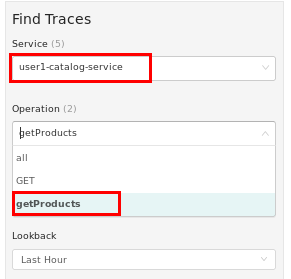

:noaudio:
:scrollbar:
:data-uri:
:toc2:
:linkattrs:
:transaction_costs: link:https://en.wikipedia.org/wiki/Transaction_cost[transaction costs]

= Service Mesh Observability Lab

.Goals
* End-to-end distributed tracing of an MSA application using Jaeger implementation of the _OpenTracing_ specification

:numbered:

== API Gateway: OpenTracing Enabled

=== Overview

As the next step in the journey toward utilization of API Management and Service Mesh, in this section of the lab you will begin to explore the visibility provided of your service mesh using the _OpenTracing_ implementation: _Jaeger_.

You will do so in this section by utilizing an _OpenTracing_-enabled variant of the Red Hat 3scale API Management gateway.

OpenTracing is a consistent, expressive, vendor-neutral API for distributed tracing and context propagation. Jaeger is one of several implementations of OpenTracing.

The API gateway that you will switch to in this section of the lab includes several additional _OpenTracing_ and _Jaeger_ related libraries:

. *ngx_http_opentracing_module_so*
+
Located at the following path in the API gateway: /usr/local/openresty/nginx/modules/ngx_http_opentracing_module.so

. *libjaegertracing.so.0*
+
Located at the following path in the API gateway: /opt/app-root/lib/libjaegertracing.so.0

These libraries provide support for the _OpenTracing_ specification using _Jaeger_.

image::images/jaeger_architecture.png[]

You will configure the OpenTracing client libraries in your API gateway to forward traces via UDP to the _jaeger-agent_.

=== Enable OpenTracing using Jaeger

. You will be making quite a few changes to your Istio-enabled API gateway.  Subsequently, put it in a paused state while those changes are being made:
+
-----
$ oc rollout pause deploy $OCP_USERNAME-prod-apicast-istio -n $GW_PROJECT
-----

.. Verify that the _jaeger-agent_ and _jaeger-collector_ both exist in the _istio-system_ namespace :
+
-----
$  oc get service jaeger-agent jaeger-collector -n istio-system --as=system:admin

NAME           TYPE        CLUSTER-IP   EXTERNAL-IP   PORT(S)                      AGE
jaeger-agent   ClusterIP   None         <none>        5775/UDP,6831/UDP,6832/UDP   4d
jaeger-collector   ClusterIP   172.30.95.25   <none>        14267/TCP,14268/TCP          4d
-----
+
The Jaeger agent receives tracing information (in the form of UDP packets on port 6831) submitted by Jaeger client libraries embedded in applications. It forwards the tracing information in batches to the Jaeger collector.
+
Alternatively, Jaeger client libraries can push tracing information via a TCP connection directly to the _jaeger-collector_ on port 14268.

. Create a JSON configuration file that will instruct the OpenTracing and Jaeger related client libraries in the API gateway to push traces to the `jaeger-agent`:
+
-----
$   cat <<EOF > $HOME/lab/jaeger_config.json
{
    "service_name": "$OCP_USERNAME-prod-apicast-istio",
    "disabled": false,
    "sampler": {
      "type": "const",
      "param": 1
    },
    "reporter": {
      "queueSize": 100,
      "bufferFlushInterval": 10,
      "logSpans": false,
      "localAgentHostPort": "jaeger-agent.istio-system:6831"
    },
    "headers": {
      "jaegerDebugHeader": "debug-id",
      "jaegerBaggageHeader": "baggage",
      "TraceContextHeaderName": "uber-trace-id",
      "traceBaggageHeaderPrefix": "testctx-"
    },
    "baggage_restrictions": {
        "denyBaggageOnInitializationFailure": false,
        "hostPort": "jaeger-agent.istio-system:5778",
        "refreshInterval": 60
    }
}
EOF
-----

.. Pay special attention to the value of _localAgentHostPort_.
+
This is the URL of your API gateway that will push traces (via UDP) to the _jaeger-agent_ service host and port.

. Create a _configmap_ from the OpenTracing JSON file:
+
-----
$ oc create configmap jaeger-config --from-file=$HOME/lab/jaeger_config.json -n $GW_PROJECT
-----

. Mount the configmap to your OpenTracing-enabled API Gateway:
+
-----
$ oc set volume deploy/$OCP_USERNAME-prod-apicast-istio --add -m /tmp/jaeger/ -t configmap --configmap-name jaeger-config -n $GW_PROJECT
-----

. Set environment variables that indicate to the API gateway where to read OpenTracing related configurations:
+
-----
$ oc set env deploy/$OCP_USERNAME-prod-apicast-istio \
         OPENTRACING_TRACER=jaeger \
         OPENTRACING_CONFIG=/tmp/jaeger/jaeger_config.json \
         -n $GW_PROJECT
-----

. Update the API gateway _deployment_ to use the OpenTracing and Jaeger enabled image:
+
-----
$ oc patch deploy/$OCP_USERNAME-prod-apicast-istio \
   --patch '{"spec":{"template":{"spec":{"containers":[{"name":"'$OCP_USERNAME'-prod-apicast-istio", "image": "quay.io/3scale/apicast:master" }]}}}}' \
   -n $GW_PROJECT
-----
+
Notice the use of a community version of the API gateway container image available in a public _quay.io_ organization.
This is the container image that includes the _opentracing_ and _jaeger_ client libraries.

. Resume your Istio-enabled and OpenTracing-enabled API gateway:
+
-----
$ oc rollout resume deploy $OCP_USERNAME-prod-apicast-istio -n $GW_PROJECT
-----

. Verify the existence of the OpenTracing library for NGinx in the API gateway.
+
Once your API gateway is running again, execute the following commands:
+
-----
$ oc project $GW_PROJECT

$ oc rsh `oc get pod -n $GW_PROJECT | grep "apicast-istio" | awk '{print $1}'` ls -l /usr/local/openresty/nginx/modules/ngx_http_opentracing_module.so

...

-rwxr-xr-x. 1 root root 1457848 Jun 11 06:29 /usr/local/openresty/nginx/modules/ngx_http_opentracing_module.so
-----

. Verify the existence of the Jaeger client library in the API gateway:
+
-----
$ oc rsh `oc get pod | grep "apicast-istio" | awk '{print $1}'` ls -l /opt/app-root/lib/libjaegertracing.so.0

...

lrwxrwxrwx. 1 root root 25 Jun 11 06:38 /opt/app-root/lib/libjaegertracing.so.0 -> libjaegertracing.so.0.3.0
-----

== Jaeger UI

Often the first thing to understand about your microservice architecture is specifically which microservices are involved in an end-user transaction.

The _observability_ tooling built into Istio, either Zipkin or Jaeger, can provide this information.

In this section of the lab, you are exposed to the Jaeger user interface (UI).

The Jaeger UI provides a visual depiction of traces through the services that make up your application.

=== Terminology

An important _distributed tracing_ term to understand is: _span_.
Jaeger defines a _span_ as “a logical unit of work in the system that has an operation name, an operation start time, and a duration. Spans can be nested and ordered to model causal relationships. An RPC call is an example of a span.”

Another important term to understand is: _trace_. Jaeger defines _trace_ as “a data or execution path through the system, and can be thought of as a directed acyclic graph of spans".

=== View Traces and Spans

. If you are not already there, return to the terminal window of your lab, and use the `curl` utility to invoke your catalog service (via Istio ingress gateway -> API gateway) a few times:
+
-----
$ curl -v \
       -HHost:$CATALOG_API_GW_HOST \
       http://$INGRESS_HOST:$INGRESS_PORT/products?user_key=$CATALOG_USER_KEY
-----

. Identify the URL to the Jaeger UI:
+
-----
$ echo -en "\n\nhttp://"$(oc get route/tracing -o template --template {{.spec.host}} -n istio-system)"\n\n"
-----

.. In a web browser, navigate to this URL.
.. In this version of Istio, the Jaeger UI is currently not secured.

. In the _Find Traces_ panel, scroll down to locate the traces associated with your OCP user name:
+
image::images/trace_dropdown_selection.png[]

.. From the `Service` drop-down list, select the option for the API gateway associated with your username, such as $OCP_USERNAME-prod-apicast-istio.
.. In the `Operation` drop-down list, there are likely only two options available: `all` and `apicast_management`.
+
At this time, neither of these operations are particularly relevant to our use case.
The `apicast_management` operation relates to the invocations made by the _readiness_ and _liveness_ relates to probes of the deployment to the API gateway pod.

.. Return to the Jaeger UI and notice more options present in the `Operation` drop-down.
+
Select the character: '/'.
+
This corresponds to the requests flowing through the API gateway and backend catalog service.

. In the Jaeger UI, click `Find Traces`.
+
You should see an overview with timelines of all of your traces:
+

. Click on any one of the circles.
Each one corresponds to an invocation to your catalog service.
+

. Click the span relevant to _@upstream_
+
image::images/upstream_span.png[]
+
Notice that this span relates to the invocation of the `products` endpoint of your catalog service.

Traces relevant to your Istio-enabled API gateway are now available .
However, tracing of the backend _catalog_ service is missing.

In the next section, you will enable your _catalog_ service to participate in this end-to-end distributed tracing.

== Catalog Service: Istio-enabled

image::images/deployment_catalog-istio.png[]

In the above diagram, notice the introduction of a new pod: _catalog-service-istio_.

Ingress requests through the _catalog-service_ are now directed to this new Istio-enabled _catalog_ pod (instead of the original _catalog_ pod that is not Istio enabled).

The new catalog service is enabled with OpenTracing and Jaeger libraries so that it can also participate in distributed tracing.

=== OpenTracing Libraries Included in Catalog Service

The _catalog service_ is link:https://github.com/gpe-mw-training/catalog-service[written in Java] using the _reactive_ programming framework link:https://vertx.io/[vert.x].

As such, the new catalog service used in the remainder of this course is embedded with the OpenTracing and Jaeger Java client libraries.

Recall that when configuring the NGinx and C++ OpenTracing/Jaeger client libraries in the API gateway, a configuration file (via a config map) was loaded.
The OpenTracing and Jaeger client libraries for Java are easier to work with.
The Java client libraries allow for configuration via environment variables.

The Dockerfile with environment variables (and their default values) utilized in building the new OpenTracing catalog image is as follows:

-----
FROM redhat-openjdk-18/openjdk18-openshift:1.5-14
ENV JAVA_APP_DIR=/deployments
ENV AB_OFF=true
EXPOSE 8080 8778 9779
COPY target/catalog-service-tracing-1.0.17.jar /deployments/
-----

The source code of the OpenTracing-enabled catalog service is available at link:https://github.com/gpe-mw-training/catalog-service/tree/jaeger-rht[https://github.com/gpe-mw-training/catalog-service/tree/jaeger-rht].

=== Inject Envoy into Catalog Service

. Retrieve YAML representation of current _catalog service_ deployment:
+
-----
$ oc get deploy catalog-service -n $MSA_PROJECT -o yaml > $HOME/lab/catalog-service.yml
-----

. Differentiate your Istio-enabled catalog service from your existing catalog service:
+
-----
$ sed -i "s/ catalog-service/ $OCP_USERNAME-cat-service-istio/" $HOME/lab/catalog-service.yml
-----

. Place the deployment in a paused state:
+
-----
$ sed -i "s/replicas:\ 1/replicas: 1\n  paused: true/" $HOME/lab/catalog-service.yml
-----

. Inject Istio configurations into a new catalog service deployment:
+
-----

$ istioctl kube-inject \
           -f $HOME/lab/catalog-service.yml \
           > $HOME/lab/catalog-service-istio.yml
-----

. View Istio-injected catalog service deployment descriptor:
+
-----
$ less $HOME/lab/catalog-service-istio.yml | more
-----

. Create a new configmap with parameters that configure the OpenTracing-enabled catalog service:
+
-----
$ echo "service-name: $OCP_USERNAME-catalog-service
catalog.http.port: 8080
connection_string: mongodb://catalog-mongodb:27017
db_name: catalogdb
username: mongo
password: mongo
sampler-type: const
sampler-param: 1
reporter-log-spans: True
collector-endpoint: \"http://jaeger-collector.istio-system.svc:14268/api/traces\"
" > $HOME/lab/app-config.yaml

# Delete existing configmap
$ oc delete configmap app-config -n $MSA_PROJECT

# Recreate configmap using additional OpenTracing related params
$ oc create configmap app-config --from-file=$HOME/lab/app-config.yaml -n $MSA_PROJECT
-----

. Deploy a new production Istio-enabled API gateway that correctly points to the Jaeger agent in your _istio-system_ namespace:
+
-----
$ oc create \
     -f $HOME/lab/catalog-service-istio.yml \
     -n $MSA_PROJECT
-----

. Set various environment variables on the OpenTracing-enabled catalog service:
+
-----
$ oc set env deploy/$OCP_USERNAME-cat-service-istio APP_CONFIGMAP_NAME=app-config  -n $MSA_PROJECT

$ oc set env deploy/$OCP_USERNAME-cat-service-istio APP_CONFIGMAP_KEY=app-config.yaml  -n $MSA_PROJECT

# Allows for optionally debugging of catalog service so as to better understand how exactly it utilizes the opentracing / jaeger java libraries
$ oc set env deploy/$OCP_USERNAME-cat-service-istio JAVA_DEBUG=true  -n $MSA_PROJECT
$ oc set env deploy/$OCP_USERNAME-cat-service-istio JAVA_DEBUG_PORT=8787  -n $MSA_PROJECT
-----

. Inject required resource limits and requests into Istio-related containers :
+
There is a clusterquota assigned to your OCP user.
This clusterquota requires that all containers, including the _istio-proxy_ and _istio-init_, specify _limits_ and _requests_.
+
-----
$ oc patch deploy/$OCP_USERNAME-cat-service-istio \
   --patch '{"spec":{"template":{"spec":{"containers":[{"name":"istio-proxy", "resources": {   "limits":{"cpu": "500m","memory": "128Mi"},"requests":{"cpu":"50m","memory":"32Mi"}   }}]}}}}' \
   -n $MSA_PROJECT

$ oc patch deploy/$OCP_USERNAME-cat-service-istio \
   --patch '{"spec":{"template":{"spec":{"initContainers":[{"name":"istio-init", "resources": {   "limits":{"cpu": "500m","memory": "128Mi"},"requests":{"cpu":"50m","memory":"32Mi"}   }}]}}}}' \
   -n $MSA_PROJECT
-----

. Update the new catalog service deployment to use the OpenTracing-enabled and Jaeger-enabled image:
+
-----
$ oc patch deploy/$OCP_USERNAME-cat-service-istio \
   --patch '{"spec":{"template":{"spec":{"containers":[{"name":"'$OCP_USERNAME'-cat-service-istio", "image": "docker.io/rhtgptetraining/catalog-service-tracing:1.0.17" }]}}}}' \
   -n $MSA_PROJECT
-----

ifdef::showscript[]

    based on:  https://github.com/gpe-mw-training/catalog-service/tree/jaeger-rht

endif::showscript[]

. Resume the paused deployment:
+
-----
$ oc rollout resume deploy/$OCP_USERNAME-cat-service-istio -n $MSA_PROJECT
-----

. Modify the _service_ to route to the new Istio-enabled catalog service:
+
-----
$ oc patch service/catalog-service \
   --patch '{"spec":{"selector":{"deployment":"'$OCP_USERNAME'-cat-service-istio"}}}' \
   -n $MSA_PROJECT
-----

. The original catalog service is no longer needed.  Scale it down as follows:
+
-----
$ oc scale deploy/catalog-service --replicas=0 -n $MSA_PROJECT
-----

. Ensure your `$CATALOG_USER_KEY` and `$CATALOG_API_GW_HOST` environment variables remain set:
+
-----
$ echo $CATALOG_USER_KEY

d59904ad4515522ecccb8b81c761a283

$ echo $CATALOG_API_GW_HOST

catalog-prod-apicast-developer.apps.clientvm.b902.rhte.opentlc.com
-----

. From the terminal, use the `curl` utility as you have done previously to invoke your catalog service several times via the Istio ingress.
.. Review the log file of your Istio-enabled catalog service:
+
-----
$ oc logs -f `oc get pod -n $MSA_PROJECT | grep "istio" | awk '{print $1}'` -c $OCP_USERNAME-cat-service-istio -n $MSA_PROJECT
-----

.. With every invocation of the `getProducts` function of the catalog service, there should be a log statement as follows:
+
-----
INFO: getProducts() started span ...
-----

. Return to the Jaeger UI and locate your traces.
.. Notice that there is now a new `service` corresponding to your Istio-enabled catalog service:
+

.. Drill into this service and notice the _spans_ (to include the span corresponding to invocation of the `getProducts()` function).
+
image::images/spans_with_catalog.png[]

ifdef::showscript[]
endif::showscript[]
