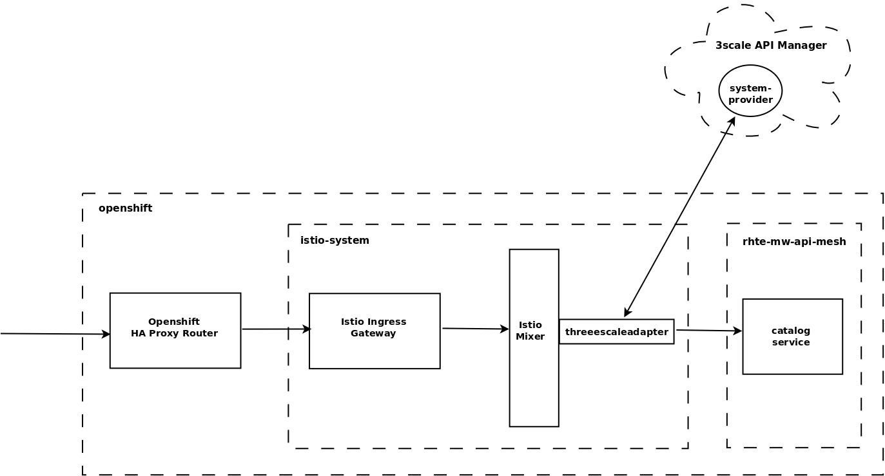

:noaudio:
:scrollbar:
:data-uri:
:toc2:
:linkattrs:
:transaction_costs: link:https://en.wikipedia.org/wiki/Transaction_cost[transaction costs]

= 3scale Mixer Adapter Lab

.Goals
* Introduction to the Red Hat 3scale API Management Mixer Adapter

:numbered:

== Overview

The Red Hat 3scale API Management engineering team, in collaboration with the Red Hat Service Mesh team, has created an Istio _mixer_ adapter for API Management.
This Istio mixer adapter will allow Red Hat 3scale API Management policies to be applied directly communication that occurs between services in the _service mesh_.

In the above diagram, [blue]#notice the replacement of an API Gateway with the Istio 3scale Mixer Adapter#.

== Disable Existing API Gateways

Your API gateways will no longer be needed.
Inbound traffic will flow through the Istio ingress gateway directly to the 3scale Istio Mixer and out to the remote Red Hat 3scale API Management manager.

Subsequently, the API gateways and any associated routing rules can be deleted.

. Scale down the non-Istio-enabled API gateway:
+
-----
$ oc scale deploy/prod-apicast --replicas=0 -n $GW_PROJECT
-----

. Scale down the Istio-enabled API gateway:
+
-----
$ oc scale deploy/$OCP_USERNAME-prod-apicast-istio --replicas=0 -n $GW_PROJECT
-----

. Remove virtual service:
+
-----
$ oc delete virtualservice catalog-istio-gateway-vs -n $GW_PROJECT --as=system:admin
-----

. Remove gateway:
+
-----
$ oc delete gateway catalog-istio-gateway -n $GW_PROJECT --as=system:admin
-----

== New Virtual Service to Catalog Service
Up until this section in the lab, the request path to your catalog service has been:  OCP ha-proxy route -> Istio ingress gateway -> API gateway -> catalog service.

In this section of the lab, you will create a routing rule to invoke the backend catalog service directly via the Istio _ingress_ gateway (by-passing the API gateway).

Later, more complex routing rules will modify the flow to also apply API policies via the Red Hat 3scale API Management Istio Mixer adapter.

. Ensure the $NAKED_CATALOG_ROUTE environment variable still remains in your shell:
+
-----
$ echo $NAKED_CATALOG_ROUTE

catalog-unsecured-rhte-mw-api-mesh-a1001.apps.clientvm.b902.rhte.opentlc.com
-----

. Define a gateway and virtual service that routes inbound traffic from the _ingressgateway_ on port 80 directly to your backend catalog service on port 8080.
+
-----
$ echo \
    "apiVersion: networking.istio.io/v1alpha3
kind: Gateway
metadata:
  name: catalog-direct-gw
spec:
  selector:
    istio: ingressgateway
  servers:
  - port:
      number: 80
      name: http
      protocol: HTTP
    hosts:
    - \"*\"
---
apiVersion: networking.istio.io/v1alpha3
kind: VirtualService
metadata:
  name: catalog-direct-vs
spec:
  hosts:
  - \"*\"
  gateways:
  - catalog-direct-gw
  http:
  - match:
    - uri:
        prefix: /products
    - uri:
        prefix: /product
    route:
    - destination:
        host: catalog-service
        port:
          number: 8080" \
 > $HOME/lab/catalog-direct-gw-vs.yml
-----
+
Notice that a match is made for all context paths exposed by the catalog service:  `/products` and `/product`.

. Create the gateway and virtual service in your $MSA_PROJECT :
+
-----
$ oc create -f ~/lab/catalog-direct-gw-vs.yml -n $MSA_PROJECT
-----

. Similar to what you did in a previous lab, check the routes from the istio-ingressgateway:
+
-----
$ sudo -i

# oc project istio-system && \
         oc rsh `oc get pod | grep "istio-ingressgateway" | awk '{print $1}'` \
         curl http://localhost:15000/config_dump \
         > /tmp/config_dump \
         && less /tmp/config_dump \
         | /usr/local/bin/jq ".configs | last | .dynamic_route_configs"

$ exit
-----

. From the terminal, conduct a smoke test to validate traffic to the catalog service directly from the Istio ingress gateway.
.. For the next few smoke tests, notice that the API _user_key_ is not being specified.
It is not needed in these smoke tests because this inbound traffic is no longer flowing through your API gateway.
Later in the lab, you'll re-introduce the use of the API _user_key_ .

.. POST a new catalog item:
+
-----
$ curl -v -X POST -H "Content-Type: application/json" `echo "http://"$(oc get route istio-ingressgateway -n istio-system -o template --template {{.spec.host}})""`/product/ -d '{
  "itemId" : "822222",
  "name" : "Oculus Rift 2",
  "desc" : "Oculus Rift 2",
  "price" : 102.0
}'

...

< HTTP/1.1 201 Created
-----
+
The reponse status back should be an HTTP 201 .

.. View details of the recently posted catalog item:
+
-----
$ curl -v `echo "http://"$(oc get route istio-ingressgateway -n istio-system -o template --template {{.spec.host}})"/product/822222"`
-----

.. View details of all catalog items:
+
-----
$ curl -v `echo "http://"$(oc get route istio-ingressgateway -n istio-system -o template --template {{.spec.host}})"/products"`
-----

[blue]#You have successully routed traffic through the _istio-ingressgateway_ directly to your backend business service#.
Next step is to inject the 3scale Istio Mixer into this request path and subsequently begin to apply API Management.

== 3scale Istio Mixer

Red Hat Service Mesh includes the 3scale Istio Adapter out of the box.

In this section of the lab, you review the various components that make of the 3scale Istio Adapter and then configure it so that it applies API Management policies (as per what you have already configured in the API Manager _control plane_) to inbound requests.

. General information about Istio's plug-in architecture to apply policies and capture telemetry can be found link:https://istio.io/docs/concepts/policies-and-telemetry/[here].

=== Ensure Policy Checks are not disabled
By default, Red Hat Service Mesh disables evaluation of all policies.

In order for API Management policies to be applied to service mesh traffic, this default behavior needs to be reversed.
The setting for this behavior is in the _istio_ configmap in the istio namespace.
This configmap is read by the Envoy proxy upon start-up of an istio enabled pod.

Your lab environment already comes provisioned with service mesh policies (to include API Management policies that will be introduced in this lab) enabled.

You can view state of this setting that disables service mesh policies as follows: 
 
-----
$ oc describe cm istio -n istio-system | grep disablePolicyChecks

disablePolicyChecks: false
-----

=== View 3scale Istio Adapter components

image::images/mixer_architecture.png[]

. Review 3scale Istio Adapter components in _istio-system_ namespace:
+
-----
$ oc get all -l app=3scale-istio-adapter -n istio-system
-----

.. The response should list the deployment, replicaset and pod.

.. As per the diagram above, the _3scale-istio-adapter_ Linux container includes the following two components:

... *3scale-istio-adapter*
+
Accepts gRPC invocations from Istio ingress and routes to the other side car in the pod:  _3scale-istio-httpclient_

... *3scale-istio-httpclient*
+
Accepts invocations from _3scale-istio-adapter_ and invokes the _system-provider_ and _backend-listener_ endpoints of the remote Red Hat 3scale API Management manager.

.. Its possible that the pod corresponding to the 3scale-istio-adapter is in an _ImagePullBackOff_ error state.
+
If so, edit the _3scale-istio-adapter_ Deployment such that the URL to the image explicitly includes _registry.redhat.io_ as follows:
+
-----
image: registry.redhat.io/openshift-istio-tech-preview/3scale-istio-adapter:0.4.1
-----

. View listing of configs that support the 3scale Mixer Adapter:
+
Embedded in the following YAML files is the 3scale handler that is injected into the Istio Mixer.
This handler is written in Golang by the 3scale engineering team as per the link:https://github.com/istio/istio/wiki/Mixer-Out-Of-Process-Adapter-Dev-Guide[Mixer Out of Process Adapter Dev Guide].
Much of these files consists of the adapter's configuration link:https://developers.google.com/protocol-buffers/docs/proto3[proto].

.. Adapters:
+
-----
$ oc get adapters.config.istio.io -n istio-system
threescale   7d
-----

.. Template:
+
-----
$ oc get templates.config.istio.io -n istio-system

threescale-authorization   7d
-----

== Red Hat 3scale Mixer Adapter Configurations

Now that 3scale Istio Adapter has been verified to exist, various configurations need to be added to the service mesh.

In particular, you will specify the URL of the _system-provider_ endpoint of your 3scale tenant along with the corresponding access token.
This is needed so that the Istio Mixer can pull API proxy details from the 3scale API Manager (similar to what the 3scale API Gateway does).

. In the details of your _catalog_ service in the Red Hat 3scale API Manager administration console, locate the `ID for API calls ... `:
+

. Set an environment variable that captures this catalog service ID:
+
-----
$ echo "export CATALOG_SERVICE_ID=<your catalog service ID>" >> ~/.bashrc

source ~/.bashrc
-----

. Clone the source code of the 3scale Istio Mixer configurations to your lab environment.
+
Execute:
+
-----
$ git clone \
      --branch v0.5.0 \
      https://github.com/3scale/istio-integration \
      $HOME/lab/istio-integration
-----

. Review the `threescale-adapter-config.yaml` file :
+
-----
$ less $HOME/lab/istio-integration/istio/threescale-adapter-config.yaml | more
-----

. Modify the `threescale-adapter-config.yaml` file with the ID of your catalog service:
+
-----
$ sed -i "s/service_id: .*/service_id: \"$CATALOG_SERVICE_ID\"/" \
      $HOME/lab/istio-integration/istio/threescale-adapter-config.yaml
-----

. Modify the `threescale-adapter-config.yaml` file with the URL to your Red Hat 3scale API Management manager tenant:
+
-----
$ sed -i "s/system_url: .*/system_url: \"https:\/\/$TENANT_NAME-admin.$API_WILDCARD_DOMAIN\"/" \
      $HOME/lab/istio-integration/istio/threescale-adapter-config.yaml
-----

. Modify the `threescale-adapter-config.yaml` file with the administrative access token of your Red Hat 3scale API Management manager administration account:
+
-----
$ sed -i "s/access_token: .*/access_token: \"$API_ADMIN_ACCESS_TOKEN\"/" \
      $HOME/lab/istio-integration/istio/threescale-adapter-config.yaml
-----

. The _rule_ in _threescale-adapter-config.yaml_ defines the conditions that API Management policies should be applied to a request.
+
The existing default rule is as follows:
+
-----
match: destination.labels["service-mesh.3scale.net"] == "true"
----- 
+
This rule specifies that API Management policies should be applied to the request when the target Deployment includes a label of:  `service-mesh.3scale.net`.
In this version of the lab, this rule does not apply API Management policies as expected.
Further research into the issue is needed. 

.. As a work-around for the current problem, modify the `threescale-adapter-config.yaml` file with a modified rule that specifies that API Management policies should be applied when the target is the catalog-service:
+
-----
$ sed -i "s/match: .*/match: destination.service.name == \"catalog-service\"/" \
      $HOME/lab/istio-integration/istio/threescale-adapter-config.yaml
-----

.. More information about Istio's Policy Attribute Vocabulary (used in the creation of rules) can be found link:https://istio.io/docs/reference/config/policy-and-telemetry/attribute-vocabulary/[here].

. Load the Red Hat 3scale API Management Istio Handler configurations:
+
-----
$ oc create -f $HOME/lab/istio-integration/istio/threescale-adapter-config.yaml

...

handler.config.istio.io/threescale created
instance.config.istio.io "threescale-authorization" created
rule.config.istio.io "threescale" created
-----

.. If for whatever reason you want to delete these 3scale Istio mixer adapter configurations, execute the following:
+
-----
oc delete rule.config.istio.io threescale -n istio-system
oc delete instance.config.istio.io threescale-authorization -n istio-system
oc delete handler.config.istio.io threescale -n istio-system
-----

. Verify that the Istio Handler configurations were created in the istio-system namespace:
+
-----
$ oc get handler threescale -n istio-system -o yaml

apiVersion: v1
items:
- apiVersion: config.istio.io/v1alpha2
  kind: handler

  ....

  spec:
    adapter: threescale
    connection:
      address: threescaleistioadapter:3333
    params:
      access_token: fa16cd9ebd66jd07c7bd5511be4b78ecf6d58c30daa940ff711515ca7de1194a
      service_id: "103"
      system_url: https://user1-3scale-mt-admin.apps.4a64.openshift.opentlc.com

-----

== Smoke Test 3scale Istio Mixer Adapter

. From the terminal, execute the following to invoke your catalog service directly via the Istio ingress:
+
-----
$ curl -v \
       `echo "http://"$(oc get route istio-ingressgateway -n istio-system -o template --template {{.spec.host}})"/products"`

...

< HTTP/1.1 403 Forbidden
...

* Connection #0 to host istio-ingressgateway-istio-system.apps.clientvm.b902.rhte.opentlc.com left intact

PERMISSION_DENIED:threescalehandler.handler.istio-system:no auth credentials provided or provided in invalid location
-----

.. Notice a 403 error response of `PERMISSION_DENIED:threescalehandler.handler.istio-system:`. This is to be expected.
+
Inbound requests through the Istio ingress are now correctly flowing through the mixer to the 3scale adapter.
+
In the above request however, the API _user_key_ associated with your catalog service _application_ has been omitted.
.. View the log file of the 3scale adapter:
+
-----
$ oc logs -f `oc get pod -n istio-system | grep "3scale-istio-adapter" | awk '{print $1}'` \
          -n istio-system \
          -c 3scale-istio-adapter

"Got instance &InstanceMsg{Subject:&SubjectMsg{User:,Groups:,Properties:map[string]*istio_policy_v1beta11.Value{app_id: &Value{Value:&Value_StringValue{StringValue:,},},app_key: &Value{Value:&Value_StringValue{StringValue:,},},},},Action:&ActionMsg{Namespace:,Service:,Method:GET,Path:/products,Properties:map[string]*istio_policy_v1beta11.Value{},},Name:threescale-authorization.instance.istio-system,}"

"proxy config for service id 4 is being fetching from 3scale"
-----

. Try again to invoke your catalog service using the catalog service _user_key_:
+
-----
$ curl -v \
       `echo "http://"$(oc get route istio-ingressgateway -n istio-system -o template --template {{.spec.host}})"/products?user_key=$CATALOG_USER_KEY"`
-----

[blue]#Congratulations! The catalog service is again being managed and secured by the Red Hat 3scale API Management manager.#
This time however, the 3scale Istio Mixer adapter is being utilized rather than the API gateway.

== Fine-tune 3scale Istio Mixer Adapter Rules

At this point, *all* traffic inbound through the Istio ingress is configured to route through the 3scale Istio Mixer adapter.
Your use case may require more fine-grained routing rules.

In this last section of the lab, you specify that requests for the catalog `/products` endpoint can bypass the 3scale Istio Mixer adapter and invoke the catalog service directly.
All requests to the `/product` endpoint will continue to require authentication via the 3scale Istio Mixer adapter.

. Modify the existing `usethreescale` rule:
+
-----
$ oc patch rule.config.istio.io threescale \
       --type=json \
       --patch '[{"op": "add", "path": "/spec/match", "value":"destination.service.name == \"catalog-service\" && source.namespace != \"'$MSA_PROJECT'\" && request.method == \"POST\" && request.path.startsWith(\"/product\")"  }]' \
       -n istio-system 
-----
+
This modification introduces a fine grained _match_ rule with several conditions. Only when all of the conditions are met, will the inbound traffic be routed to the 3scale mixer adapter.
+
The conditions of the rule are as follows:

.. The destination service needs to be the backend catalog service.
.. The inbound request needs to originate from outside the $MSA_PROJECT (that is, from the istio-ingress of the istio-system).
.. The target is the `/product/` endpoint (which allows for POST, DELETE and GET methods).

.. View the log file of the _istio-policy_ pod:
+
-----
$ oc logs -f `oc get pod -n istio-system | grep "istio-policy" | awk '{print $1}'` -c mixer -n istio-system

....

IntrospectionOptions: ctrlz.Options{Port:0x2694, Address:"127.0.0.1"}
warn    Neither --kubeconfig nor --master was specified.  Using the inClusterConfig.  This might not work.
info    Built new config.Snapshot: id='0'
info    Cleaning up handler table, with config ID:-1
info    Built new config.Snapshot: id='1'
info    adapters        getting kubeconfig from: ""     {"adapter": "handler.kubernetesenv.istio-system"}
warn    Neither --kubeconfig nor --master was specified.  Using the inClusterConfig.  This might not work.
info    adapters        Waiting for kubernetes cache sync...    {"adapter": "handler.kubernetesenv.istio-system"}
info    adapters        Cache sync successful.  {"adapter": "handler.kubernetesenv.istio-system"}
info    Cleaning up handler table, with config ID:0
info    adapters        serving prometheus metrics on 42422     {"adapter": "handler.prometheus.istio-system"}
 Mixer: root@71a9470ea93c-docker.io/istio-1.0.0-3a136c90ec5e308f236e0d7ebb5c4c5e405217f4-Clean
Starting gRPC server on port 9091
info    ControlZ available at 172.17.0.10:9876
-----
+
In particular, notice that the new policies were put into effect with no error messages logged.

. Try again to invoke your catalog service *without* the catalog service _user_key_:
+
-----
$ curl -v \
       `echo "http://"$(oc get route istio-ingressgateway -n istio-system -o template --template {{.spec.host}})"/products"`
-----
+
This request should have now been routed directly to your backend catalog service.
This is because the `/products` endpoint is being invoked (which fails the third condition of the rule).
Subsequently, the API _user_key_ is not needed.

. Try to POST a new catalog service *without* the catalog service _user_key_:
+
-----
$ curl -v \
       -X POST \
       -H "Content-Type: application/json" \
       `echo "http://"$(oc get route istio-ingressgateway -n istio-system -o template --template {{.spec.host}})"/product"` \
       -d '{
  "itemId" : "833333",
  "name" : "Oculus Rift 3",
  "desc" : "Oculus Rift 3",
  "price" : 103.0
}'
-----
+
This request should have been routed to the 3scale Istio Mixer adapter.
This is because all three conditions of the routing rule have been met.
Subsequently, because the API _user_key_ was not applied, the response should be "403 PERMISSION DENIED".

. Try again to POST a new catalog service using the catalog service _user_key_:
+
-----
$ curl -v \
       -X POST \
       -H "Content-Type: application/json" \
       `echo "http://"$(oc get route istio-ingressgateway -n istio-system -o template --template {{.spec.host}})"/product?user_key=$CATALOG_USER_KEY"` \
       -d '{
  "itemId" : "833333",
  "name" : "Oculus Rift 3",
  "desc" : "Oculus Rift 3",
  "price" : 103.0
}'
-----
+
This request should have been routed to the 3scale Istio Mixer adapter.
Subsequently, because the API _user_key_ was applied, the response should be "201 Created".

== Extra Credit

Until now, specific endpoints of a single backend _catalog_ service are being managed by the API Manager via the 3scale Istio Mixer adapter.

As an additional exercise, introduce a new backend business service into your service mesh.
Have this backend business service also managed by the API Manager via the 3scale Istio Mixer adapter.

Which configurations need to be modified or added?

== Questions

. Which of the following libraries is embedded in the community API gateway to support distributed tracing?
+
-----
a) ngx_http_opentracing_module.so
b) libjaegertracing.so.0
c) libzipkintracing.so.0
d) A and B
-----

. What is the name of the CustomResourceDefinition introduced by Istio's v1alpha3 routing API that allows for configuration of an egress route?
+
-----
a) EgressRule
b) DestinationRule
c) ServiceEntry
d) EgressRoute
-----

. The Jaeger Java client library provides which of the following features?
+
-----
a) Propogation of traces to the jaeger-agent via UDP on port 6831
b) Propogation of traces to the jaeger-collector via TCP by specifying the environment variable: JAEGER_ENDPOINT
c) Setting of the trace sampler type via the environment variable: JAEGER_SAMPLER_TYPE
d) All of the above
-----

. Which of the following are features of the Red Hat 3scale API Management product that are not found in Istio?
+
-----
a) Developer portal
b) Rate limiting
c) Billing
d) A and C
-----

ifdef::showscript[]
1)  answer D
2)  answer C
3)  answer D
4)  answer D
endif::showscript[]

== Conclusion

In this lab we covered the following topics:

* Injecting Istio Envoy proxy configurations into an API gateway
* Configuration of an Istio Egress Route to allow the API gateway to communicate to the remote API Manager
* Invocation of your backend service via the Istio Ingress gateway and Red Hat 3scale API Management gateway
* End-to-end distributed tracing of an MSA application using the Jaeger implementation of the _OpenTracing_ specification
* Review of the analytics dashboard provided by Red Hat 3scale API Management
* Introduction to the Red Hat 3scale API Management Mixer Adapter

== Appendix

[[Reference]]
=== Reference

This section provides link to reference material pertaining to Istio and Service Mesh.

. Istio / Service Mesh:
.. link:https://docs.google.com/presentation/d/1PaE3RqyKoadllKHlPg0-kHcUrTuCeIdAe81CMk12iWw/edit#slide=id.g17a49862ec_0_0[3scale Next.Gen and Istio]
.. link:https://istio.io/docs/concepts/what-is-istio/[Community Istio Documentation]
.. link:https://github.com/Maistra/istio-operator[Red Hat community Istio (Maistra) operator]
.. link:https://maistra.io/[OpenShift Service Mesh (Maistra) project]

. Distributed Tracing:
.. link:https://github.com/opentracing[GitHub organization for OpenTracing]
+
Includes the OpenTracing specification and the OpenTracing client libraries for many languages.

.. link:https://www.jaegertracing.io/[jaegertracing.io]
.. link:https://github.com/jaegertracing/[GitHub organization for community Jaeger]
+
Includes source code of community Jaeger, and Jaeger client libraries for many languages that implement the corresponding OpenTracing client libraries.

.. link:https://istio.io/blog/2018/v1alpha3-routing/[Overview of Istio v1alpha3 routing API]

=== Delete Red Hat 3scale API Management Istio Mixer Related Artifacts

For convenience, the following script is provided if there is a need to delete Red Hat 3scale API Management Istio Mixer related artifacts.

. Create deletion script:
+
-----
$ echo "
oc delete dc 3scale-istio-adapter -n istio-system --as=system:admin
oc delete handler threescalehandler -n istio-system --as=system:admin
oc delete instance threescaleauthorizationtemplate -n istio-system --as=system:admin
oc delete rule usethreescale -n istio-system --as=system:admin
oc delete adapter threescale -n istio-system --as=system:admin
oc delete template authorization -n istio-system" --as=system:admin \
> $HOME/lab/delete_mixer.sh

$ chmod 755 $HOME/lab/delete_mixer.sh

$ $HOME/lab/delete_mixer.sh
-----

ifdef::showscript[]

[[istio_troubleshooting]]
=== Istio troubleshooting

[red]#TO_DO#

. https://bani.com.br/2018/08/istio-mtls-debugging-a-503-error/

echo -en "\n\ncurl -k ${THREESCALE_PORTAL_ENDPOINT}/admin/api/services.json\n\n"                                    :   test retrival of proxy service info from system-provider

oc rsh `oc get pod | grep "prod-apicast-istio" | awk '{print $1}'` curl localhost:8090/status/live                  :   test liveness probe of istio enabled apicast
oc rsh `oc get pod | grep "prod-apicast-istio" | awk '{print $1}'` curl localhost:8090/status/ready                 :   test readiness probe of istio enabled apicast

oc rsh `oc get pod | grep "apicast-istio" | awk '{print $1}'`                                                       :   ssh into istio enabled API gateway gw

oc logs -f  `oc get pod | grep "apicast-istio" \
            | grep "Running" \
            | awk '{print $1}'` -c $OCP_USERNAME-prod-apicast-istio                                                 :   log of istio enabled API gateway gw

for i in `oc get pod | grep "apicast-istio" | awk '{print $1}'`; do oc delete pod $i; done                          :   Re-dploy Istio enabled API gateway

TO-DO
  1)  Is a liveness probe necessary for API gateway ?  API gateway appears to error out on its own during boot problems.
  2)  With liveness and readiness probes removed, API gateway boot error behaves differently depending on whether it is injected with istio
        - istio injected :   API gateway boot errors cause fail-over the first 2 or 3 times.  Then no longer any errors.
        - no istio       :   API gateway continues to fail upon boot errors

      Turns out envoy proxy is blocking outbound calls at boot for about 1 minute or so
      All outbound calls from primary pods (ie:  API gateway invocation to THREESCALE_PORTAL_ENDPOINT and vert.x / fabric8 invocation to kubernetes API to query for configmap) during that time are blocked.

      https://github.com/istio/istio/issues/3533        :   startup time of istio-proxy causes comm issues for up to 30 seconds

  3) investigate istio-ingress
        OCP ha-proxy -> istio-ingress -> API gateway gw -> catalog service

  4) when API gateway is in info log level, why does it stop rebooting itself when a THREESCALE_PORTAL_ENDPOINT related problem is encountered ?
     when API gateway is in debug log level, it continues to cycle when it encounters a THREESCALE_PORTAL_ENDPOINT problem .

  5) with istio injected apicast, boot doesn't start however a curl within the same pod on THREESCALE_PORTAL_ENDPOINT does work

  6) allow user write access to istio-system to allow for execution of:  "istioctl create"

  7) opentracing enabled apicast
        - quay.io/3scale/apicast:master
        - OPENTRACING_TRACER:           Which Tracer implementation to use, right now, only Jaeger is available.
        - OPENTRACING_CONFIG:           Each tracer has a default configuration file, you can see an example here: jaeger.example.json
        - OPENTRACING_HEADER_FORWARD:   By default, uses uber-trace-id, if your OpenTracing has a different configuration, you will need to change this value, if not, ignore it.

        .. [red]#TODO Investigate why liveness and readiness probes are failing#
        +
        -----
        Readiness probe failed: Get http://10.1.3.121:8090/status/ready: dial tcp 10.1.3.121:8090: getsockopt: connection refused
        Liveness probe failed: Get http://10.1.3.121:8090/status/live: dial tcp 10.1.3.121:8090: getsockopt: connection refused

        -----

The _info_ log level in API gateway actually provides more useful connection error details than does the _debug_ log level.
+
This will become important because we are about to encounter a connection related error now that Istio is introduced .
The connection problem will be in the API gateway at boot when it attempts to pull (using the value set in its THREESCALE_PORTAL_ENDPOINT env variable) _proxy-config_ information from the _system-provider_ of the API Manager.

. Investigate _apicast_ provisioning problem
+
-----
$ oc logs -f `oc get pod | grep "apicast-istio" | awk '{print $1}'` -c $OCP_USERNAME-prod-apicast-istio

...

2018/08/02 08:32:23 [warn] 23#23: *2 [lua] remote_v2.lua:163: call(): failed to get list of services: invalid status: 0 url: https://user1-3scale-admin.apps.7777.thinkpadratwater.com/admin/api/services.json, context: ngx.timer
2018/08/02 08:32:23 [info] 23#23: *2 [lua] remote_v1.lua:98: call(): configuration request sent: https://user1-3scale-admin.apps.7777.thinkpadratwater.com/admin/api/nginx/spec.json, context: ngx.timer
2018/08/02 08:32:23 [error] 23#23: *2 peer closed connection in SSL handshake, context: ngx.timer
2018/08/02 08:32:23 [warn] 23#23: *2 [lua] remote_v1.lua:108: call(): configuration download error: handshake failed, context: ngx.timer
ERROR: /opt/app-root/src/src/apicast/configuration_loader.lua:57: missing configuration
stack traceback:
	/opt/app-root/src/src/apicast/configuration_loader.lua:57: in function 'boot'
	/opt/app-root/src/libexec/boot.lua:6: in function 'file_gen'
	init_worker_by_lua:49: in function <init_worker_by_lua:47>
	[C]: in function 'xpcall'
	init_worker_by_lua:56: in function <init_worker_by_lua:54>

-----

.. From the log file, notice that initial warning indicates a failure "to get list services" from the API Manager _system-provider_ service.
+
Why would you expect that the _curl_ utility to be able to pull the _service-proxy_ data when rsh'd into the API gateway but the API gateway itself fails to do so ?

== istio / OCP workshop problem

[2018-08-11 21:02:53.607][154][info][config] external/envoy/source/server/listener_manager_impl.cc:903] all dependencies initialized. starting workers
2018-08-11T21:02:57.106685Z	warn	Epoch 0 terminated with an error: signal: killed
2018-08-11T21:02:57.106713Z	warn	Aborted all epochs
2018-08-11T21:02:57.106739Z	info	Epoch 0: set retry delay to 3.2s, budget to 5
2018-08-11T21:03:00.306904Z	info	Reconciling configuration (budget 5)

=== Lab Focus: Configuration

The emphasis of this lab is on configuration: specifically, configuration of a _Cloud Native _ application managed by 3scale and an Istio  _Service Mesh_.

Students of this lab will not write any business logic.

Development of cloud native applications can be written in a wide variety of development platforms offered by Red Hat to include:

. Red Hat Openshift Application Runtimes (RHOAR)
. Red Hat Fuse on OpenShift

Details about these Red Hat development platforms are out of scope for this specific lab.

. The Istio Mixer that will be utilized will originate from the following community image in Red Hat's _Quay_ container image registry:
+
-----
quay.io/3scale/apicast:3scale-http-plugin
-----

. Load the Istio Mixer Adapter deployment (found in the 3scale Istio integration project you just cloned) into the istio-system namespace:
+
-----
$ oc create -f $HOME/lab/istio-integration/3scaleAdapter/openshift -n istio-system --as=system:admin
-----

. Set the 3scale Adapter to debug log level:
+
-----
$ oc patch deploy/3scale-istio-adapter -e "THREESCALE_LOG_LEVEL=debug" -n istio-system --as=system:admin
-----

. Verify that the 3scale Istio Mixer Adapter pod has started :
+
-----
$ oc get pods -n istio-system | grep 3scale-istio-adapter

3scale-istio-adapter-1-t9kj2                1/1       Running     0          47s
-----

. Bounce the Istio _policy_ pod:
.. The Istio policy of Red Hat Service Mesh may sometime get into an unstable state.
Before progressing with management of more sophisticated routing rules to support the Red Hat 3scale API Management Istio Mixer, it is recommended to bounce the _policy_ pod.

.. Execute:
+
-----
$ oc delete pod \
     `oc get pod -n istio-system | grep "istio-policy" | awk '{print $1}'` \
     -n istio-system \
     --as=system:admin
-----

endif::showscript[]

ifdef::showscript[]
endif::showscript[]
